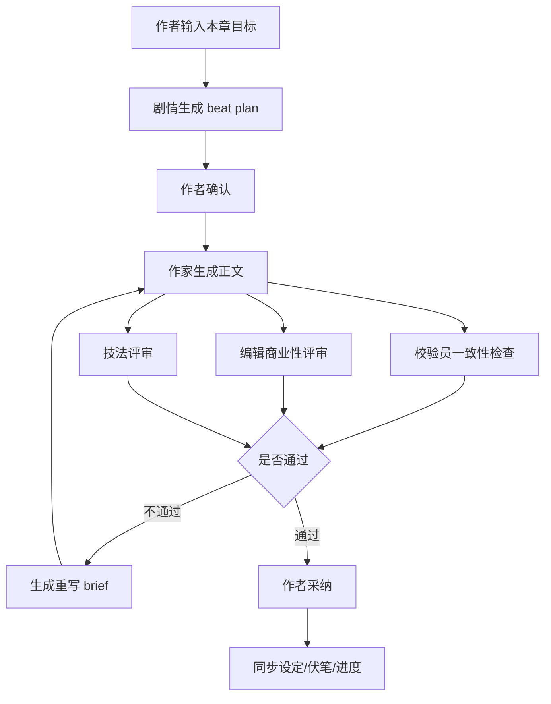

> 状态：历史归档，不作为当前实现依据。当前事实以 `DOCS.md`、`AGENTS.md`、`src/agents/AGENTS.md`、代码和 schema 为准。

# 智能小说写作系统路线图

> 状态：历史路线图，保留用于理解演进背景，不作为当前实现依据。
>
> 当前事实以 `DOCS.md`、`AGENTS.md`、`src/agents/AGENTS.md`、`docs/requirements/03-ai-writing-and-agents.md` 和 `docs/requirements/04-review-quality-and-workflow.md` 为准。
>
> 本文中 v6.0、Phase 1-7 等状态描述已落后于当前 v8.x Agent 架构，不能直接作为开发清单执行。

> 历史记录（2026-06-09）：当时记录为已完成 Phase 1-7 重构，详见 `docs/AGENT_REFACTOR_EXECUTION_PLAN.md`。
> 当时版本记录为 v6.0（AgentDefinition + AgentRunner + 质量检查服务端化 + 写作闭环工作流）。
> 当时遗留问题追踪：`docs/REFACTOR_ISSUES.md`。

本文档记录当前 Agent 系统距离目标产品形态的差距与后续改造顺序。

目标产品不是”让 AI 自动写完整本小说”，而是在作者监督下快速推进正文，同时持续控制 OOC、设定冲突、伏笔遗漏、剧情漂移、商业性不足、文笔流水账等问题。系统必须服务作者的大纲与审美判断，而不是替代作者做不可追溯的决定。

## 一、目标能力拆解

### 1. 作者监督下的快速生产

系统应支持“规划 → 生成 → 审稿 → 修改 → 同步设定 → 继续写作”的闭环。作者始终能看到 Agent 当前状态、调用工具、产生的更新建议，并能确认或拒绝落库。

当前状态（v6.0）：

- 已有写作会话、SSE 状态、流式输出、工具调用状态展示。
- 已有待审核中间层：Agent 生成 `updates` 后先进入 `ReviewArtifact` 草案，支持复审/返工，用户确认后才保存正式库。
- 已有手动”同步设定”入口。
- 已有章节状态：`drafting | review | completed`。
- 已有章节一致性终检队列：章节送审后默认只保留一致性校验；同步设定改为显式动作，商业性和技法问题放回写作草案复审循环。
- ✅ **安全加固**：`/resume` 鉴权 + 任务归属校验 + LLM 直接写库已禁用（Phase 1）。
- ✅ **结构化输出**：Zod Schema 替代手写正则 JSON 解析（Phase 2）。
- ✅ **工具层重构**：22 个 Zod 工具 + 注册表 + 权限模型（Phase 3）。
- ✅ **AgentRunner**：AgentDefinition 声明式配置，消除模板重复（Phase 4）。
- ✅ **执行器拆分**：graph / runtime / SSE / persistence 分层（Phase 5）。
- ✅ **质量检查服务端化**：编辑/校验评分直接落库，不依赖前端 SSE（Phase 6）。
- ✅ **技法评审**：编辑 Agent 已支持 craft 模式，不再只是占位（Phase 7）。
- ✅ **Beat Plan 类型**：`StoryBeat` / `BeatPlan` / `ChapterWritingGoal` 已定义（Phase 7）。
- ✅ **质量门禁**：`evaluateQualityGate()` 支持阈值配置（Phase 7）。
- ✅ **待审核中间层**：`ReviewArtifact` 将 Agent 产物、评审结论、返工 revision 与最终落库解耦，支撑“编辑审核 → 剧情/设定返工 → 再审核 → 用户确认落库”的通用闭环。

主要缺口：

- “每完成 N 章建议同步设定”还没有做成可配置规则；该动作应显式触发并进入待审核草案。
- Beat Plan 的 API 端点未实现（类型已定义，需前端入口）。
- 工作流阶段状态机（`WorkflowStage`）未完整落地到 WritingTask 持久化；当前先由 LangGraph state + `ReviewArtifact` 承接复审循环的业务产物。
- 质量门禁阈值尚未通过 UI 配置（`DEFAULT_QUALITY_GATE` 硬编码）。
- LangGraph `MemorySaver` 仅用于当前进程内 interrupt/resume；当前产品短期不要求停机恢复，暂不规划持久化 checkpointer。

### 1.1 待审核中间层原则

`ReviewArtifact` 是 Agent 写入正式库前的唯一中间产物层，不是某个单独流程的补丁。

- 草案状态只保留 `draft | under_review | awaiting_user | applying | applied`，避免 `discarded/rejected/blocked/superseded` 等异常状态膨胀。
- 用户丢弃草案时硬删除 Artifact、revision 和 evaluation。
- Agent 读取草案必须通过 `get_active_review_artifact` / `get_review_artifact`，或当前 state 的 `artifactReview.activeArtifactId` 上下文（旧 `activeArtifactId` 仅兼容）；草案内容不得默认混入正式小说上下文。
- 生产 Agent 负责提交/修订草案，评审 Agent 负责 `submit_evaluation`，用户负责最终应用或丢弃。
- 正式落库只发生在用户确认应用后，由 `applyReviewArtifact()` 调用正式写入逻辑。

### 2. OOC 与设定冲突控制

系统应区分长期设定、阶段状态、角色经历。不能让最近几章的临时描写覆盖人物核心画像。

当前状态：

- `Character` 已有核心字段、状态字段、实力字段。
- `Character` 已有角色不变量字段：核心欲望、行为边界、说话习惯、关键关系原则、当前短期目标。
- `CharacterExperience` 已可由设定 Agent 写入。
- 校验员可按需读取详情检查正文一致性，并已提示优先引用角色不变量判断 OOC。

主要缺口：

- 缺少更完整的“角色当前状态快照”：所在地、伤势、情绪、关系变化、未解决压力。
- 校验员已有角色不变量提示，但还缺少可保存的 OOC 报告和评分。

### 3. 伏笔与剧情漂移控制

系统应知道大纲目标、当前章节职责、伏笔生命周期、偏离大纲的风险。

当前状态：

- 已有 `OutlineNode`、`Foreshadowing`、`PlotProgress`。
- 剧情顾问可查询大纲和伏笔摘要。

主要缺口：

- `Foreshadowing` 只有活跃/回收/废弃，缺少重要程度、最晚回收区间、关联角色/章节/大纲节点。
- 没有“章节意图”：本章要推进什么矛盾、完成什么信息释放、埋/收哪些伏笔。
- 没有剧情漂移评分：当前生成内容是否偏离本卷主线、本章目标、主角驱动力。

### 4. 网文商业性与读者兴趣

系统应具备“编辑视角”：判断钩子、爽点、期待感、节奏、反转、章节结尾、读者承诺是否成立。

当前状态：

- 已新增 `编辑` Agent，负责商业性、读者兴趣、爽点节奏和章节尾钩评审。
- 作家提示词强调质量与一致性，但没有结构化商业指标。
- 已新增作品圣经，记录题材/频道、目标读者、核心卖点、读者承诺、爽点模型、雷点、对标方向。
- 章节质量检查队列中的“商业性评审”已接入 `@编辑`。

主要缺口：

- 商业性评审应在写作草案复审循环内完成；历史 `ChapterQualityCheck` 评分字段仅兼容旧报告。
- 商业性评审已能给作家返工 brief，但还没有阈值化自动门禁和趋势分析视图。

### 5. 作家技法与反流水账

系统应从“发生了什么”升级为“怎样写才有戏”。它需要检查场景是否有目标、阻力、转折、代价、余波，而不是只按事件流水账推进。

当前状态：

- 作家 Agent 可以生成正文，并接受校验员重写请求。
- 文风画像系统可提供语言风格约束。

主要缺口：

- 没有结构化场景技法清单。
- 没有“场景功能”校验：本场戏是否有冲突、选择、代价、信息变化、人物关系变化。
- 没有“章节节奏图”：铺垫、升级、爆点、余波、钩子的位置与比例。

## 二、推荐改造顺序

### Phase 1：章节完成与质量门禁

目标：让系统知道什么时候该审稿、同步设定、更新伏笔。

建议改动：

1. [已完成] 给 `Chapter` 增加状态字段：`drafting | review | completed`。
2. [已完成] 增加章节完成操作：用户点击“送审”或“标记完成”。
3. [已完成] 增加完成后终检队列：默认只创建一致性终检，报告会保存到检查项。
4. [待完成] 增加显式触发规则：每完成 N 章，建议用户触发“同步设定”；同步设定必须走待审核草案，不作为默认质量检查。
5. [已完成] 保存每章质量报告，避免只在聊天里看一次就丢失。

验收标准：

- 用户完成章节后，前端能看到一致性终检入口。
- 用户可运行、跳过或重置一致性终检。
- 设定同步不作为默认终检项；显式触发时不覆盖核心画像，只更新阶段事实和角色经历。

### Phase 2：作品圣经与角色不变量

目标：让 OOC 判定有明确依据。

建议改动：

1. [已完成] 增加作品级 `WritingBible`，记录题材、频道、目标读者、核心卖点、爽点模型、禁忌雷点。
2. [已完成] 给角色增加或扩展结构化字段：
   - 核心欲望
   - 行为边界
   - 说话习惯
   - 关键关系原则
   - 当前短期目标
3. [已完成] Agent 上下文已注入作品圣经；校验员已提示检查题材定位、读者承诺、爽点模型和雷点。
4. [已完成] 校验员提示词改为先检查角色不变量，再检查普通设定事实；设定 Agent 更新策略要求不因最近章节覆盖长期不变量。

验收标准：

- 校验报告能指出“为什么 OOC”，引用对应角色不变量。
- 近期情绪/伤势不会被当成性格变化写入核心字段；短期目标可以更新，但必须服务长期核心欲望。

### Phase 3：商业性评审 Agent

目标：让系统具备网文编辑视角。

新增 Agent：`编辑`

职责：

- [已完成] 评估章节钩子、爽点、期待感、节奏、冲突密度、尾钩。
- [已完成] 判断读者是否知道主角要什么、阻力是什么、读完有什么情绪收益。
- [已完成] 提供具体改法，不只给抽象评价。
- [已完成] 严重影响追读时通过 `submit_quality_report` 记录返工 brief；需要复审返工的流程由 LangGraph `operationWorkflow` 决定。
- [部分完成] 将评审报告保存为章节质量报告；六项评分、综合分、门禁建议、返工 brief 已结构化保存，问题列表尚未独立结构化。

输出协议：

- 可见评审报告直接输出 Markdown。
- 评分、质量门禁和返工 brief 通过 `submit_quality_report` control tool 提交。
- 严重问题通过结构化质量报告给出返工 brief；自动返工由 LangGraph 审核/返工边驱动。

验收标准：

- [已完成] 每章完成后可从检查队列运行商业性评审。
- [已完成] 评分低、明显影响追读时，能给作家 Agent 一个明确重写 brief。
- [已完成] 评分报告落库，可在章节检查队列中追踪。
- [已完成] 六项评分结构化存储。
- [待完成] 基于结构化评分做阈值化门禁和章节质量趋势分析。

### Phase 4：技法评审与场景结构

目标：降低流水账，提升戏剧性和可读性。

建议新增结构：

- `SceneBeat`：目标、阻力、转折、代价、结果、余波。
- `ChapterBeatPlan`：本章多个场景的功能与节奏位置。

建议改动：

1. 剧情顾问在写作前先生成本章 beat plan。
2. 作家按 beat plan 写正文。
3. 技法评审检查每个场景是否有戏剧动作，不只是事件描述。

验收标准：

- 生成正文前有明确场景计划。
- 评审能指出“这里是流水账，因为没有阻力/转折/代价”。

### Phase 5：伏笔生命周期管理

目标：减少伏笔遗忘和误回收。

建议扩展 `Foreshadowing`：

- `importance`
- `relatedCharacterIds`
- `relatedOutlineNodeIds`
- `latestPayoffChapter`
- `payoffCondition`
- `readerVisible`

建议改动：

1. 剧情顾问每章完成后扫描新增/推进/回收伏笔。
2. 活跃伏笔超过阈值或临近最晚回收章节时，主动提醒。
3. 校验员区分“已回收”“误回收”“回收不足”。

验收标准：

- 系统能列出当前最危险的伏笔。
- 写作前能提醒本章适合回收或推进哪些伏笔。

### Phase 6：监督式工作流编排

目标：把多个 Agent 从“聊天对象”升级为“受控生产流水线”。

建议流程：

验收标准：

- 每个阶段都有状态、报告、可跳过/可确认操作。
- Agent 间调用不是黑箱，用户能看到谁建议调用谁、为什么调用。

## 三、当前最应该做的 5 个改动

按收益和依赖排序：

1. **章节完成状态 + 完成后检查队列**
   已完成基础队列；下一步是保存质量报告和配置自动触发规则。

2. **作品圣经**
   已具备基础存储和上下文注入；编辑 Agent 已基于它做评审，下一步是结构化保存评分。

3. **角色不变量**
   已完成基础字段和校验提示；下一步是保存 OOC 报告和角色状态快照。

4. **编辑 Agent**
   已补齐商业性、节奏、爽点、尾钩判断；下一步是阈值化门禁。

5. **章节 beat plan**
   写作前先规划场景功能，解决流水账和剧情漂移。

## 四、不建议优先做的事

- 不建议继续增加大量“读取全部数据”的工具。当前问题不是资料不够，而是缺少结构化判断标准。
- 不建议让 Agent 自动无确认改库。小说设定是高风险资产，应继续保持用户确认。
- 不建议只靠提示词让作家“写得更好”。商业性、技法、OOC 需要独立评审和可追踪报告。
- 不建议一开始就做全自动写作流水线。应先做“可监督、可跳过、可回滚”的半自动流程。

## 五、下一步实施建议

下一次开发建议从 Phase 1 开始：

1. Prisma 增加章节状态和质量报告模型。
2. 前端编辑器增加“标记完成”按钮。
3. 完成后在写作面板显示检查队列：校验一致性、编辑评审、同步设定。
4. 先复用现有校验员和设定顾问，商业性评审可先以文档和提示词形式准备，再新增 Agent。

## 2026-06-14 补充：ReviewArtifact 生命周期驱动

为避免 Agent 只在正文中承诺“提交复审”但没有实际工具调用，审核循环必须由 `ReviewArtifact` 状态驱动：`under_review + reviewerAgent` 自动路由到 reviewer，`submit_evaluation(pass)` 后才进入 `awaiting_user` 并等待用户确认。这个规则覆盖设定、大纲、伏笔、正文草案和后续可落库产物，不为单一“编辑审大纲”场景写专用流程。
