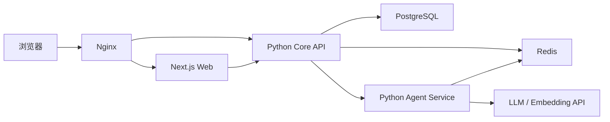

# Python 后端一次性重构规格

## 背景

InkForge 当前把页面、服务器操作、接口路由、Prisma 数据访问、认证计费、文件处理、检索增强生成、LangGraph 编排和智能体运行时全部放在一个 Next.js 进程体系内。用户决定保留 Next.js 作为页面与搜索引擎优化层，将所有业务后端迁移到 Python，并在一次切换中交付生产可用的新架构。

本次重构不是渐进式线上双栈迁移。开发期间允许旧实现作为行为依据存在，但最终发布物必须删除 Next.js 业务后端、Prisma 运行时和 LangGraph.js 主路径。生产部署以单机、单实例、2 核 2 GB、Docker Compose 为第一目标，同时为未来把智能体执行器部署到其他云服务商预留稳定协议。

## 当前项目事实

- 当前前端为 Next.js 16、React 19、TypeScript 严格模式和原生 CSS。
- 当前数据库为 PostgreSQL，权威结构是 `prisma/schema.prisma`，包含 40 个模型和相关 PostgreSQL 枚举。
- `src/app/actions.ts` 暴露 50 个服务器操作，覆盖认证、项目、章节、设定、大纲、参考资料、文风、写作配置、任务和计费。
- `src/app/api/**` 当前包含写作会话、恢复、消息、草案、质量检查、文风分节生成和调试日志等业务路由处理器。
- Next.js 服务器组件当前直接使用 Prisma 读取仪表盘、工作区、文风和计费数据。
- Agent 主路径为 `CreativeOperation -> operationWorkflow -> ReviewArtifact -> 用户确认 -> 正式落库`。
- 智能体运行时使用 OpenAI 兼容工具调用承载控制信息；用户可见内容是自然段文本。
- Agent 产物不能直接写正式小说表，必须通过 ReviewArtifact 审核链路。
- 写作恢复的持久主链路为 `WritingSession -> WritingTask.writingSessionId -> WritingTask.graphStateJson`。
- 当前检索增强生成使用现有 `RagDocument`、`RagChunk` 和 PostgreSQL pgvector，不新增向量数据库。
- 当前认证 Cookie 名为 `inkforge-token`，会话 JWT 使用 HS256，有效期 30 天；密码使用 bcrypt 成本因子 12。
- 当前生产构建可以完成，但构建期间仍会触发 Prisma 数据库读取；Next.js 代码检查当前有 7 个既存 React 规则错误。
- 当前 TypeScript 测试共 371 项，370 项通过；唯一失败是未配置模型密钥时旧智能体运行时没有稳定进入模拟模型提供方。

## 已确认约束

1. 最终采用同域部署：页面请求交给 Next.js，`/api/*` 和 SSE 交给 Python Core API。
2. 采用一次性切换，不把长期 Next/Python 双后端作为交付结果。
3. PostgreSQL 数据库结构不得修改：不得新增、删除、重命名或改变表、列、枚举、索引、约束和扩展。
4. 不执行 Prisma 迁移、Alembic 迁移、`create_all()` 或任何自动数据定义语句。
5. 不批量重写现有业务数据。应用运行产生的正常 CRUD 写入不属于数据迁移。
6. 前后端接口允许重做，以 FastAPI OpenAPI 为唯一公共业务契约。
7. 第一版由两个 Python 单实例组成：Core API 与 Agent Service，运行在同一个 Docker Compose。
8. Agent Service 永远不持有 PostgreSQL 凭据，不直接访问 PostgreSQL。
9. 第一版不实现跨云多实例调度和自动接管，但协议不得依赖同进程调用或共享数据库。
10. 生产服务器为 2 核 2 GB，PostgreSQL、Next、Core API、Agent Service、Redis 和网关运行在同一台机器。
11. Redis 只保存可丢失或可从 PostgreSQL恢复的运行时数据，不成为业务事实源。
12. 禁止静默截断正文、草案、工具结果、Agent 回复、控制事件、日志或持久化数据。

## 目标

- 把全部业务接口、数据库访问、认证授权、计费、文件处理、检索增强生成和后台任务迁入 Python 核心接口服务。
- 把 LangGraph、智能体运行时、智能体定义、工具循环、控制事件和审核返工编排迁入独立 Python 智能体服务。
- 保留 Next.js 页面、SSR/SEO 和现有用户工作流，并用生成的 TypeScript 客户端访问 Core API。
- 保持现有数据库结构和现有业务数据可直接使用。
- 保持 ReviewArtifact、用户确认、资源归属、计费和会话恢复等关键业务规则。
- 让 Next.js 构建和运行不再需要 `DATABASE_URL`、Prisma Client 或服务器模型密钥。
- 用一个生产 Compose 文件完成部署，提供健康检查、网络隔离、持久卷、资源限制、结构化日志、备份和回滚说明。
- 预留未来远程智能体执行器的身份、能力描述、执行协议和事件协议，但不提前实现多云控制面。

## 非目标

- 不重做现有 UI 视觉设计，不增加移动端专项布局。
- 不新增产品功能、计费模式、数据库实体或数据库字段。
- 不把 PostgreSQL 拆成独立数据库服务集群。
- 不引入 Kafka、RabbitMQ、Celery、Kubernetes、Consul、Keycloak、SPIFFE/SPIRE 或服务网格。
- 不在 2 核 2 GB 服务器上运行本地大模型或嵌入模型。
- 不要求第一版在智能体执行器生成到一半时由另一个实例无缝接管。
- 不保留可被新代码调用的 TypeScript 后端兼容层。

## 设计方案

### 1. 仓库结构

```text
inkForge/
├── apps/
│   ├── web/                       # Next.js 页面、React、服务端渲染和搜索引擎优化
│   ├── core-api/                  # FastAPI 业务核心
│   │   ├── src/inkforge_core/
│   │   └── tests/
│   └── agent-service/             # FastAPI 智能体编排服务
│       ├── src/inkforge_agents/
│       └── tests/
├── packages/
│   ├── service-contracts/         # 两个 Python 服务共享的 Pydantic 协议
│   ├── service-auth/              # 两个 Python 服务共享的签名认证与重放保护库
│   └── api-client/                # OpenAPI 生成的 TypeScript 客户端
├── infra/
│   ├── compose.yaml
│   ├── nginx/
│   └── docker/
├── scripts/                       # 数据库结构守卫、生成客户端、切换与验收脚本
├── uploads/                       # 生产命名卷挂载点
├── docs/
├── pyproject.toml                 # uv Python 工作区
├── uv.lock
└── package.json                   # npm 工作区根命令
```

`packages/service-contracts` 只允许放跨服务请求、响应、事件、身份 claims 和版本常量。`packages/service-auth` 只允许放 Ed25519 服务令牌、请求绑定、本地 JWKS 和 Redis 重放保护的无业务通用实现；它是被 Core API 和 Agent Service 共同依赖的 Python 库，不是运行服务，不增加 Docker Compose 进程。不得把 Core repository、ORM model、Agent prompt 或业务 service 放进任一共享包，避免重新形成跨服务源码耦合。

### 2. 运行架构



- Nginx 是唯一暴露端口的容器。
- `/`、页面路由、`/_next/*` 和静态资源转发到 Web。
- `/api/*` 和面向浏览器的 SSE 转发到 Core。
- `/internal/*` 不允许从公网访问。
- Core 和 Agent 通过版本化 HTTP 协议通信，不导入对方源码。
- 智能体服务内置五个智能体执行器；第一版编排器和执行器同进程运行。

### 3. Docker 网络隔离

```text
public_net: nginx, web, core-api
agent_net:  core-api, agent-service, redis
data_net:   core-api, postgres
```

- `data_net` 必须声明为内部网络。
- Agent Service 不加入 `data_net`，也不注入 `DATABASE_URL`。
- PostgreSQL、Redis、Core 和 Agent 端口不映射到宿主公网。
- Web 只得到核心接口服务的内部地址，不得到 PostgreSQL、Redis 或模型密钥。

### 4. Python 技术栈

- Python 3.12。
- FastAPI + Pydantic v2 + pydantic-settings。
- SQLAlchemy 2 异步接口和 asyncpg。
- pgvector SQLAlchemy 类型与参数化 SQL，用于现有向量字段和相似度查询。
- LangGraph Python 和 LangChain OpenAI 兼容适配器。
- httpx 作为服务间和模型外围 HTTP 客户端。
- redis-py 异步接口作为检查点、短期队列、SSE 事件缓冲区、限流和防重放存储。
- PyJWT + cryptography 处理浏览器 HS256 会话与服务 Ed25519 JWT。
- `inkforge-service-auth` 工作区库集中实现服务签名和验证，两个运行服务只保留固定通信方向的装配入口。
- bcrypt 验证现有 bcryptjs 哈希并生成兼容的新哈希。
- structlog 和 orjson 输出结构化 JSON 日志。
- pytest、pytest-asyncio、httpx、respx 和 Playwright 负责测试。
- uv 管理、锁定和构建 Python 依赖。

### 5. Core API 领域边界

Core API 是业务事实、权限和正式写入的唯一所有者，按领域拆分：

| 领域 | 职责 |
| --- | --- |
| auth | 注册、登录、登出、Cookie、当前用户、登录限流 |
| novels | 小说创建、列表、详情、workspace 聚合 |
| chapters | 章节 CRUD、自动保存、状态、章节进展、终检状态 |
| lore | 角色、关系、经历、物品、地点、势力、术语、背景、世界设定、作品圣经 |
| outlines | 文本总纲、三层大纲、章节范围验证、剧情进度、伏笔 |
| references | 参考资料 CRUD、RAG 索引任务和检索数据 |
| styles | 文风、TXT 文件、画像任务状态、画像分节、应用文风 |
| writing | 会话、消息、WritingTask、恢复入口、SSE、状态快照 |
| reviews | ReviewArtifact、revision、evaluation、部分应用和正式写入 |
| billing | 余额预检、模型授权、TokenUsage、CreditLedger、统计 |
| operations | 工作流日志查询、健康、readiness 和受保护调试入口 |

每个领域包含 `router.py`、`schemas.py`、`service.py`、`repository.py`。领域之间只能通过公开服务接口调用；路由层不直接拼接 SQL，仓储层不包含 HTTP 或用户展示逻辑。

### 6. 数据库零变更与兼容映射

- SQLAlchemy 模型必须显式映射现有带引号的 PascalCase 表名、camelCase 列名和 PostgreSQL 枚举名称。
- 所有主键由 Python 应用生成字符串标识，不依赖数据库新增默认值。
- 不提供 Alembic 目录，不在依赖中加入自动迁移启动步骤。
- 应用启动时禁止调用元数据创建或删除操作。
- `scripts/schema_guard.py` 只读查询 `information_schema`、`pg_catalog` 和枚举定义，与仓库内 `schema-contract.json` 比较。
- 数据库结构守卫比较表、列、类型、可空性、默认值、主键、外键、唯一约束、索引、枚举值和向量维度；不一致时就绪检查失败，应用不接收流量。
- Core 数据库用户获得现有表的 SELECT/INSERT/UPDATE/DELETE 和 sequence 使用权，但不得获得 CREATE/ALTER/DROP 权限。
- Agent 数据库用户不存在；Agent 容器没有数据库连接字符串。
- 连接池默认 `pool_size=5`、`max_overflow=0`、`pool_pre_ping=true`，避免耗尽单机 PostgreSQL。
- 现有 JSON 字符串字段继续使用现有序列化格式，不把它们暗中改成 JSONB。
- 现有 `graphStateJson` 在回滚窗口保持旧字段语义兼容，并增加应用层版本 envelope；不修改列类型。

### 7. 浏览器认证与资源授权

- 保留 `inkforge-token` Cookie 名称、HS256、`sub=userId` 和 30 天有效期，确保切换前会话继续有效。
- 生产环境必须显式配置至少 32 个 UTF-8 字节的 `JWT_SECRET`，禁止默认密钥。
- Cookie 在生产设置 `httpOnly=true`、`secure=true`、`sameSite=lax`、`path=/`。
- 核心接口服务只有在直接对端地址命中生产必填的 `TRUSTED_PROXY_CIDRS` 时，才接受只包含一个合法 IP 的 `X-Real-IP`；其他来源、重复头、列表头和无效值一律忽略。
- 登录使用较宽的来源桶和每来源/账号 5 次每分钟桶；注册同时使用每来源 3 次每小时桶和来源/账号桶，两个桶必须在同一次 Redis Lua 调用中原子检查。
- Next.js 代理只做页面访问体验优化；所有接口仍由核心接口服务完整验证 Cookie 和资源归属。
- 注册继续使用当前用户名规则、bcrypt 成本因子 12、1000 积分赠送和 CreditLedger 事务。
- 历史 `Novel.userId = null` 只按现有显式兼容开关处理，默认拒绝。
- 每个 Novel、Chapter、WritingSession、WritingTask、ReviewArtifact、QualityCheck 和消息请求都从数据库重新校验归属，不信任前端传入的关联 ID。

### 8. Core 与 Agent 服务互信

第一版在 Docker 内网使用 HTTP，但应用层从第一天启用非对称服务 JWT：

- Core 接收 Agent 回调的路由固定使用 `/internal/v1/**`，不得挂在 `/api/v1` 公共业务前缀下，也不得进入公开 OpenAPI。
- 生产环境必须通过 `AGENT_SERVICE_CIDRS` 配置允许直连 Core 的智能体服务网段；配置值必须是一个或多个合法 IPv4 或 IPv6 CIDR。
- Core 只使用 ASGI `Request.client.host` 判断直接 TCP 对端地址，不读取或信任 `X-Forwarded-For`、`X-Real-IP` 等转发头。直接对端不在 `AGENT_SERVICE_CIDRS` 内时，即使转发头伪造为允许地址也必须拒绝。
- Core 与 Agent 各有独立 Ed25519 私钥。
- 私钥通过 Docker Secret 注入，公钥以本地 JWKS 文件或受保护的 JWKS 接口提供。
- 令牌包含 `iss`、`sub`、`aud`、`scope`、`task_id`、`run_id`、`novel_id`、`jti`、`iat`、`exp`、`body_sha256` 和 `query_sha256`。
- 令牌有效期 2 分钟，最大不超过 5 分钟。
- Redis 记录已消费的高风险 `jti`，生存时间固定为令牌最大寿命 300 秒。
- 内部写请求携带 `Idempotency-Key`、时间戳和请求体 SHA-256；签名同时绑定 ASGI 提供的原始查询字符串字节，不得在校验前解码或重新编码查询参数。
- 内部回调必须同时通过直接对端网段校验和 Ed25519 服务 JWT 校验；任一校验失败都不得进入业务服务。JWT 仍须绑定请求方法、`/internal/v1/**` 原始路径、原始查询字符串、请求体、权限范围、任务、运行和小说，并继续使用 Redis 防重放。
- 核心接口服务对智能体服务的每次读取和控制事件重新执行任务与小说绑定校验。
- Agent 不接收用户 Cookie、用户 JWT、数据库凭据或 Core 私钥。
- 未来跨云时在现有 HTTP 客户端和服务端适配器外增加 HTTPS、双向传输层安全、远程 JWKS 和密钥轮换，不改变业务载荷。

### 9. Agent Service

Agent Service 拥有以下内容：

- LangGraph 父图和 Operation 子图。
- CreativeOperation 分类、定义和路由。
- 五个智能体的声明式定义、提示词和能力。
- 唯一多轮模型与工具调用循环。
- OpenAI 兼容模型提供方适配、显式模拟模型提供方和用量采集。
- 只读、提案和控制工具注册表及权限过滤。
- 复审智能体并行审核、通过、修改或阻断结论汇总、小修和返工路由。
- Redis 检查点、运行队列、事件序号和人工工作流日志。

Agent Service 不拥有：

- 用户会话和资源归属事实。
- WritingTask、WritingSession、ReviewArtifact 或正式小说表的写入权。
- 计费余额和扣费事务。
- 上传文件的业务元数据。

智能体工具通过核心接口服务的内部工具网关执行。只读工具返回完整结果或显式容量错误；提案工具和控制工具只返回受验证事件，由核心接口服务创建或更新 ReviewArtifact。

### 10. Agent 执行协议与未来扩展

第一版定义协议，但只实现内置适配器：

```text
POST /internal/v1/runs
POST /internal/v1/runs/{runId}/resume
POST /internal/v1/runs/{runId}/cancel
GET  /internal/v1/runs/{runId}/status
```

核心接口服务创建 WritingTask 后提交运行任务。智能体服务返回接受状态并在内部单并发队列执行。智能体事件按小批量回调核心接口服务：

```text
POST /internal/v1/agent-runs/{runId}/events
POST /internal/v1/agent-runs/{runId}/checkpoint
POST /internal/v1/agent-runs/{runId}/complete
POST /internal/v1/agent-runs/{runId}/fail
```

所有事件包含 `protocolVersion`、`runId`、`taskId`、`sequence`、`eventId` 和 `occurredAt`。核心接口服务按 `sequence` 去重，并拒绝乱序越过缺口。

预留 `AgentExecutionPort`：

- `BuiltInAgentExecutor` 第一版在 Agent Service 内运行。
- `RemoteAgentExecutor` 只保留接口和契约测试，不提供生产路由。
- 智能体能力描述包含智能体类型、协议版本、提示词版本、工具能力、模型要求和健康状态。
- 不实现服务发现、租约、隔离令牌、负载均衡或自动故障切换。

### 11. 状态、恢复和 SSE

状态分为三层：

| 状态 | 权威位置 | 恢复规则 |
| --- | --- | --- |
| 用户消息、任务、草案、正式数据 | Core + PostgreSQL | 永久事实 |
| Graph 稳定快照 | `WritingTask.graphStateJson` | 进程重启后的恢复来源 |
| LangGraph 短 checkpoint、运行队列、SSE buffer | Redis | 可丢失、可重建 |
| 当前模型请求和未提交 token | Agent 内存 | 失败后重跑当前 step |

- 智能体服务在操作分类、上下文准备、每个模型轮次、每个工具结果、草案提交、审核结论和中断前后形成检查点。
- 稳定检查点通过签名回调交给核心接口服务，由核心接口服务写入 `graphStateJson`。
- 智能体容器启动时扫描 Redis 待执行任务，并向核心接口服务查询任务当前状态后决定恢复或取消。
- 核心接口服务定时对账 PostgreSQL 中的非终态 WritingTask 与智能体运行状态；Redis 队列消息被淘汰或丢失时，核心接口服务使用同一运行任务和业务任务幂等键重新提交，不依赖 Redis 持久化保证任务存在。
- 核心接口服务的浏览器 SSE 接口是唯一前端事件源，支持 `Last-Event-ID`。
- Redis Stream 保存短期事件，关键终态同时写入现有任务、消息或草案数据。
- 第一版单实例故障时允许短暂停顿和当前未提交段落重跑，不声称无感接管。
- SSE 保持现有事件名称和用户语义；新增信封、序号、心跳和重放字段。

### 12. 计费协议

- 模型调用前，智能体服务使用运行权限向核心接口服务请求计费授权。
- 核心接口服务校验用户、任务、余额和提示词估算，返回 `requestId`、允许的模型和 `maxOutputTokens`。
- 智能体服务只能在授权有效期内发起一次模型调用。
- 模型完成后智能体服务上报实际用量；核心接口服务在事务中扣减余额、写 CreditLedger 和 TokenUsage。
- Core 使用 PostgreSQL advisory lock 锁定 `requestId`，并查询现有 CreditLedger，避免重试重复扣费，不新增唯一索引。
- 模型调用失败且未产生用量时不扣费；出现部分用量时按供应商实际用量记录。
- 模拟模型提供方永远不产生真实扣费。

### 13. 文件与 RAG

- `uploads` 使用 Docker 命名卷，同时挂载到核心接口服务的固定路径 `/data/uploads`。
- 现有 Windows 绝对路径不批量改写；核心接口服务的存储解析器识别 `uploads/styles/...` 后缀并映射到 `/data/uploads`。
- 新文件保存稳定的相对存储键，并在现有 `filepath` 字段中保持旧应用回滚期可解析的固定容器路径。
- 文件名必须净化并阻止路径穿越；只允许 TXT，空文件拒绝，50 MB 上限保持不变。
- 检索增强生成继续使用现有 pgvector 表和嵌入接口，不引入新存储。
- 嵌入任务进入智能体服务的单并发运行队列，但检索增强生成元数据和向量写入由核心接口服务完成。
- 未配置嵌入服务时参考资料仍正常保存，索引状态为 `disabled`。
- 分块不得丢字；长文本不静默裁剪。

### 14. 公共 API 与生成客户端

公共 API 统一位于 `/api/v1`：

| API 域 | 主要路径 |
| --- | --- |
| auth | `/auth/register`、`/auth/login`、`/auth/logout`、`/auth/me` |
| dashboard | `/dashboard` |
| novels | `/novels`、`/novels/{novelId}`、`/novels/{novelId}/workspace` |
| chapters | `/novels/{novelId}/chapters`、`/chapters/{chapterId}`、`/chapters/{chapterId}/status` |
| lore | `/novels/{novelId}/characters|relations|experiences|items|locations|factions|glossary` |
| project text | `/novels/{novelId}/story-background|world-setting|writing-bible|story-progress|plot-progress` |
| outlines | `/novels/{novelId}/outline`、`/novels/{novelId}/outline-nodes` |
| references | `/novels/{novelId}/references`、`/references/{id}/reindex` |
| styles | `/styles`、`/styles/{id}/references`、`/styles/{id}/portrait`、`/portrait-tasks/{id}` |
| writing | `/writing/sessions`、`/writing/sessions/{id}`、`/writing/runs`、`/writing/runs/{id}/resume` |
| artifacts | `/writing/tasks/{id}/artifact`、`/review-artifacts/{id}`、`/review-artifacts/{id}/decision` |
| quality | `/quality-checks/{id}`、`/quality-checks/{id}/run` |
| billing | `/billing/summary`、`/billing/usage` |
| operations | `/health/live`、`/health/ready`、`/debug/workflow-runs` |

- 错误统一为 `{ code, message, details, requestId }`，用户消息使用中文。
- 输入使用 Pydantic 严格校验，禁止未声明字段进入业务层。
- OpenAPI 文档是前端契约源，生成物放入 `packages/api-client`。
- 持续集成必须验证生成客户端无漂移。
- 浏览器同域访问，不启用宽泛 CORS。
- 所有更新使用明确 HTTP 方法和状态码；不使用服务器操作返回值作为隐式协议。

### 15. Next.js 前端边界

- 页面、React 组件、CSS、搜索引擎优化元数据、`robots` 和站点地图保留在 `apps/web`。
- 服务器组件可以通过受控服务端请求调用核心接口服务，但不能访问数据库、Redis、文件系统、模型或智能体服务。
- 浏览器交互统一使用生成的接口客户端；SSE 使用单独的类型化事件客户端。
- 删除 `"use server"` 业务文件和 `src/app/api/**` 业务路由处理器。
- Next.js 中间件或代理只做页面重定向体验；接口权限以核心接口服务为准。
- 仪表盘、工作区、文风和计费数据改为核心接口服务聚合接口。
- 自动保存 1.2 秒、字数统计、普通段落渲染和现有审核交互保持不变。
- 修复现有 7 个代码检查错误，最终 `npm run lint` 必须零错误。
- Next.js 构建在未配置 `DATABASE_URL`、模型密钥和 Redis 地址时仍可完成。

### 16. 后台任务

- 不引入 Celery。
- 智能体服务在单个 Uvicorn 执行进程的生命周期中运行一个基于 Redis 的单并发消费者。
- 队列消息只保存运行任务和业务任务标识及最小元数据，执行前从核心接口服务拉取当前权威上下文。
- 任务使用可见性超时和显式确认；进程退出前停止领取新任务。
- 核心接口服务的任务对账器持续补投“数据库非终态但智能体服务或 Redis 无活动记录”的任务，确保关闭 AOF 和键淘汰不会造成永久任务丢失。
- 画像、检索增强生成嵌入和写作工作流共享单并发预算，但使用不同优先级：用户交互写作高于画像和重建索引。
- Core 不使用 FastAPI `BackgroundTasks` 承担必须恢复的任务。

### 17. 日志与可观测性

- 所有容器输出 JSON 日志到 stdout，包含 timestamp、level、service、requestId、taskId、runId、userId、durationMs 和 error code。
- 不记录密码、Cookie、JWT、模型密钥、服务私钥和完整 Authorization header。
- 智能体人工工作流日志保持当前“请求和响应加中文状态切换”的阅读面，路径位于智能体日志卷。
- 核心接口服务鉴权后通过智能体内部调试接口查询日志，不依赖共享宿主文件路径。
- 机器 JSONL 默认关闭，显式环境变量开启。
- `/health/live` 只判断进程存活；`/health/ready` 检查数据库结构守卫、数据库、Redis 和下游智能体服务状态。
- Nginx 透传 `X-Request-ID`，服务缺失时生成并在响应返回。
- LangSmith 保持可选，未配置时不得影响启动或测试。

### 18. 安全基线

- 容器使用非根用户，生产镜像不包含编译器、测试数据和源码挂载。
- 除上传卷和日志卷外文件系统尽可能只读。
- 密钥通过 Docker Secret 或只读密钥文件注入，不写入镜像和日志。
- Nginx 设置请求体上限、超时、安全响应头和 SSE 禁用缓冲。
- 登录、注册、模型启动和调试接口使用 Redis 限流。
- 内部接口同时验证直接 TCP 对端网络来源和服务 JWT，不能只依赖 Docker 网络，也不能信任转发头替代直接对端；Nginx 必须阻断公网 `/internal/`。
- 所有文件路径通过 storage root 解析，拒绝 `..`、绝对路径注入和符号链接逃逸。
- 外部 URL 和模型 base URL 只能来自受信配置，不接受用户直接传入，避免 SSRF。

### 19. 单机资源预算

初始 Compose 硬限制：

| 服务 | 内存上限 | 进程策略 |
| --- | ---: | --- |
| nginx | 32 MB | 1 worker |
| web | 320 MB | Node heap 256 MB |
| core-api | 224 MB | Uvicorn 1 worker |
| agent-service | 384 MB | Uvicorn 1 worker + 单并发 consumer |
| redis | 64 MB | `allkeys-lru`，无 AOF |
| postgres | 384 MB | max connections 20，shared buffers 96 MB |

- 总容器硬限制约 1.4 GB，为宿主系统和 Docker 保留余量。
- 生产镜像在 CI 或开发机预构建，2 GB 服务器只拉取镜像，不执行 Next/Python 依赖构建。
- 不在 Agent 进程内加载本地模型。
- 达到内存限制时健康检查必须暴露失败，不能靠无限扩大 swap 掩盖问题。

### 20. 一次性切换与回滚

开发在独立分支完成，正式切换按以下顺序：

1. 构建并签名所有镜像，在预发布环境使用生产数据脱敏副本演练。
2. 冻结旧应用写入。
3. 备份 PostgreSQL 和 uploads，记录备份校验和。
4. 对生产数据库运行只读数据库结构守卫，确认与仓库契约完全一致。
5. 停止旧 Next.js 全栈容器，使用现有 PostgreSQL 数据卷启动新编排；PostgreSQL 容器不得挂载初始化 SQL，不得执行数据库结构初始化。
6. 运行只读冒烟验证、事务回滚写入冒烟验证、认证、智能体模拟模型提供方和 SSE 冒烟验证。
7. 开放流量并观察错误率、内存、数据库连接和任务恢复。
8. 稳定窗口结束后归档旧部署镜像和 TypeScript 后端代码历史。

回滚要求：

- 因为没有数据库结构迁移，旧应用可以重新连接同一数据库。
- Python 写入的 ID、bcrypt、Cookie、ReviewArtifact payload 和 `graphStateJson` 在回滚窗口保持旧格式兼容。
- uploads 在新旧容器中挂载到相同逻辑路径。
- 回滚前停止新写入并备份；回滚不执行反向数据库迁移。

## 影响范围

### 新增

- `apps/core-api/**`
- `apps/agent-service/**`
- `packages/service-contracts/**`
- `packages/service-auth/**`
- `packages/api-client/**`
- `infra/**`
- `scripts/schema_guard.py` 及部署验收脚本
- 根 Python workspace、锁文件和统一开发命令

### 迁移

- 当前 Next 页面和组件迁入 `apps/web/**`
- `src/app/actions.ts` 全部功能迁入核心接口服务
- `src/app/api/**` 全部业务路由处理器迁入核心接口服务
- `src/shared/lib/auth.ts`、`billing.ts`、`rag-service.ts`、`context-aggregator.ts` 等服务器能力迁入 Python
- `src/agents/**` 的当前权威行为迁入智能体服务或核心接口服务的复审与工具网关
- `src/shared/contracts/**` 的前端所需契约改由 OpenAPI 和类型化 SSE 客户端提供

### 删除

- Next.js 业务服务器操作
- Next.js 业务路由处理器
- TypeScript Prisma 客户端、Prisma 运行时和应用启动生成依赖
- LangGraph.js、LangChain.js、OpenAI Node SDK 的服务器主路径
- TypeScript 智能体运行时、工具执行、数据库操作和检查点实现
- Next 对 PostgreSQL、Redis、上传目录和工作流日志的直接访问

### 文档同步

- 根 `AGENTS.md`
- `DOCS.md` 当前项目事实
- `src/agents/AGENTS.md` 迁移为 Agent Service 权威文档或归档旧路径
- `docs/requirements/00-05*.md`
- `docs/LANGGRAPH_STUDIO.md`
- `docs/WORKFLOW_EVENT_LOG_FORMAT.md`
- `README.md` 和环境变量示例

## 验收标准

### 架构与删除证明

- 仓库只存在两个 Python 应用服务：Core API 与 Agent Service。
- `rg` 证明 Next 源码中不存在 Prisma import、数据库连接、模型调用、Agent Runtime 和业务 `"use server"`。
- Next.js 的 `src/app/api` 不包含业务路由处理器；如保留健康或框架专用入口，必须不含业务逻辑。
- 智能体服务容器没有 `DATABASE_URL`、不在 `data_net`，代码依赖中不存在核心接口服务的对象关系映射或仓储导入。
- TypeScript 运行依赖不再包含 Prisma Client、LangGraph.js、LangChain.js 和服务器 OpenAI SDK。

### 数据库

- 切换前后数据库结构守卫输出完全相同的结构指纹。
- 没有新增迁移文件，没有运行数据定义语句，没有批量改写现有数据。
- Python 可以读取现有全部核心表、现有枚举、大整数、日期时间、JSON 字符串和 pgvector。
- 现有用户、小说、章节、设定、大纲、会话、任务、草案、积分和 RAG 数据可正常读取。

### 功能

- 当前 requirements 00-05 的每项现有功能都有对应 Core API、前端入口和测试。
- 50 个旧服务器操作和全部旧接口方法都有迁移映射，不存在未分类入口。
- 注册、登录、登出和切换前 Cookie 兼容通过。
- 项目、章节、设定、大纲、参考资料、文风、画像、质量检查和计费流程通过。
- CreativeOperation、五个 Agent、工具权限、ReviewArtifact、复审返工、用户确认和正式应用通过。
- 会话刷新、容器重启、Redis 短期状态丢失后可以从 `graphStateJson` 恢复稳定任务状态。
- 所有越权和未登录测试返回稳定错误，Agent 无法绕过 Core 正式写库。
- 不发生未经用户明确许可的信息截断。

### 契约与测试

- Python 单元测试、服务间契约测试、数据库集成测试、Redis 恢复测试全部通过。
- OpenAPI 生成客户端无漂移，TypeScript 类型检查通过。
- Next.js 代码检查零错误，生产构建不需要数据库或模型环境变量。
- Playwright 覆盖注册登录、创建小说、章节自动保存、设定/大纲操作、写作会话、草案应用和质量检查主流程。
- Docker Compose 健康检查全部正常；重启核心接口服务、智能体服务和 Redis 后执行恢复测试通过。
- 模拟模型提供方能完成智能体全流程且不访问外网、不扣费。
- 真实模型提供方冒烟验证只在显式提供测试密钥时运行。

### 生产与资源

- Compose 仅暴露 Nginx 端口，内部服务网络隔离符合设计。
- 容器使用非根用户、密钥不进入镜像或日志、上传卷和数据库卷可备份恢复。
- 在 2 核 2 GB Linux 环境的 30 分钟主流程稳定性压测中无内存溢出、无连接泄漏、无任务丢失。
- 第 95 百分位普通增删改查响应、SSE 首事件、智能体任务接受延迟在验收报告中记录；不以语言迁移本身推断性能提升。
- 切换演练和回滚演练都使用实际脚本完成并保留校验输出。

## 文档生命周期

本规格在 Python 后端重构完成并通过全部验收前保持有效。完成后，已落地的事实迁入 `AGENTS.md`、`DOCS.md`、`docs/requirements/**` 和智能体服务架构文档；本文件保留为重构设计历史，不继续作为运行时事实的唯一来源。
