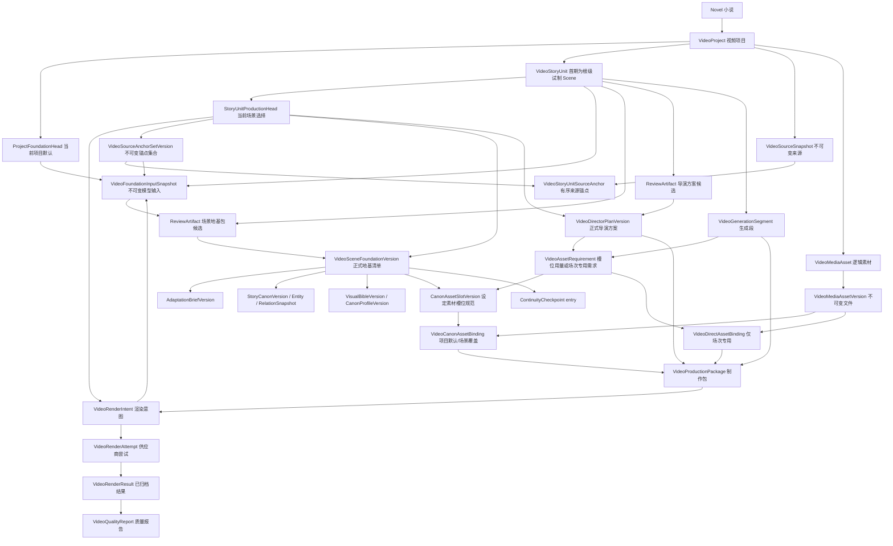
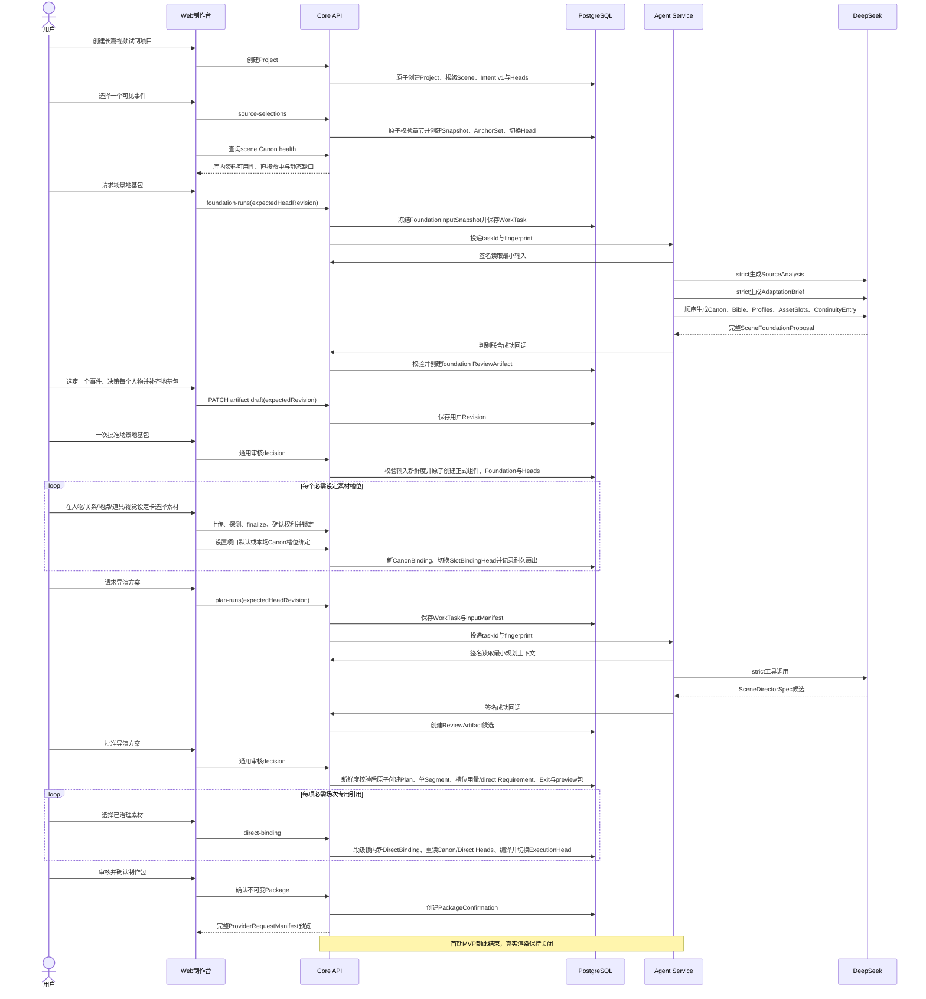

# InkForge 长篇小说视频制作系统详细设计

状态：目标 v2 详细设计，v2 数据库迁移和业务重构尚未执行；当前视频 v1 仅获准作为
`novelwriterdev` 开发预览控制面，生产与 v2 schema 治理前置条件仍未满足

日期：2026-08-08

产品范围：仅支持 `long_serial`；首期交付为根级试制 Scene → 单个约 15 秒 GenerationSegment

上位规格：`2026-08-08-novel-to-video-product-architecture.md`

历史供应商研究：`2026-08-07-novel-multimodal-video-production-system.md`（不作为产品范围、schema 或迁移依据）

## 1. 本设计解决什么

本设计把产品总方案落到可以直接实施的四类契约：

1. PostgreSQL 领域对象、关系、约束与版本策略；
2. Core、Agent、Web 和供应商适配器的接口边界；
3. PC 制作台的信息架构、关键交互和状态文案；
4. 从当前视频原型迁移到目标架构的实施顺序与验收矩阵。

本阶段不实施目标 v2 业务重构，也不执行 v2 数据库 DDL；现有视频业务只允许按第 11.0 节加固具名的
`novelwriterdev` v1 开发预览切片，第 11 节其余内容说明如何从该原型迁移到目标架构。

## 2. 已锁定的设计决策

### 2.1 永久只支持长篇

视频产品所有版本都只接受 `long_serial`，因为长篇工作区已有章节、人物、关系、地点、物品、世界设定、
结构化大纲和 Beat Plan 等上游事实。中短篇不保留入口、适配器、兼容契约或未来路线图；Web 不显示入口，
Core 对绕过界面的请求稳定返回 `VIDEO_LONG_SERIAL_REQUIRED`。正式视频版本不实时读取长篇写作行；typed
source link 只属于导入与追溯层。现有事实必须经过显式导入、补全、ReviewArtifact 审核并冻结为视频 Canon。

截至本设计日期，开发库现有 long_serial 样本本身并没有可用于验收的完整人物、关系、地点和道具数据。
因此长篇视频产品必须配套一份可重复初始化的长篇验收基线；单纯把当前项目切换为 long_serial 不会自动
补齐 Canon。

### 2.2 首个交付单元

首期试制能力固定为一个根级 Scene、严格一个 4～15 秒 `GenerationSegment`，默认约 15 秒，只包含一个
可见事件、2～4 个连续镜头节拍以及 3～6 项必要素材需求。4～30 秒和多 Segment 是底层 Provider 能力，
不等于首期产品立即开放的范围。

### 2.3 场景与生成段分离

`VideoStoryUnit(kind=scene)` 是叙事和审核单位，可以包含多个生成段；`VideoGenerationSegment` 是一次
供应商调用单位。当前原型把两者混在一起，导致场景时长、镜头计划、供应商任务和提示词共用同一行。

### 2.4 正式版本不可覆盖

导演方案和制作包采用不可变版本。`VideoStoryUnitProductionHead.currentDirectorPlanVersionId` 只指向当前
正式版本；修改候选保存在 ReviewArtifact，用户批准后才创建新正式版本并切换 head。供应商任务永远
引用一个确定的制作包版本。

### 2.5 素材属于视频设定，导演方案只消费设定

人物、关系、地点、道具、声音和项目风格先在已审核的视频设定中形成原子 `VideoCanonAssetSlotVersion`；
用户上传或生成 `VideoMediaAssetVersion` 后，在项目或场景作用域显式建立版本化槽位绑定。导演方案中的
identity、costume、location、prop、voice、style 需求只能引用这些槽位，不允许再拥有第二套需求级绑定。
只有动作、特效、运镜、音乐和临时故事板等一次性场次引用使用 direct requirement binding。实体名称、
文件名或自然语言相似度只能用于推荐，不能自动成为正式绑定。

### 2.6 状态分轴，投影必须可重建

前端需要 Canon/视觉地基、导演方案、素材、制作包、渲染、质检六条状态轴；数据库不创建六个相互独立、
可随意更新的状态真相。Core 根据各领域对象的权威状态聚合 `VideoSegmentReadiness`；列表投影必须由纯函数
维护并可从事实重建，防止不一致。

### 2.7 供应商中立，首适配 Seedance 2.5

导演方案、素材需求和连续性不出现方舟请求字段。`ProductionPackage` 包含供应商中立部分和经过能力档案
确认的输出规格；Seedance Adapter 确定性构造可审核的 `content[]`/顶层参数 Manifest，真实提交时才注入短时 URL。

### 2.8 场景地基一次审核、正式对象分离

首期用户只审核一个 `SceneFoundationProposal`。其内部依赖 DAG 固定为：

```text
Project + Scene + ProductionIntentVersion + FoundationInputSnapshot
→ SourceAnalysis
→ AdaptationBrief
→ StoryCanon
→ VisualBible
→ CanonProfile
→ CanonAssetSlot
→ ContinuityEntry
```

地基 DAG 在 ContinuityEntry 结束；导演方案不属于 SceneFoundationProposal。用户批准地基后才进入第二条、
独立审核链：

```text
SceneFoundationVersion
→ video_scene_plan ReviewArtifact
→ VideoDirectorPlanVersion
```

Agent 可按顺序执行多个 strict 结构调用，但在用户面前聚合为一个可展开、可结构化修订的地基包候选。
批准时 Core 在同一事务中创建彼此独立的正式版本并切换对应 head；聚合审核不等于把领域对象重新塞回
一个大 JSON 真相。

## 3. 领域层级与所有权



所有视频对象最终都必须能通过 `VideoProject.novelId` 追溯到当前用户。浏览器提交的任何 project、story unit、
segment、requirement、asset 或 package ID 都必须在 Core 内重新执行同小说归属校验。

## 4. 目标数据模型

### 4.1 VideoProject

保留现有表作为项目根，补齐产品设置，不在该表保存具体场景状态。

| 字段 | 类型 | 说明 |
| --- | --- | --- |
| `id` | text PK | 项目 ID |
| `novelId` | text FK | 所属小说 |
| `sourceNovelProfile` | text nullable | production_v2 固定 `long_serial`；legacy_v1 固定为空 |
| `title` | text | 项目标题 |
| `outputMode` | enum/text | 首期 `highlight`、`trailer`、`clip`；`episode`、`series` 仅保留枚举，不开放选择 |
| `targetAspectRatio` | text | 项目默认画幅 |
| `targetLanguage` | text | 默认语言 |
| `defaultSegmentSeconds` | integer | 项目默认生成段时长；`pilot_v1` 创建项目时限制 4～15 |
| `providerPreference` | text | 默认 `seedance_2_5`，不是强绑定 |
| `architectureGeneration` | text | 不可变 `legacy_v1` 或 `production_v2` |
| `accessMode` | text | `read_write` 或 `read_only`；旧原型回填只读 |
| `status` | text | `draft`、`active`、`archived` |
| `revision` | integer | 项目设置并发控制 |
| `createdAt/updatedAt/deletedAt` | timestamp | 生命周期 |

VideoProject 不保存可切换的篇幅模式；Core 创建前锁定 Novel 并验证 profile=`long_serial`，浏览器不能提交或
伪造 narrativeMode。数据库为 Novel 建立 `(id, profile)` 唯一键，并使用条件约束：
`architectureGeneration='production_v2' => sourceNovelProfile='long_serial'`，
`architectureGeneration='legacy_v1' => sourceNovelProfile IS NULL AND accessMode='read_only'`；非空的
`(novelId, sourceNovelProfile)` 再组合外键到 Novel。这样旧 short_medium 只读行能留到清理迁移，但任何新
生产项目仍不可绕过长篇限制；存在 production_v2 项目时修改 Novel.profile 会被外键稳定阻断。
`providerPreference` 只表示首选适配器，不能用来推断当前账号已经配置或可以渲染。
新 v2 项目固定为 production_v2/read_write。迁移只将旧项目回填为 legacy_v1/read_only + archived；
工作台按这两个真实字段过滤，不使用一个数据模型中不存在的“legacy_read_only 状态”。

### 4.2 正式版本 Head 与场景地基清单

正式版本内容行只增不改；“当前使用哪个版本”统一由小型 head 表表达，并用 revision 做 CAS：

- `VideoProjectFoundationHead`：projectId、currentAdaptationBriefVersionId、currentStoryCanonVersionId、
  currentVisualBibleVersionId、revision；表示项目默认地基，不强迫已有场景自动跟随；
- `VideoStoryUnitProductionHead`：storyUnitId、currentSourceAnchorSetVersionId、currentFoundationVersionId、
  currentProductionIntentVersionId、currentDirectorPlanVersionId、productionHold、revision；表示本场明确选择；
- `VideoCanonProfileHead`：canonEntityId、profileKind、scopeKind、scopeStoryUnitId、规范化 scopeKey、
  currentProfileVersionId、revision；同一实体、职责和作用域唯一；
- `VideoMediaAssetHead`：mediaAssetId、currentVersionId(nullable)、revision；
- `VideoCanonAssetBindingHead`：slotId、slotSpecHash、scopeKind、scopeStoryUnitId、规范化 scopeKey、
  currentBindingId(nullable)、revision；同一槽位的不同规范兼容键可并存，项目默认与场景覆盖分别唯一；
- `VideoDirectAssetBindingHead`：仅为 resolutionKind=direct 的 requirement 保存 currentBindingId(nullable)、revision；
- `VideoSegmentExecutionHead`：segmentId、currentPackageId(nullable)、revision。

`VideoSceneFoundationVersion` 是一次地基包批准产生的不可变清单，保存 storyUnitId、
productionIntentVersionId、sourceAnchorSetVersionId、foundationInputSnapshotId、adaptationBriefVersionId、
sourceAnalysisJson、sourceAnalysisHash、storyCanonVersionId、visualBibleVersionId、
continuityEntryCheckpointId、publishAsProjectDefault、publishedProjectFoundationRevision(nullable)、
inputFingerprint、contentHash、reviewArtifactId 和 createdAt。多个 Profile 通过
`VideoSceneFoundationProfileRef(foundationVersionId, profileVersionId, ordinal)` 建立显式外键与稳定顺序，
不把 ID 数组当作唯一关系真相。多个已审核槽位版本通过
`VideoSceneFoundationAssetSlotRef(foundationVersionId, slotId, slotVersionId, ordinal)` 锁定本场可被导演方案引用的
具体设定素材规范。
DirectorPlan 只接受一个当前 SceneFoundationVersion，既避免“到底哪个 Profile 当前有效”的歧义，也让
一次聚合审核仍能追溯到分离的正式版本。

SceneFoundationVersion.reviewArtifactId 唯一；组件版本的 originReviewArtifactId 允许相同，因为同一个聚合
审核会原子产生多类正式组件。

Head 是唯一允许原子切换当前指针的地方；历史版本是否被取代由 head 和依赖关系推导，版本行不保存
`isCurrent`、`supersededAt` 或可变 `stale` 状态。

首个地基包可在 ProjectFoundationHead 为空时建立项目默认值；后续场景默认只更新自己的
StoryUnitProductionHead。只有候选明确标记 publishAsProjectDefault 且用户在审核中确认，才允许切换项目
默认 Brief/Canon/VisualBible，避免一个试制场景悄悄改写全项目风格。
ProjectFoundationHead 为空时，`publishAsProjectDefault` 在候选中保持未选择，Agent 不得代填 true；用户必须
在“项目视频设定基线”分区查看完整差异并明确选择 true 后，地基才可批准。选择 false 只能保存草稿，不能
让项目在没有正式基线时继续生成导演方案。后续场景默认为 false。该决定及理由属于 ReviewArtifact
payload/contentHash，不是审核外的普通设置开关。

#### VideoSceneProductionIntentVersion

场景生产意图是导演地基之前必须稳定的输入，不能等到 `plan-runs` 时由浏览器再传一套参数。
`VideoSceneProductionIntentVersion` 保存 id、storyUnitId、versionNo、productCapabilityProfile（首期固定
`pilot_v1`）、durationSeconds、ratio、outputMode、targetLanguage、adaptationScale、contentHash、
createdByUserId 和 createdAt。首期 durationSeconds 只允许 4～15，outputMode 只允许 highlight、
trailer 或 clip。

创建项目时，Core 在同一事务中创建根级 Scene、Intent v1 和 ProductionHead。修改时长、画幅、
输出形态或语言会创建 Intent vN 并以 CAS 切换 head；旧来源锚点本身仍可阅读，但必须重新
进行适配分析、生成新 Foundation，随后才能生成新 Plan。旧 Foundation、Plan 和 Package 仍引用旧
Intent，不被原地改写。项目默认设置变化不会自动改变已存在 Scene 的当前 Intent。

### 4.3 长篇视频 Canon 与视觉地基

现有 Character、CharacterRelation、Location、Item、Faction、WorldSetting 和大纲是“文学事实来源”，不是
可直接渲染的视频 Canon。第一期新增以下正式版本对象。

#### VideoStoryCanonVersion

保存视频项目截至该版本已经确认的完整文学事实与关系子图：id、projectId、versionNo、sourceFactsJson、
snapshotJson、contentHash、originReviewArtifactId、basedOnVersionId、createdAt。第一版只纳入首场相关的 1～3 个
人物、0～3 条关系、1 个地点和少量关键道具；后续版本在此基础上增加或修订项目 Canon，但不批量快照
尚未进入制作范围的整本小说资料。
当 ProjectFoundationHead 已有当前 StoryCanonVersion 时，新地基候选必须明确以该基线版本为 basedOn；
Agent 可在审核界面中只展示本场增量/修订差异，但 Core 批准时必须确定性合并基线与差异，产生一份
可独立重建的完整新 StoryCanonVersion。这样上一场由用户补齐、但原小说中没有的 Canon 不会在下一场丢失。

`snapshotJson` 是用于审核、哈希和完整历史重建的规范聚合；下述成员与关系表是带外键的查询投影。批准
事务必须从同一规范候选同时生成两者并校验 contentHash，禁止两套内容分别编辑。

#### VideoCanonEntity、VideoStoryCanonEntitySnapshot、VideoCanonRelationIdentity 与关系快照

`VideoCanonEntity` 是视频项目中的稳定人物、地点、道具或势力，保存 projectId、kind、name、
sourceCharacterId、sourceLocationId、sourceItemId、sourceFactionId 和生命周期。四个来源 FK exactly-one，
并按 kind 强制 character/location/item/faction 对应字段；组合归属外键确保来源实体属于 Project.novelId，
同一来源实体在同一视频项目内唯一。它只表达跨版本稳定身份，不保存会变化的外貌、服装或场景状态，
也不存在一个可以漏建的可选 SourceLink 子行。

首期所有主要出镜人物、主地点和关键道具必须分别链接已有 Character、Location 和 Item；被导演方案激活的
重要人物关系必须通过 VideoCanonRelationIdentity 链接已有 CharacterRelation。WorldSetting、原文选区等
非实体证据保存在 sourceEvidenceJson。禁止使用无法建立外键的 sourceEntityType/sourceEntityId 多态自由 ID。

如果 SourceAnalysis 发现主要人物、主地点、关键道具或重要关系尚未进入长篇资料库，地基返回
`VIDEO_SOURCE_SETTING_REQUIRED`，用户必须回创作资料库补建后重新冻结输入。未命名群众或明确
background/off_screen/omitted 的次要对象可以只保留原文证据，但不创建 CanonEntity，也不获得身份素材槽位。

`VideoStoryCanonEntitySnapshot` 是 StoryCanonVersion 与 CanonEntity 的不可变成员表，保存 entityId、
factJson、sourceEvidenceJson、ordinal 和在当前作用域的叙事职责。这样既能用外键约束人物关系和素材目标，
也能完整重建某个历史 Canon；不得只在 CanonEntity 当前行上覆盖事实。

`VideoCanonRelationIdentity` 是跨 StoryCanon 版本稳定的关系身份，保存 projectId、fromEntityId、
toEntityId 和非空 sourceCharacterRelationId；同一来源关系在项目内唯一。`VideoStoryCanonRelationSnapshot`
属于一个 StoryCanonVersion，引用 RelationIdentity，保存关系类型、方向、称谓、亲密/冲突描述、故事时间
有效范围、双方已知的信息、禁止提前披露的信息、可选 applicableStoryUnitId 与 sourceEvidenceJson。
这样关系互动素材可以稳定挂在 RelationIdentity 上，而每个 Canon 版本仍保留当时的关系事实；重要关系
不允许只靠自由文本临时建立。

#### VideoVisualBibleVersion 与 VideoCanonProfileVersion

`VideoVisualBibleVersion` 保存项目级美术、摄影、色彩、材质、剪辑、声音和禁止项，字段包括 projectId、
versionNo、specJson、contentHash、originReviewArtifactId 和 createdAt。

`VideoCanonProfileVersion` 保存一个 CanonEntity 的银幕形象版本，字段包括 canonEntityId、profileKind、
scopeKind、可空 scopeStoryUnitId、storyCanonVersionId、visualBibleVersionId、versionNo、basedOnVersionId、
specJson、contentHash、originReviewArtifactId 和 createdAt；scopeKind 为 project 或 story_unit，项目基线可被
明确的 Scene/Episode 作用域覆盖，首期只使用 project 与根级试制 Scene：

- 人物：脸与骨相、年龄感、身高体型、基础服装、阶段服装、发型妆容、表演范围、音色和说话方式；
- 地点：空间布局、方位、建筑材质、时间/天气/光源版本、允许与禁止元素；
- 道具：形状、比例、材质以及完整、破损、染血等状态版本。

首版 profileKind 固定为 character_identity、character_costume、character_voice、location_layout、
location_look 和 prop_look；伤势、污渍、持有物、天气等逐场变化归 ContinuityCheckpoint，不在基线 Profile
上反复覆盖。

MediaAssetVersion 是证明和锁定这些规范的具体参考文件，不等同于 CanonProfile。

#### VideoCanonAssetSlot 与 VideoCanonAssetSlotVersion

`VideoCanonAssetSlot` 是长篇视频设定中的稳定素材职责，不保存当前文件。它保存 id、projectId、
ownerKind(canon_entity/canon_relation/visual_bible)、可空 canonEntityId、可空 canonRelationIdentityId、
规范化 ownerScopeKey、slotKey、modality、duty、lifecycleStatus 和时间；本地 CHECK 保证 canon_entity 只填
canonEntityId、canon_relation 只填 canonRelationIdentityId、visual_bible 两者都为空并由 projectId 明确所有。
`(projectId, ownerScopeKey, slotKey)` 唯一，禁止自由 `ownerType + ownerId` 多态外键。

槽位必须保持原子职责，例如：人物 identity.face_front、identity.body_full、costume.base、
costume.rainy_night、voice.neutral；地点 layout.establishing、look.day、look.rainy_night；道具
look.intact、look.broken；关系 interaction.default_distance、interaction.signature_action；视觉圣经
style_frame.primary、color_palette.primary、camera.reference。禁止用一张“大人物参考图”同时承担脸、
服装、动作和声音。

`VideoCanonAssetSlotVersion` 保存 id、slotId、versionNo、basedOnVersionId、canonProfileVersionId(nullable)、
visualBibleVersionId(nullable)、storyCanonRelationSnapshotId(nullable)、availabilityPolicy(required/recommended/
optional)、specJson、slotSpecHash、originReviewArtifactId 和 createdAt。三个设定版本外键 exactly-one，且必须
与 Slot.ownerKind 匹配；specJson 保存角度/状态、采用与排除特征、素材验收规则和可接受媒体范围。
`slotSpecHash` 使用 canonical_json_v1 覆盖 slotId、owner、modality、duty、availabilityPolicy 和完整 specJson，
不能只哈希一段描述文本。
对每种非空设定版本外键分别建立 `(slotId, settingVersionId)` 部分唯一约束；同一个 Profile/VisualBible/
RelationSnapshot 不能产生两个竞争的当前 SlotVersion。槽位规范变化必须随新的已审核设定版本产生，不能
脱离地基单独追加一个“当前槽位规范”。

当前槽位规范不另建 SlotHead：项目默认由 ProjectFoundationHead/ProfileHead 引用的正式版本决定，本场采用
哪些版本由 `VideoSceneFoundationAssetSlotRef(foundationVersionId, slotId, slotVersionId, ordinal)` 明确锁定。
项目当前槽位目录是一个确定性投影：只包含当前 ProjectFoundationHead 指向的 StoryCanon/VisualBible、当前
project scope ProfileHeads 所对应的 SlotVersions；FoundationInputSnapshot 会把该目录的实际内容与哈希一并冻结。
slotSpecHash 未变化时既有素材绑定可以复用；规范变化时必须由用户针对新 SlotVersion 重新确认，不能只按
稳定 slotId 静默沿用旧图片。Foundation 可以在素材尚未齐备时批准，但必需槽位未绑定会阻断有效制作包。

`VideoSceneFoundationAssetSlotRef` 冗余 slotId，并以 `(foundationVersionId, slotId)` 唯一；Core 批准前按
story_unit Profile 覆盖 project Profile、场景关系快照覆盖项目关系快照的固定规则，为每个稳定 slotId 只解析
一个有效 SlotVersion。不能把项目版与场景版同时锁入同一 Foundation 交给导演方案任选。

为保证后续并发锁可落在真实行上，Foundation 批准事务同时幂等预建空的 CanonAssetBindingHead：所有项目
作用域 SlotVersion 建立 `(slotId, slotSpecHash, project)` head；本 Scene 每个 FoundationAssetSlotRef 建立
`(slotId, slotSpecHash, story_unit:{sceneId})` head，即使当前没有覆盖素材也保留 currentBindingId=null 的
显式继承状态。导演批准和编译禁止依赖一个无法加行锁的“head 不存在”状态。

#### VideoContinuityCheckpoint

保存 scene 的 entry/exit 状态：人物服装、伤势、污渍、持有物、位置、视线和情绪，以及地点时间、天气、
光线和破坏状态。字段包括 storyUnitId、position(entry/exit)、sourceKind(user_confirmed/inherited/
director_plan)、basedOnCheckpointId、stateJson、contentHash、可空 directorPlanVersionId、可空
originReviewArtifactId、可空 confirmedByUserId/confirmedAt 和 createdAt。

地基包批准时创建 `sourceKind=user_confirmed` 的首场 entry；它不依赖尚不存在的 DirectorPlan。导演方案
批准时原子创建 `sourceKind=director_plan` 的 exit，并要求 directorPlanVersionId 非空。下一场若继承该
出口则创建新的 `sourceKind=inherited` entry，保留 basedOnCheckpointId。`continuityIn` 哈希必须与方案引用
的 entry checkpoint 一致，不能读取“最新角色状态”猜测。
pilot Scene 的 entry/exit 只用于本次试制，不能成为 production Scene 的 basedOnCheckpointId；正式场景必须
从其 Episode/Sequence 时间线中的正式前序继承。基于 pilot 新建 production Scene 时只复用来源、设定和方案
候选信息，连续性入口必须重新审核。

上述内容在首期统一通过 `video_scene_foundation` ReviewArtifact 候选审核；Core 批准事务才创建正式、
不可变、相互引用的版本与 SceneFoundationVersion。

### 4.4 VideoAdaptationBriefVersion

SourceAnalysis 是地基 DAG 的第一项；AdaptationBrief 是其后第一个改编决策分区。它只读取已冻结的
FoundationInputSnapshot、ProductionIntentVersion，以及 SourceAnalysis 中的事件候选、建议/已选事件与人物决策，
不依赖尚未产生的正式 StoryCanon。该不可变版本保存 scopeKind(project/story_unit)、可空 scopeStoryUnitId、
目标受众、输出形态、
删改原则、unitPromise、可空 arcBoundary、允许合并/新增的尺度、信息披露规则、时长策略、specJson、
contentHash、originReviewArtifactId 和 createdAt。`unitPromise` 表示当前长篇项目、集或场的叙事承诺，
首期根级试制 Scene 使用场景承诺，不把它硬编码为“首集”。

StoryCanon 候选受 AdaptationBrief 候选约束，VisualBible 再受二者约束。导演方案最终只引用一个已批准的
SceneFoundationVersion；任一相关正式输入变更时先创建并批准新的 SceneFoundationVersion，再生成新
DirectorPlan。历史方案与制作包始终指向原输入，不被改写或原地标 stale。

### 4.5 VideoSourceSnapshot、VideoSourceAnchorSetVersion 与 VideoStoryUnitSourceAnchor

来源快照独立于章节后续修改，避免用户改变正文后旧方案失去依据。

| 字段 | 类型 | 说明 |
| --- | --- | --- |
| `id` | text PK | 快照 ID |
| `projectId` | text FK | 所属视频项目 |
| `chapterId` | text FK nullable | 原章节删除时保留快照，外键 `SET NULL` |
| `chapterTitle` | text | 创建时章节标题 |
| `chapterUpdatedAt` | timestamp | 创建时章节版本戳 |
| `chapterContentHash` | char(64) | 创建时完整章节哈希 |
| `selectionStartCodePoint` | integer | 规范化 Unicode code point 起点 |
| `selectionEndCodePoint` | integer | 规范化终点，必须大于起点 |
| `offsetUnit` | text | 固定 `unicode_code_point`，防止跨语言歧义 |
| `sourceText` | text | 不可变选区全文 |
| `sourceHash` | char(64) | 选区 SHA-256 |
| `createdAt` | timestamp | 创建时间 |

浏览器创建请求同时发送 `expectedChapterUpdatedAt`、UTF-16 起止位置和选中文本。Core 锁定并读取章节，
校验版本戳，先按浏览器 UTF-16 语义重新切片并逐字比较，再规范化为 Unicode code point 位置持久化。
冲突返回 `409 VIDEO_SOURCE_CHANGED`，不得默默使用新正文或只按文本搜索第一个相同片段。

首期 `pilot_v1` 建议选区为 100～800 个文本字符，硬上限 2000。`source-selections` 只能对超过
上限、空选区、版本/偏移/文本不一致等确定性问题返回错误；从半句开始或结束只给非阻断警告。
多个并行事件、无法在当前 Intent 时长内完成和全部命名人物必须由 Foundation 内的
`SourceAnalysis` 枚举。用户未选定恰好一个事件或未决策每个命名人物时，地基可保存草稿但
不能批准。缩选时创建新 AnchorSetVersion，不得静默截断或强行压缩。

一个 scene 通过不可变 `VideoSourceAnchorSetVersion` 拥有多个有序快照锚点。AnchorSetVersion 保存 id、
storyUnitId、versionNo、contentHash、basedOnVersionId、createdByUserId 和 createdAt；成员
`VideoStoryUnitSourceAnchor` 保存 anchorSetVersionId、sourceSnapshotId、ordinal、adaptationUse
（retain/merge/condense/inspiration）和 note。

修改来源选择会创建新的 AnchorSetVersion 并切换 VideoStoryUnitProductionHead 当前指针，不能原地覆盖
成员。第一期 UI 只开放单章连续选区，但表和导演方案契约不把场景限制成一个来源；长篇跨章合并无需
再次改表。旧导演方案直接引用历史 AnchorSetVersion，不能只保存一个无法反查内容的集合哈希。

#### VideoFoundationInputSnapshot

`foundation-runs` 在创建 WorkTask 的同一事务中产生不可变 `VideoFoundationInputSnapshot`。
它至少保存 id、projectId、storyUnitId、productionIntentVersionId、sourceAnchorSetVersionId、
projectRevision、projectSettingsJson、sourceAnalysisSeedJson、sourceFactsJson、sourceFactRefsJson、
sourceCatalogRevision、sourceCatalogHash、foundationBaselineManifestJson、foundationBaselineContentJson、
inputFingerprint 和 createdAt。
该事务使用单一 PostgreSQL 一致性快照（`REPEATABLE READ` 或等价的固定顺序共享锁）读取 Project、
Intent/AnchorSet 和相关小说事实，再一次性写入 Snapshot + WorkTask；不得在多个默认 `READ COMMITTED`
事务中分段拼出可能来自不同时刻的输入。

Core 根据已冻结原文做确定性的名称/别名直接命中，保存小型实体定位目录，并对命中的 Character、
CharacterRelation、Location、Item、Faction、必要 WorldSetting 与大纲片段保存完整规范化字段值、
updatedAt 和内容哈希。未直接匹配的命名人物仍由 Agent 从原文枚举，但必须标记为未匹配或缺口，
不得在任务运行中回头读取当前小说表猜测。
定位目录使用 Core 可重建的 sourceCatalogRevision/sourceCatalogHash 表示整个名称/别名索引快照；
新增、删除或改名任一相关资料都会改变 catalog hash，不会只复核已命中 source fact 而漏掉新别名。

`foundationBaselineManifestJson` 冻结候选创建时的 ProjectFoundationHead revision，当前
AdaptationBrief/StoryCanon/VisualBible 版本 ID 与 contentHash，以及所有相关项目级/场景级
CanonProfileHead 的 scopeKey、revision、currentProfileVersionId 和 contentHash，以及当前项目地基引用的
CanonAssetSlotVersion ID/slotSpecHash。Agent 只能读该冻结基线，不得在运行中读“最新项目 Canon/Profile/Slot”。
`foundationBaselineContentJson` 同时物化上述已钉死版本的实际规范内容：AdaptationBrief.specJson、完整
StoryCanon.snapshotJson 及其成员/关系规范投影、VisualBible.specJson，以及按稳定 scopeKey 排序的相关
CanonProfile.specJson 和 CanonAssetSlotVersion.specJson。第一版为空对象；后续地基任务必须从该内容生成基于现有完整 Canon 的增量或修订，
不能仅凭版本 ID 或 contentHash 猜测旧 Canon。Core 从同一一致性快照读取这些不可变版本，逐项复算并核对
Manifest 中的 contentHash 后才写入 Snapshot；Agent 的内部读取工具可按实体键返回这份已冻结内容的最小子集，
但不能回查当前 head 或可变正式行。
快照 inputFingerprint 使用 canonical_json_v1 同时覆盖 Project revision/settings、ProductionIntent、AnchorSet、
sourceCatalogRevision/hash、完整 source facts、foundationBaselineManifest 和 foundationBaselineContent；任一部分
不得只存 ID 而不纳入哈希。

Agent 的所有 Foundation 工具只能读该快照，ReviewArtifact 同时保存 snapshot ID 和 fingerprint。批准时
Core 锁定 ReviewArtifact、Project 与相关 heads，重新比较项目 revision、Intent/AnchorSet 指针及每个
source fact 的 updatedAt/哈希、sourceCatalogHash，以及 baseline manifest 中每个 head revision/版本/哈希；
任一变化返回 `VIDEO_REVIEW_INPUT_STALE`。正式 Foundation 批准之后，
上游写作资料变化只生成 `source_update_available` 差异，不改写已批准 Canon。`castDecision` 是候选内容
而非外部输入，记入 ReviewArtifact revision/contentHash，不伪装成任务创建前已知事实。

### 4.6 VideoStoryUnit

`VideoStoryUnit` 只表达影视制作树，不复刻小说来源目录。小说来源继续由 Novel → Volume → Chapter →
SourceAnchor 表达；影视制作侧固定为 VideoProject → Season → Episode → Sequence（可选）→ Scene →
GenerationSegment → CameraBeat，禁止自动映射“卷=季”或“章=集”。首期只创建一个根级试制 Scene，
不把 15 秒片段冒充“第 1 集”。

| 字段 | 类型 | 说明 |
| --- | --- | --- |
| `id` | text PK | 故事单元 ID |
| `projectId` | text FK | 所属项目 |
| `parentId` | text nullable FK | 父级单元；根节点为空 |
| `kind` | text | `season`、`episode`、`sequence`、`scene` |
| `purpose` | text | scene 使用 `pilot` 或 `production`；其他 kind 固定 `production` |
| `derivedFromPilotStoryUnitId` | text nullable FK | 正式场景可追溯的试制来源，不表示原地转换 |
| `ordinal` | integer | 父级内顺序 |
| `title` | text | 单元标题 |
| `lifecycleStatus` | text | `active`、`archived` |
| `revision` | integer | 标题和排序的并发控制；生产指针由独立 head 管理 |
| `createdAt/updatedAt/deletedAt` | timestamp | 生命周期 |

根级单元按 `(projectId, parentId IS NULL, ordinal)` 保持唯一，子级按 `(projectId, parentId, ordinal)`
唯一，并禁止循环父子关系。`pilot` scene 必须为根且创建后不可 reparent，不进入 Episode 集数、正式片段序列
或跨场景 Continuity 继承；`production` scene 必须挂在 Episode 或 Sequence 下，Sequence 必须属于 Episode。
将试制成果纳入正片时新建 production scene，并通过 derivedFromPilotStoryUnitId 与来源锚点显式追溯。
scene 才能通过 ProductionHead 选择 SourceAnchorSetVersion、Foundation、DirectorPlan 和 GenerationSegment；
其他层级只聚合下级状态。方案、提示词和任务状态不得写在本表。

### 4.7 VideoDirectorPlanVersion

AI 候选完整保存在 `ReviewArtifact.payload`。只有用户批准后，Core 才创建一条不可变正式导演方案版本；
因此本表没有 candidate 状态，也不复制通用审核状态。

| 字段 | 类型 | 说明 |
| --- | --- | --- |
| `id` | text PK | 方案版本 ID |
| `storyUnitId` | text FK | 所属 scene 单元 |
| `versionNo` | integer | scene 内递增正式版本，唯一 |
| `schemaVersion` | text | 结构契约版本 |
| `specJson` | jsonb/text | 完整 `SceneDirectorSpec` |
| `contentHash` | char(64) | canonical JSON 哈希 |
| `sceneFoundationVersionId` | text FK | 使用的不可变场景地基清单 |
| `productionIntentVersionId` | text FK | 地基已冻结的生产意图版本 |
| `sourceAnchorSetVersionId` | text FK | 冗余保存清单中的来源版本，便于组合外键校验 |
| `reviewArtifactId` | text UNIQUE FK | 产生该正式版本的审核事实 |
| `basedOnVersionId` | text nullable FK | 返工所基于的正式版本 |
| `createdByTaskId` | text nullable | 规划工作任务审计 ID |
| `createdAt` | timestamp | 创建时间 |

规划任务和 ReviewArtifact 都保存 Core 解析的 inputManifest/fingerprint；除 Foundation/Intent/Anchor 外，
它还钉住导演实际消费的 Canon SlotVersion、决定性 Binding Head revision、MediaAssetVersion/sha256 与治理
证据。批准事务按固定顺序锁定 ReviewArtifact → VideoStoryUnitProductionHead → 所有引用的
CanonAssetBindingHeads（slotId/slotSpecHash/scopeKey 排序）→ GovernanceHeads，比较
productionIntentVersionId、sourceAnchorSetVersionId、sceneFoundationVersionId、内容哈希、生产 head revision
和完整素材解析 fingerprint；任一项已切换则返回 `VIDEO_REVIEW_INPUT_STALE`，不得应用旧候选。
校验通过后，Core 在仍持有这些锁的同一事务中为正式
Segment 和 Requirement 分配 ID、重写镜头需求引用、创建 DirectorPlanVersion 与 exit continuity，并只在
head 中切换当前方案指针；只为 resolutionKind=direct 的 Requirement 创建 currentBindingId 为空的
VideoDirectAssetBindingHead，canon_slot Requirement 直接引用 Foundation 已锁定的 SlotVersion。单 Segment
创建初始 ExecutionHead、使用同一决定性解析链编译并指向 preview Package。这样并发 Canon Binding 变更要么
先发生并被本事务读取，要么在本事务提交后看到新 Segment 并纳入扇出，不会漏掉永久 conflict 包。一个
ReviewArtifact 只能应用一次；旧方案行不更新。

### 4.8 VideoGenerationSegment

| 字段 | 类型 | 说明 |
| --- | --- | --- |
| `id` | text PK | 生成段 ID |
| `storyUnitId` | text FK | 所属 scene 故事单元 |
| `planVersionId` | text FK | 创建该段的正式方案版本 |
| `ordinal` | integer | 场景内顺序 |
| `title` | text | 可读标题 |
| `durationSeconds` | integer | 从正式 Plan 投影，必须等于场景 Intent；首期 4～15 |
| `ratio` | text | 从正式 Plan 投影，必须等于场景 Intent |
| `createdAt` | timestamp | 创建时间；没有内容更新或软删除语义 |

GenerationSegment 与 Requirement 都是不可变 DirectorPlan 子事实。`SceneDirectorSpec` 是时长、画幅与
时间线的内容权威，Segment 行只是批准事务中从该 spec 创建的关系投影；数据库/Core 校验它与
Plan 及 ProductionIntentVersion 一致。首期不提供 Segment PATCH，不允许绕过 ReviewArtifact 修改输出参数；
修改时长、画幅、节拍或需求只能创建新 Intent/Foundation/DirectorPlan 及新 Segment/Requirement。未来如需要
不修改导演方案就切换输出参数，必须另建 `VideoSegmentOutputVersion + Head`，不能恢复原地更新。

CameraBeat 暂时保存在方案 `specJson` 中，因为镜头节拍整体随导演方案审核。需要镜头级检索和剪辑后再拆表，
首版不提前关系化每个 beat。首期批准 handler 还必须验证
每个 scene 恰好生成一个 segment；多段结构即使满足 Provider 限制也返回产品能力错误。

### 4.9 VideoAssetRequirement

素材需求是导演方案对设定槽位的“使用记录”，或无法归入长期设定的场次专用引用；不能由上传表单随意创建。

| 字段 | 类型 | 说明 |
| --- | --- | --- |
| `id` | text PK | 数据库需求 ID |
| `segmentId` | text FK | 所属生成段 |
| `planVersionId` | text FK | 来源方案版本 |
| `requirementKey` | text | 方案内稳定语义键，如 `langjun.identity` |
| `resolutionKind` | text | `canon_slot` 或 `direct` |
| `modality` | text | image、video、audio |
| `duty` | text | identity、costume、scene、prop 等 |
| `targetLabel` | text | 创建需求时固化的显示名，不参与实体匹配 |
| `targetCanonEntityId` | text nullable FK | 绑定正式 Canon 实体；纯音乐等无实体需求可为空 |
| `canonProfileVersionId` | text nullable FK | 产生该需求的正式银幕形象版本 |
| `canonAssetSlotId` | text nullable FK | canon_slot 必填的稳定设定槽位 |
| `canonAssetSlotVersionId` | text nullable FK | 当前 SceneFoundation 明确锁定的槽位规范版本 |
| `includeFeaturesJson` | text/jsonb | 只采用哪些特征 |
| `excludeFeaturesJson` | text/jsonb | 明确不采用哪些特征 |
| `applicableBeatIdsJson` | text/jsonb | 使用该需求的镜头节拍 |
| `required` | boolean | 是否为渲染必需，首版默认 true |
| `priority` | integer | 0～100 打包优先级 |
| `createdAt` | timestamp | 创建时间 |

首版 duty 与默认模态矩阵固定为：identity/image、costume/image、scene/image、prop/image、style/image、
relation_interaction/image|video、action/video、camera/video、effect/video、voice/audio、music/audio。确需跨模态时必须由 ProviderCapabilityProfile 明确允许，
不能由浏览器传任意字符串绕过校验。环境声和动作音效若不需要参考文件，只保留在 CameraBeat，不制造
虚假 audio requirement。

identity、costume、scene/location、prop、voice、style 和 relation_interaction 必须使用
`resolutionKind=canon_slot`，同时提供 slotId/slotVersionId；该 SlotVersion 必须存在于当前
VideoSceneFoundationAssetSlotRef 中，且目标实体/Profile/关系与槽位 owner 完全一致。这类 Requirement 不创建
VideoDirectAssetBindingHead，当前素材按“本 Scene 覆盖 → 项目默认”解析。

action、camera、effect、music、storyboard 等一次性职责允许使用 `resolutionKind=direct`，此时两个槽位字段
必须为空，并创建 DirectAssetBindingHead。action 若指定表演主体仍须引用 CanonEntity。数据库 CHECK 与 Core
跨表校验同时执行，targetLabel 永远不能替代外键；同一职责不得同时走 canon_slot 与 direct 两条真相。

canon_slot Requirement 不是第二份素材规范：modality、duty、targetCanonEntityId、canonProfileVersionId、
includeFeatures 和 excludeFeatures 必须由 Core 从 SlotVersion 确定性投影并与候选逐项相等；模型只能决定
applicableBeatIds 及在不削弱基线前提下的使用优先级。availabilityPolicy=required 的 Foundation Slot 在
pilot_v1 唯一 Segment 中必须恰好产生一个 canon_slot Requirement 且 required=true，模型不得遗漏或降级；
recommended/optional 可以不使用，一旦镜头实际依赖它可以升级 required=true，但不能改写槽位采用/排除特征。
正式 Requirement 行由批准 handler 根据已验证候选与 SlotVersion 构造，不直接照抄模型自由字段。

唯一约束为 `(segmentId, requirementKey)`；canon_slot 另以 `(segmentId, canonAssetSlotVersionId)` 唯一。
模型只生成 `requirementKey`，不得自造数据库 ID。Core 应用正式方案时分配 ID，并校验所有 beat 引用的 key
都存在、所有 required Slot 都有且只有一项用量。

方案返工产生新方案版本和新需求行。canon_slot 用量按同一 slotId/slotSpecHash 自动解析项目默认或本场覆盖，
不要求用户逐段重复绑定；direct requirement 不自动沿用旧绑定。若新旧 direct 需求完全一致，UI 可以建议
复用旧素材，但仍需用户确认，不得静默继承。

### 4.10 VideoMediaAsset、上传暂存与治理记录

现在就分开逻辑素材和文件版本，避免长篇阶段再次迁移所有制作包引用。

`VideoMediaUpload` 是可过期的暂存对象，保存 projectId、临时 storageKey、原文件名、声明 MIME、byteSize、
status(uploaded/probing/ready/rejected/finalized)、探测后的 sha256/MIME/尺寸/时长/编码、完整错误、
finalizedVersionId(nullable)、expiresAt 和 createdByUserId。上传完成后自动进入探测；只有 ready 暂存对象
才能首次 finalize。它是操作事实，不是可用于制作包的正式素材版本；进入 finalized 后只能返回既有结果，
不能再次消费同一暂存文件。

`VideoMediaAsset` 保存项目内可复用的文件逻辑身份，字段包括 id、projectId、name、modality、可选
suggestedDuty、lifecycleStatus 和时间。它不保存权威 canonEntityId；人物、地点或道具归属只由经过审核的
CanonAssetBinding 表达，suggestedDuty 也只能用于筛选推荐。当前文件版本由
`VideoMediaAssetHead(mediaAssetId, currentVersionId, revision)` 选择，不写在逻辑素材行上。

finalize ready upload 时创建 `VideoMediaAssetVersion`，保存不可变具体文件：

| 字段 | 类型 | 说明 |
| --- | --- | --- |
| `id` | text PK | 素材版本 ID |
| `mediaAssetId/projectId` | text FK | 逻辑素材及冗余项目归属 |
| `versionNo` | integer | 逻辑素材内版本 |
| `storageKey` | text | 受控存储键 |
| `mimeType/byteSize` | text/bigint | 探测后的格式与大小 |
| `width/height/durationMs` | integer nullable | 媒体技术信息 |
| `sha256` | char(64) | 内容哈希 |
| `sourceUploadId` | text FK nullable unique | 用户上传来源；同一 upload 最多产生一个正式版本 |
| `sourceKind` | text | user_upload、authorized_real、virtual、model_generated |
| `provenanceJson` | json | 生成模型、授权素材 ID 等来源 |
| `probeJson` | json | 编码、帧率、声道等探测结果 |
| `createdAt` | timestamp | 创建时间；没有内容更新语义 |

文件内容、存储键、哈希、模态和技术信息创建后不可变。被制作包引用后不能覆盖或删除，只能创建新版本。
finalize 事务同时以 expected MediaAssetHead revision 切换 currentVersionId；失败时正式版本与 head 均不产生
半写入。

finalize 使用耐久 `VideoMediaFinalizeCommand` 做精确重放，保存 id、projectId、uploadId、operation
(create_asset/create_version)、targetMediaAssetId(nullable)、clientRequestId、requestHash、
expectedMediaAssetHeadRevision(nullable)、status(pending/applied/rejected)、resultingMediaAssetId(nullable)、
resultingVersionId(nullable)、resultingMediaAssetHeadRevision(nullable)、responseJson、errorJson、
requestedByUserId 和时间戳；`(requestedByUserId, clientRequestId)` 唯一。

Core 先按幂等键读取命令，再固定锁定 Upload 与目标 MediaAssetHead。成功事务原子创建逻辑素材（如需要）、
带唯一 sourceUploadId 的 MediaAssetVersion、对应 GovernanceHead，切换 MediaAssetHead，把 Upload 标记为
finalized 并写 finalizedVersionId，同时把命令置为 applied。相同 clientRequestId 与 requestHash 永远返回原
response；相同 key 不同请求返回 `VIDEO_IDEMPOTENCY_KEY_REUSED`。不同幂等键再次 finalize 同一 upload 时，
由 sourceUploadId 唯一约束和 Upload.finalizedVersionId 稳定返回 `VIDEO_UPLOAD_ALREADY_FINALIZED` 及既有版本，
不会因当前素材 head 后续切换而创建重复版本。

权利、锁定和撤销不回写版本行，而使用追加式 `VideoMediaAssetGovernanceEvent`：assetVersionId、revision、
previousEventId、action(rights_confirmed/locked/revoked)、detailsJson、clientRequestId、createdByUserId、createdAt；
`VideoMediaAssetGovernanceHead` 只保存 currentEventId 和 revision。用户路径固定为
uploaded → probing → ready → finalize → rights_confirmed → locked；撤销产生 revoked 事件。绑定和新渲染只
接受当前治理链为 rights_confirmed + locked 且未 revoked 的版本。真人脸和声音在 ProviderManifestPreflight 前再
执行额外合规检查。

### 4.11 VideoCanonAssetBinding 与 VideoDirectAssetBinding

两类绑定都采用不可变历史并钉住治理证据，但解决不同问题。Canon Binding 属于长篇视频设定，可跨场景
复用并允许场景覆盖；Direct Binding 只解析一次性场次 requirement。一个 Requirement 必须二选一，不能
同时从两类绑定取素材。

`VideoCanonAssetBinding` 保存 id、slotId、validatedSlotVersionId、validatedSlotSpecHash、
scopeKind(project/story_unit)、可空 scopeStoryUnitId、规范化 scopeKey、mediaAssetVersionId、
mediaSelectorJson、validatedGovernanceEventId/revision、revision、createdByUserId 和 createdAt。
`VideoCanonAssetBindingHead` 以 `(slotId, slotSpecHash, scopeKey)` 唯一，保存 currentBindingId(nullable) 与
revision。项目 Binding 只能使用当前项目基线中的 project 作用域 SlotVersion；Scene Binding 必须使用目标
Scene 当前 `VideoSceneFoundationAssetSlotRef` 中的精确 slotId/slotVersionId/slotSpecHash，且
scopeStoryUnitId 与该 Scene 一致。组合外键/批准事务同时阻止把 Scene A 的雨夜服装绑定到项目默认或 Scene B。
创建时还要验证模态/职责/素材选区匹配，且治理链已 rights_confirmed + locked、未 revoked。

解析规则固定为：

1. 只查询 Requirement 指定 `(slotId, slotSpecHash)` 的 Heads；同一稳定槽位的旧/新规范互不覆盖；
2. 当前 Scene 的 story_unit head 有有效 Binding 时使用场景覆盖；
3. Scene head 的 currentBindingId 为空时继承同 slotId/slotSpecHash 的 project head；
4. Scene Binding 存在但被撤销、治理失效或与当前 SlotVersion 不兼容时返回 conflict，禁止静默回退项目素材；
5. 用户显式清除 Scene 覆盖并把 head 切空后才恢复项目继承；
6. SlotVersion 变化但 slotSpecHash 完全一致时可继续复用；哈希变化使用另一组 Head，必须针对新规范重新确认。

Canon Binding 可能影响多个 Segment，不能在一个事务中锁住全项目逐段重编。耐久
`VideoCanonAssetBindingMutationCommand` 保存 slotId、scope、operation(bind/unbind)、clientRequestId、
requestHash、requestedMediaAssetVersionId、validatedSlotVersionId/specHash、expectedBindingHeadRevision、
status、resultingBindingId/headRevision、recompileStatus(pending/running/completed/failed)、responseJson/errorJson、
requestedByUserId 和时间。绑定事务固定锁定 Command → CanonAssetBindingHead → Media/GovernanceHead，原子
提交 Binding、Head 和 pending fanout；再按 `(slotId, slotSpecHash, bindingHeadRevision, segmentId)` 幂等投递
package_compile。项目级变更扇出到所有引用同 slotId/slotSpecHash 且当前没有有效 Scene 覆盖的活动 Segment；
场景覆盖变更只扇出本 Scene 中引用同一规范哈希的 Segment。
尚无 DirectorPlan 的槽位变更可直接标记扇出完成。扇出完成前，旧当前 Package
因实时 fingerprint 不一致推导为 conflict，RenderIntent 创建也必须同步重读 Heads，不能等待异步任务替用户兜底。
命令以 `(requestedByUserId, clientRequestId)` 唯一；相同 requestHash 返回原 Binding/head 与原扇出状态，
不同请求返回 `VIDEO_IDEMPOTENCY_KEY_REUSED`。旧 unbind 重放只返回原结果，不能清除之后的新 Binding 或
创建第二轮扇出。

扇出不是一次不可靠的 Redis publish。`VideoCanonAssetRecompileTarget` 以
`(mutationCommandId, segmentId)` 唯一，保存 bindingHeadRevision、status、workTaskId、attemptCount、nextAttemptAt
和完整错误；MutationCommand 保存枚举游标和 enumerationCompletedAt。PostgreSQL due index 分页枚举当前
Requirement 使用关系并创建 Target，Redis 只投递 targetId。重启后从游标继续，只有枚举完成且所有 Target
终态成功时 recompileStatus 才能 completed；失败目标可显式重试且不漏掉其余 Segment。

`VideoDirectAssetBinding` 只服务 resolutionKind=direct 的 requirement，保存 id、requirementId、
mediaAssetVersionId、validatedGovernanceEventId/revision、revision、createdByUserId 和 createdAt；当前值由
`VideoDirectAssetBindingHead` 决定。它沿用段级串行锁：SegmentExecutionHead → Requirement →
DirectBindingHead → Media/GovernanceHead → 更新 Head → 重读本段全部 Canon/Direct Binding Heads → 编译
Package → 切换 SegmentExecutionHead。

`VideoDirectAssetBindingMutationCommand` 耐久保存 segmentId、requirementId、operation、clientRequestId、
requestHash、requestedMediaAssetVersionId、两个 expected head revisions、状态、结果 Binding/Package/revisions、
responseJson/errorJson、用户和时间；成功时与 Direct Binding、Heads、Package 同事务提交。相同幂等键和哈希
返回原响应，不同请求返回 `VIDEO_IDEMPOTENCY_KEY_REUSED`。unbind 的旧请求重放不能清除之后的新绑定。

两类绑定都必须显式选择；一份文件可被多个槽位复用，但每个槽位都要独立确认并保存采用范围。采用/排除
特征来自已审核的 SlotVersion 或 direct requirement，绑定表单不得覆盖。槽位职责变化要返工地基，direct
职责变化要返工导演方案。

### 4.12 VideoProductionPackage

制作包是本系统最关键的正式执行产物。

| 字段 | 类型 | 说明 |
| --- | --- | --- |
| `id` | text PK | 制作包 ID |
| `segmentId` | text FK | 所属生成段 |
| `planVersionId` | text FK | 使用的正式方案 |
| `version` | integer | 段内递增版本 |
| `compilerVersion` | text | 确定性编译器版本 |
| `provider/model` | text | 本包面向的供应商和模型 |
| `providerProfileVersion` | text | 能力档案快照版本 |
| `inputFingerprint` | char(64) | 全部输入的规范哈希 |
| `compileStatus` | text | `preview`、`valid`、`invalid`，创建后不可变 |
| `packageJson` | text/jsonb | 完整制作包，包含结构化生产清单及其规范哈希 |
| `promptText` | text | 当前 Provider 提示词；兼容字段只能镜像 `providerPrompt` |
| `promptCharacterCount` | integer | Provider 提示词长度，不是生产清单长度 |
| `referenceBindingsJson` | text/jsonb | 别名到需求、槽位版本、解析作用域、绑定、素材版本与哈希的映射 |
| `providerRequestManifestJson` | text/jsonb | 不含密钥/短时 URL 的确定性请求清单 |
| `manifestContentHash` | char(64) | canonical ProviderRequestManifest 哈希 |
| `missingRequirementIdsJson` | text/jsonb | 未解析需求 |
| `warningsJson/errorsJson` | text/jsonb | 编译与门禁结果 |
| `createdAt` | timestamp | 创建时间 |

唯一纯函数 `CanonAssetResolver` 同时服务 readiness、扇出筛选、编译、Package 确认和 RenderIntent，输入为
SceneFoundation SlotRef、Scene/Project Heads 与治理事实，输出“决定性解析链”：

```text
Scene 覆盖有效：
  sceneHead(slotId, slotSpecHash, revision) + sceneBinding
  不把 projectHead 纳入 fingerprint

Scene head 显式为空，继承项目默认：
  sceneHead 的 EMPTY 状态与 revision
  + projectHead(slotId, slotSpecHash, revision) + projectBinding

Scene Binding 存在但失效：
  conflict，不生成 valid Package，也不回退项目默认
```

任何调用方不得自行重写继承规则。项目 Binding 变更只会使实际继承它的 Segment 冲突并进入扇出；已有有效
Scene 覆盖的 Package 不包含 projectHead，因此不会被无关项目素材变化误判冲突。

`inputFingerprint` 至少包含：SceneFoundationVersion、ProductionIntentVersion、方案内容哈希、
不可变 GenerationSegment 输出事实、完整 Requirement、Canon SlotVersion/slotSpecHash、按 slotId/scopeKey
排序的 CanonAssetResolver 决定性解析链、按 requirementKey 排序的 Direct Binding Head revision、最终解析的
Binding ID、MediaAssetVersion ID/哈希、Binding.validatedGovernanceEventId/revision、编译器版本和
Provider 能力档案版本。使用固定
`canonical_json_v1`；时间戳、显示名称和临时签名 URL 不进入哈希。输入相同时返回已有制作包。

批准方案、场次 direct binding 后，Core 在同一段级业务操作中确定性重新编译；Canon Binding 变更则通过
耐久扇出任务逐段执行同一编译函数：

每次编译固定锁序为 SegmentExecutionHead → 当前方案引用的 Scene CanonAssetBindingHeads，再按需锁继承的
Project Heads（均按 slotId/slotSpecHash/scopeKey 排序）→ DirectAssetBindingHeads（按 requirementId 排序）→
对应 GovernanceHeads，再在同一事务中调用 CanonAssetResolver、
计算 fingerprint、持久 Package 并切换 SegmentExecutionHead。任何 head revision 在锁定前后不一致都重试，
不能把不同时刻的项目默认和场景覆盖拼进同一个包。

- 缺少素材时保存 `preview` 包和明确缺口；
- 所有必需素材齐备且 ProviderManifestPreflight 通过时保存 `valid`，但在用户确认前仍不能渲染；
- 结构或能力校验失败时保存 `invalid` 和完整错误；
- 新包创建后只切换 VideoSegmentExecutionHead.currentPackageId；旧包内容和 compileStatus 均不更新。

用户确认使用独立追加事实 `VideoProductionPackageConfirmation`，保存 packageId、inputFingerprint、
manifestContentHash、confirmationCommandId、confirmedByUserId 和 confirmedAt，packageId 与 confirmationCommandId 分别唯一。
读模型把当前 head 指向的
preview/invalid 包原样展示；
valid 且无确认时显示 awaiting_confirmation，有确认时显示 confirmed。`stale` 只可作为“某历史包不是当前
选择”的 UI 说明，不能写回不可变 Package。

创建 RenderIntent 时必须再次确认 packageId 等于 SegmentExecutionHead.currentPackageId、确认记录存在、
当前 DirectorPlan 与 SceneFoundation 仍是 StoryUnitProductionHead 的活动选择，且素材治理未撤销。旧包
对历史输入仍然 valid，但不能绕过当前 head 用于新的渲染；还必须按稳定 slotId 顺序同步重读所有 Canon
Binding Heads 与 direct heads，调用 CanonAssetResolver 重建决定性解析链并比较 inputFingerprint；有有效
Scene 覆盖时无关 project head 不进入比较。这样既防止异步重编尚未完成时提交旧包，也不会让覆盖场景被
无关项目素材替换误伤。

`ProviderRequestManifest` 是 Package 内的可审核、可持久派生值：它完整保存 prompt、顶层参数、
`content[]` 顺序、别名、requirementId、resolutionKind、可空 slotId/slotVersionId/bindingScope、
mediaAssetVersionId、sha256 与如
`runtime://media/{assetVersionId}` 的不可执行槽位。它不声称是字节级实际 HTTP 请求。真实渲染阶段在有效
RenderIntent 之后由受控网关把槽位解析为短时签名 URL，在内存中构造 `TransportRequest`。
TransportRequest 及鉴权头不持久化、不返回浏览器，日志必须脱敏。
生成方向唯一为“正式输入 → 内存 CompiledPackageDraft → ManifestBuilder/Preflight → 原子持久
ProductionPackage（内含 Manifest + manifestContentHash）”。不存在一个先持久的 Package 后续再被反向修改以
塞入 Manifest。Confirmation、RenderIntent 和 RenderAttempt 必须同时钉住 packageId + manifestContentHash。

确认请求的幂等事实为 `VideoPackageConfirmationCommand`：id、projectId、segmentId、packageId、
manifestContentHash、clientRequestId、requestHash、expectedSegmentExecutionHeadRevision、status(pending/applied/rejected)、
resultingConfirmationId(nullable)、responseJson/errorJson、requestedByUserId 和时间戳。`(requestedByUserId,
clientRequestId)` 唯一。成功时 Command + Confirmation 同事务提交；拒绝时持久 rejected 回执。
重放旧确认命令时返回原结果，不会因当前 SegmentExecutionHead 已切换到新包而误确认新包。

### 4.13 ReviewArtifact 与 VideoReviewArtifactTarget

场景地基包和导演方案继续使用统一审核事实，不能再绕开通用审核领域直接改正式状态。候选
只保存在 ReviewArtifact payload；对应正式版本在批准事务中产生。

目标调整：

- `ReviewArtifactKind` 和 Pydantic `ArtifactKind` 首期只增加 `video_scene_foundation` 和
  `video_scene_plan`；`video_semantic_quality` 与其渲染目标整体延后到 Migration C；
- 新建 `VideoReviewArtifactTarget`，显式冗余 artifactKind，并使用
  `(artifactId, artifactKind) -> ReviewArtifact(id, kind)` 组合外键；首期只保存受本表 CHECK 约束的
  storyUnitId，不使用自由 targetId，也不提前引用尚未存在的 RenderAttempt；
- 视频 artifact 可以没有 WritingTask，target 表负责视频归属与应用目标；
- Target.sourceVideoWorkTaskId 必须指向创建该候选的 VideoWorkTask，不伪造 WritingTask。审核决策由
  `VideoReviewDecisionCommand` 耐久记录，不复用强制绑定 WritingTask 的 WritingRunCommand；
- 通用 decision orchestrator 按 artifact kind 分派到 WritingReviewTargetAdapter 或
  VideoReviewTargetAdapter；
- foundation approve handler 按 DAG 原子创建 AdaptationBrief、StoryCanon、VisualBible、CanonProfile、
  CanonAssetSlotVersion、FoundationAssetSlotRef、ContinuityEntry、SceneFoundationVersion 并切换场景 head；
  仅当已审核 publicationDecision.publishAsProjectDefault=true 时，
  才以 baseline manifest 中的 expected ProjectFoundation/Profile head revisions 切换项目默认 heads；
  director approve handler 原子创建正式计划、
  一个生成段、需求、exit continuity 和初始预览制作包；
- foundation 批准事务按固定顺序锁定 ReviewArtifact → VideoProject → ProjectFoundationHead →
  StoryUnitProductionHead → 相关 ProfileHead，逐项比较 FoundationInputSnapshot 的项目 revision、
  ProductionIntent/AnchorSet、sourceCatalog/source fact 哈希与 foundationBaselineManifest 中每个 head revision/版本哈希；
  director 批准事务锁定 ReviewArtifact → StoryUnitProductionHead → 按 slotId/slotSpecHash/scopeKey 排序的
  CanonAssetBindingHeads → GovernanceHeads，并用与 package compiler 相同的解析器创建初始包，避免并发批准、
  素材替换与漏扇出死锁；
- revise 保存用户具体反馈并创建新的规划工作任务，discard 结束候选且不改正式版本；
- ReviewArtifactRevision 增加可空 sourceVideoWorkTaskId；Agent 回调产生的修订必须引用对应视频任务，
  用户手工修订则使用 createdByUserId，不让后续 revise 只能追溯到初始任务；
- 用户结构化补齐使用 `PATCH /review-artifacts/{artifactId}/draft`，提交完整 payload、expectedRevision 和
  clientRequestId；Core 运行相同 strict schema/跨字段校验，写一条带 createdByUserId 的
  ReviewArtifactRevision，再更新候选头。不得让前端直接覆盖 awaiting_user JSON；
- WorkTask 与 artifact 都保存由 Core 解析的 inputManifest/fingerprint；Foundation 额外引用完整
  FoundationInputSnapshot，其他 approve handler 锁定对应 head 并
  逐项比较，输入变化返回 `VIDEO_REVIEW_INPUT_STALE`，用户只能基于新输入重生成或重新修订；
- 不再保留平行的 `/video/scenes/{id}/approve` 业务逻辑，迁移期只作为兼容入口调用同一 handler。

`VideoReviewArtifactTarget` 至少包含：

| 字段 | 类型 | 说明 |
| --- | --- | --- |
| `artifactId` | text PK/FK | 一对一 ReviewArtifact |
| `artifactKind` | ReviewArtifactKind | 冗余审核类型，与 artifactId 组合外键到 ReviewArtifact |
| `projectId` | text FK | 视频项目归属 |
| `storyUnitId` | text FK | 场景地基包与导演方案的非空 scene 目标 |
| `sourceVideoWorkTaskId` | text FK | 生成候选的耐久视频任务 |
| `createdAt` | timestamp | 建立时间 |

本表 CHECK 只读本行：artifactKind 只允许 foundation/scene_plan，且 Core/组合外键
保证它是同项目 scene。不得声称普通 CHECK 可查询 ReviewArtifact.kind。Migration C 再增加
`video_semantic_quality` ArtifactKind 和专用 `VideoSemanticQualityReviewTarget(artifactId, artifactKind,
projectId, renderAttemptId, sourceVideoWorkTaskId)`；后者的组合外键只在 VideoRenderAttempt 表存在后创建。
未来若增加单 Profile 审核，同样新建明确外键的专用目标结构。

`VideoReviewDecisionCommand` 保存 id、artifactId、decision(approve/discard/revise)、
expectedArtifactRevision、clientRequestId、requestHash、feedbackJson、status、sourceVideoWorkTaskId、
requestedByUserId、resultJson、完整错误、attemptCount、nextAttemptAt、submittedAt/completedAt 和时间戳；
`(requestedByUserId, clientRequestId)` 唯一，同一 artifact 同时最多一个 pending/submitted/processing 命令。通用
decision orchestrator 先持久命令，再调用 VideoReviewTargetAdapter；重试返回原 command/result，不重复应用正式版本。
待处理命令以 PostgreSQL due index 为权威、Redis 为可重建加速层，不依赖进程内任务保证审核应用。

### 4.14 VideoWorkTask

AI 规划和编译恢复使用 `VideoWorkTask` 保存耐久工作事实，字段至少包括 projectId、
storyUnitId(nullable FK)、segmentId(nullable FK)、operation、jobId、idempotencyKey、status、
inputManifestJson、inputFingerprint、requestJson、
resultJson、错误、重试和时间。inputManifest 由 Core 从当前 head 解析，浏览器只提交 expected revision，
不能选择任意旧正式版本。供应商渲染业务状态不再塞入通用任务表，而由 RenderIntent/Attempt 独立表达。
本表以本行 CHECK 按 operation 要求 storyUnitId 或 segmentId，并用带 projectId 的组合外键阻止跨项目串联；
禁止回退到 targetKind + targetId 自由多态目标。Migration C 的质量任务在 RenderAttempt 存在后再增加
专用 `VideoQualityWorkTask` 或类型化目标扩展，不让 Migration A 预先引用未来表。

任务状态为 pending、submitted、processing、succeeded、failed、cancelled；`(operation, idempotencyKey)`
唯一。Redis 只保存 taskId。任务完成后重复回调必须返回原终态，不重复创建 ReviewArtifact。
规划成功回调在同一 Core 事务中创建/修订 ReviewArtifact、VideoReviewArtifactTarget 与对应 Revision，
并把 sourceVideoWorkTaskId 钉住本任务；不存在“Artifact 已创建但来源任务链接未写入”的中间状态。

### 4.15 渲染和质检表

真实渲染启用前先完成禁用态模型：

- `VideoRenderIntent`：id/projectId/segmentId/packageId/manifestContentHash、quoteVersion、quoteJson、quoteExpiresAt、
  clientRequestId、status、reservationLedgerId、confirmedByUserId、confirmedAt、revision；
- `VideoRenderAttempt`：id/intentId/attemptNo、稳定 requestId、provider/model、providerTaskId、status、
  packageId/manifestContentHash、requestManifestJson、nextPollAt、pollCount、错误、submittedAt/completedAt；
  持久化 manifest 只含 Package、
  素材版本 ID 与哈希，不含运行时签名 URL 或密钥；
- `VideoRenderResult`：attemptId、受控 storageKey、sha256、mimeType、byteSize、durationMs、width/height、
  providerMetadataJson 和 archivedAt；
- `VideoQualityReport`：resultId、technical/semantic 类型、checkerVersion、status、issuesJson、summary、
  createdAt；
- `VideoResultDecision`：resultId、userId、accept/reject/regenerate 决定、理由和 createdAt，不覆盖历史。

RenderIntent 权威状态为 quoted → reserved → submitting → submitted → settled，并包含明确终态
quote_expired、reservation_failed、failed_released 和 cancelled_released。提交结果不确定时进入
submission_unknown，对账后只能转 submitted、failed_released 或 cancelled_released。任何失败/取消终态都必须同时
指向已释放/退款的 Ledger 事实，不使用一个没有费用含义的泛化 failed。RenderAttempt 状态采用
pending → submitting → processing → succeeded / failed / unknown。一次可能再次计费的重生成必须创建新的 Intent，
不能暗中复用重试。

首期 MVP 只返回“尚未配置/尚未启用”，不创建假的成功记录。

### 4.16 数据库级不变量

1. production_v2 VideoProject 通过条件 CHECK 与 `(novelId, sourceNovelProfile=long_serial)` 组合外键永久限制
   长篇来源；legacy_v1 的 sourceNovelProfile 必须为空且只读；关键关系冗余 projectId，并以组合外键或等价
   约束阻止跨项目串联；pilot Scene 必须为根且不可 reparent，production Scene 必须位于 Episode 或 Sequence 下；
2. ProductionIntentVersion、SourceSnapshot、SourceAnchorSetVersion、FoundationInputSnapshot、
   SceneFoundationVersion、StoryCanonVersion 及其成员、正式 DirectorPlanVersion、GenerationSegment、
   AssetRequirement、CanonAssetSlotVersion、MediaAssetVersion、Canon/Direct Binding、ProductionPackage、Confirmation、治理事件和
   RenderAttempt 请求 manifest 只增不改；所有当前性只由 head 指针表达；
3. VideoCanonEntity 的四个类型化来源外键 exactly-one、与 kind 匹配，且
   `(projectId, sourceCharacterId/sourceLocationId/sourceItemId/sourceFactionId)` 在对应非空列上唯一；
4. `(storyCanonVersionId, canonEntityId)` 唯一；RelationIdentity 两端属于同一项目，sourceCharacterRelationId
   在项目内唯一、属于同一 Novel 且双方 Character 与两个 CanonEntity 来源一致；每个 RelationSnapshot 的
   两端必须都是同一 StoryCanonVersion 的成员；
5. `(foundationVersionId, profileVersionId)` 与 `(foundationVersionId, ordinal)` 唯一，Profile 必须引用该
   Foundation 的 StoryCanon/VisualBible；
6. FoundationAssetSlotRef 冗余 slotId，并以 `(foundationVersionId, slotId)`、
   `(foundationVersionId, slotVersionId)` 和 `(foundationVersionId, ordinal)` 分别唯一；Slot owner exactly-one，
   SlotVersion 的设定版本外键 exactly-one 且匹配 ownerKind；
7. `(anchorSetVersionId, ordinal)` 和 `(anchorSetVersionId, sourceSnapshotId)` 唯一，锚点必须与场景
   属于同一项目；
8. SceneFoundationVersion.reviewArtifactId 与 DirectorPlanVersion.reviewArtifactId 在各自正式目标中唯一；
   ReviewArtifact 的 appliedAt/target 保证一个候选最多应用一次，聚合地基的子版本可共享
   originReviewArtifactId；
   ReviewArtifact 上 `(id, kind)` 唯一，VideoReviewArtifactTarget 通过组合外键保证 artifactKind 一致，
   sourceVideoWorkTaskId 必须与 artifact/project/storyUnit 同属一个项目；
9. `(segmentId, requirementKey)` 唯一，canon_slot 另以 `(segmentId, canonAssetSlotVersionId)` 唯一；canon_slot
   Requirement 的两个槽位字段非空、投影字段与 SlotVersion 一致且无 DirectBindingHead，direct Requirement
   的槽位字段为空且恰好一个 DirectBindingHead；
10. `(slotId, slotSpecHash, scopeKey)` 唯一 CanonBindingHead，`(requirementId, revision)` 唯一 Direct Binding；两类 Binding 的
   validatedGovernanceEventId 必须属于同一 mediaAssetVersionId；
11. `(segmentId, inputFingerprint, provider, model, compilerVersion)` 唯一保证制作包幂等，Confirmation.packageId
   唯一；
12. 所有 head 指向同项目正式版本，任何切换都锁定 head 并比较 expected revision；ProfileHead 使用规范化
    scopeKey 保证 `(canonEntityId, profileKind, scopeKey)` 唯一；
13. RenderAttempt 永久指向一个 Package，方案或素材更新不能改变历史尝试；
14. API Key、临时签名 URL 和用户明文凭据不进入 package、任务或请求审计；
15. 浏览器和 Agent 不能直接写聚合状态或正式版本内容；
16. 每个 MediaAssetVersion 恰好有一行 GovernanceHead，`(assetVersionId, revision)` 唯一；
    GovernanceEvent.previousEventId 必须指向同一素材版本的直接前序，追加使用 clientRequestId +
    expectedGovernanceHeadRevision 幂等 CAS；
    user_upload 版本必须具有唯一 sourceUploadId，非 user_upload 版本不得伪造该字段；Upload.status=finalized
    当且仅当 finalizedVersionId 非空，且该 Version.sourceUploadId 必须反向指向同一 Upload；
17. Direct Binding 操作先锁 SegmentExecutionHead 并在同段事务重编；Canon Binding 操作只原子切换
    CanonAssetBindingHead 与创建耐久扇出，`(mutationCommandId, segmentId)` 唯一 Target 保证重启可恢复；
    所有 package_compile/RenderIntent 再按 slotId 排序重读 Canon Heads；
18. VideoReviewDecisionCommand、VideoMediaFinalizeCommand、VideoCanonAssetBindingMutationCommand、
    VideoDirectAssetBindingMutationCommand、
    VideoPackageConfirmationCommand 和治理事件的
    `(requestedByUserId, clientRequestId)`（或对应用户字段）唯一；重用幂等键但 requestHash 不同必须稳定拒绝；
19. Confirmation、RenderIntent 和 RenderAttempt 的 manifestContentHash 必须等于所引用 Package 的同名字段；
20. 正文、方案、提示词、错误和供应商结果禁止静默截断。

## 5. 六轴读模型

Core 返回聚合而非让前端自行推断：

```text
VideoSegmentReadiness
├── foundation: status / productionIntentVersionId / sceneFoundationVersionId / adaptationBriefVersionId / canonVersionId
│              / visualBibleVersionId / canonProfileVersionIds / continuityCheckpointId / gaps / reason
├── plan: status / activeVersionId / reviewArtifactId / reason
├── assets: status / required / resolved / missingRequirementIds
├── package: status / packageId / fingerprint / warnings / errors
├── render: status / configured / enabled / latestIntentId / reason
├── quality: status / latestReportId / reason
└── renderReady: bool / blockers[]
```

### 5.1 Canon 与视觉地基状态

| 聚合状态 | 推导规则 |
| --- | --- |
| `not_checked` | 尚未产生包含 SourceAnalysis 的场景地基候选；静态 Canon health 不会单独改变此状态 |
| `incomplete` | 未选定单一事件、命名人物未全部决策，或必需关系/地点/道具/银幕规范存在缺口 |
| `awaiting_review` | 场景地基包存在待审候选且尚无正式 SceneFoundationVersion |
| `ready` | 当前场景所需正式版本与入口连续性全部有效 |
| `conflict` | 当前 Intent/SourceAnchorSet 已切换但 Foundation 仍引用旧版本，或正式输入被撤销/引用不一致 |
| `update_available` | 项目默认 Canon/视觉版本有更新，但当前 SceneFoundation 仍是完整正式版本 |

小说写作资料变化只产生“可同步差异”，不会让旧正式 Canon 自动变成新内容。项目默认 Canon 更新时，
Core 对当前场景引用的人物、关系、地点、道具和披露规则做依赖差异比较：无关新增只显示
update_available；相关事实变化则建议生成新的地基包。只有用户批准并切换新的 SceneFoundationVersion
后，当前导演方案才进入 needs_revision；不能仅为了项目 Canon 版本号变化让全部长篇场景一起失效。

### 5.2 方案状态

| 聚合状态 | 推导规则 |
| --- | --- |
| `not_started` | 无方案版本且无运行任务 |
| `generating` | 最新规划任务为 pending/submitted/processing |
| `awaiting_review` | 尚无正式方案，且存在 awaiting_user 的视频导演方案 ReviewArtifact |
| `approved` | ProductionHead.currentDirectorPlanVersionId 指向正式版本；待审新候选作为独立附加字段展示 |
| `needs_revision` | 当前 ProductionIntent、来源锚点或 SceneFoundationVersion 已切换，活动方案不再引用当前正式输入 |
| `failed` | 最新规划任务失败且没有可用候选 |

正式 v1 存在且 v2 候选待审核时，v1 与其制作包继续是活动正式版本，不能仅因试探性候选自动冻结生产。
UI 提供“继续使用正式 v1”或“修订期间暂停生产”；后者显式设置 ProductionHead.productionHold。只有用户
选择暂停时才产生 `PRODUCTION_HOLD` blocker。

### 5.3 素材状态

| 聚合状态 | 推导规则 |
| --- | --- |
| `not_defined` | 尚无正式 Foundation 槽位且没有正式方案 |
| `missing` | 必需 Canon 槽位与 direct requirement 的 resolved=0 且 required>0 |
| `partial` | 0<resolved<required |
| `ready` | 所有必需槽位按 Scene 覆盖/项目默认解析成功，且所有必需 direct requirement 有有效锁定绑定 |
| `conflict` | 覆盖失效、槽位规范不兼容、治理撤销、哈希不符或职责不匹配；不得静默回退 |

### 5.4 制作包状态

公共枚举固定为 none、compiling、preview、invalid、awaiting_confirmation、confirmed、conflict。
`VideoSegmentExecutionHead.currentPackageId` 只提供当前包指针，不直接保存 compiling/conflict：

- currentPackageId 为空且无编译任务时为 none；
- 最新 package_compile WorkTask 是 pending/submitted/processing 时为 compiling；
- 当前 Package.compileStatus 推导 preview/invalid；valid 且无 Confirmation 为 awaiting_confirmation，有确认为 confirmed；
- head 指向跨段包，或当前 Plan/Binding/Governance 输入与 Package.inputFingerprint/manifestContentHash 不一致时为 conflict。

conflict 会投递幂等修复任务，但不改写旧 Package 为 stale。

### 5.5 渲染与质检状态

渲染状态来自最新 RenderIntent/Attempt。质检状态来自当前待决策 RenderResult 的最新 QualityReport，
不以“已接受”为前置；ResultDecision 另行展示 pending/accept/reject/regenerate。只有用户 accept 后结果才进入正式片段序列。
供应商未配置和运维未启用是两个不同 blocker。

列表性能需要时，可以在 StoryUnit/Segment 保存由同一纯函数维护的状态投影，但它们只是可重建缓存，
不能成为独立事实。测试必须证明删除投影后能从 ReviewArtifact、PlanVersion、SlotVersion、Canon/Direct Binding、
Package、Attempt 和 QualityReport 完整重建六轴状态。`renderReady` 永不持久化。

### 5.6 renderReady

仅当以下条件全部满足才为 true：

1. ProductionHead.currentFoundationVersionId 指向完整正式 SceneFoundationVersion，且其引用当前
   ProductionIntentVersion 与 SourceAnchorSetVersion；
2. 当前导演方案引用该 SceneFoundation、ProductionIntent 与 SourceAnchorSet，且 productionHold=false；
   待审新候选本身
   不阻断；
3. 所有必需素材有效、锁定且权利合规；
4. SegmentExecutionHead 指向当前输入的 `valid` 制作包；
5. Provider 状态为 configured + verified + enabled；
6. 当前不可变制作包存在独立用户确认记录；
7. 用户有权限，当前 package 尚未被有效渲染意图锁定；
8. 报价和余额门禁在创建 RenderIntent 时再次通过。

前端不能通过环境变量、scene.status 或“有 promptText”自行得出可渲染。

## 6. 结构化导演方案契约

`SceneFoundationProposal` 是首期第一份候选契约：

```text
SceneFoundationProposal
├── schemaVersion / productionIntentVersionId / sourceAnchorSetVersionId
├── foundationInputSnapshotId / inputFingerprint
├── publicationDecision: publishAsProjectDefault(nullable until user decision) / rationale
├── sourceAnalysis
│   ├── eventCandidates[]: candidateKey / evidenceAnchorIds[] / visibleAction / estimatedSeconds
│   ├── selectedEventKey
│   └── namedCastCandidates[]: candidateKey / surfaceName / evidenceAnchorIds[]
│       / matchedSourceFactKey(nullable) / castDecision / omissionReason(nullable)
├── adaptationBrief
│   └── scope / unitPromise / retain / merge / omit / disclosure / durationStrategy
├── storyCanon
│   ├── entities[]: entityKey / entityKind / productionRole / sourceFactKey / facts / sourceEvidence
│   ├── relations[]: relationKey / fromEntityKey / toEntityKey / importance / sourceRelationFactKey / facts
│   └── worldRules[] / sourceEvidence[]
├── visualBible
│   └── art / cinematography / color / material / editing / sound / forbidden
├── canonProfiles[]
│   └── entityKey / profileKind / scope / spec / sourceEvidence
├── canonAssetSlots[]
│   └── slotKey / ownerKey / modality / duty / availabilityPolicy / spec / slotSpecHash
├── continuityEntry
│   └── characterStates[] / locationState / propStates[]
└── gaps[] / conflicts[] / warnings[]
```

内部校验严格按 SourceAnalysis → AdaptationBrief → StoryCanon → VisualBible → CanonProfile → CanonAssetSlot →
ContinuityEntry 顺序执行。批准时必须恰好有一个 selectedEventKey，并且它存在于 eventCandidates；
所有 namedCastCandidates 都必须有 primary_on_screen、background、off_screen 或 omitted_with_reason 决定，
后者必须有理由。主要出镜人物最多 3 个，重要人物不得被静默省略。用户修改事件或
castDecision 后，必须重新执行全量跨分区校验，与 AdaptationBrief/Canon 冲突时要求同步修订或令 Agent
基于该 Revision 返工。任何 required
gap 未补齐时 artifact 可以保存草稿但不能批准。

primary_on_screen 的 namedCastCandidate 必须有非空 matchedSourceFactKey，且类型为 Character；StoryCanon 中
productionRole=primary_character/main_location/key_prop 的 entity 分别必须有 Character/Location/Item 类型的
非空 sourceFactKey；importance=active/important 的 relation 必须有 CharacterRelation 类型的非空
sourceRelationFactKey。所有这些 key 必须存在于 FoundationInputSnapshot.sourceFactRefsJson，由 Core 映射到
快照中的显式类型化外键。未匹配、background、off_screen 或 omitted 对象不得进入 StoryCanon Entity、
CanonProfile 或 CanonAssetSlot；需要升格时必须先回长篇资料库补建并重新生成快照。候选或用户不得
在待审期间指向快照外的当前小说行。需要新匹配时必须重新构造 FoundationInputSnapshot 和候选。
Agent 可为首稿预填“建议事件”和建议 castDecision，以便顺序生成后续分区；这些仍是候选，
必须在同一地基工作台内由用户确认或修改，不会因为模型预填而跳过批准门禁。
如果 foundationBaselineManifest 显示 ProjectFoundationHead 仍为空，跨字段校验强制
publicationDecision.publishAsProjectDefault 必须由用户从未选择状态明确设为 true；用户可以退出或保存草稿，
但不能批准一个让项目永久没有基线的首场地基，Agent 也不能预先替用户确认。

`SceneDirectorSpec` 是 Provider-neutral 的权威结构，建议版本 `2.0`：

```text
SceneDirectorSpec
├── schemaVersion
├── sceneFoundationVersionId / productionIntentVersionId / sourceAnchorSetVersionId
├── title / logline / adaptationNotes
├── narrativeGoal / conflict / emotionalArc
├── castCanonEntityIds[] / activeRelationIds[] / disclosureConstraints[]
├── continuityIn[] / continuityOut[]
├── globalVisualDirection / globalSoundDirection
├── segments[]
│   ├── segmentKey / title / durationSeconds / ratio
│   ├── requirements[]
│   │   └── requirementKey / resolutionKind / modality / duty / targetCanonEntityId / canonProfileVersionId
│   │       / canonAssetSlotId(nullable) / canonAssetSlotVersionId(nullable)
│   │       / includeFeatures[] / excludeFeatures[] / priority
│   ├── beats[]
│   │   └── beatId / startSecond / endSecond
│   │       / shotSize / cameraAngle / cameraMovement
│   │       / entryFrame / exitFrame / blocking / screenDirection
│   │       / action / dialogue[] / ambience[] / soundEffects[] / musicCue
│   │       / transition / referencedRequirementKeys[]
│   └── negativeConstraints[]
└── risks[]
```

跨字段校验：

- segmentKey、requirementKey 和 beatId 在各自范围唯一；
- `pilot_v1` 下 segments 数组长度必须等于 1，durationSeconds 与 ratio 必须精确等于
  ProductionIntentVersion，其中时长为 4～15；
- 每段时间从 0 连续覆盖 durationSeconds；
- 每个 beat 一个主运镜；
- 所有 requirement 引用存在且属于同段；
- requirement 模态与职责合法；canon_slot 引用当前 FoundationAssetSlotRef，direct 不得携带槽位字段；
- identity/costume/location/prop/voice/style/relation_interaction 不得降级成 direct requirement；
- canon_slot 的模态、职责、目标、include/exclude 必须等于 SlotVersion 确定性投影；pilot_v1 每个 required
  SlotVersion 恰好出现一次且 required=true，recommended/optional 只能升级、不能削弱；
- 人物、关系、称谓、信息披露和素材需求只能引用本方案绑定的正式 Canon 版本；
- 相邻 beat 的 exitFrame 与 entryFrame 不要求文本完全相同，但必须提供；
- 对白按时长给出密度警告，不自动删除；
- 方案不包含上传 URL、storageKey、真实素材 ID、供应商 task ID 或“已锁定”声明。

DeepSeek strict schema 的所有属性显式 required；可选值使用 nullable，而不是依赖省略字段。地基包可由
多个按 DAG 顺序的小工具结果聚合，导演方案另行调用；不能把整本小说一次塞进一个超大 JSON。

## 7. 确定性制作包流水线

```text
正式 SceneDirectorSpec
    + SceneFoundationVersion 及其正式组件
    + ProductionIntentVersion
    + SourceAnchorSetVersion
    + 不可变 GenerationSegment/AssetRequirement
    + Foundation 锁定的 CanonAssetSlotVersion
    + 当前 Scene/Project CanonAssetBinding
    + 当前 DirectAssetBinding/MediaAssetVersion/GovernanceEvent
    + ProviderCapabilityProfile
    + CompilerVersion
        ↓
ReferencePacker
        ↓
ContinuityValidator
        ↓
SeedancePromptCompiler
        ↓
CompiledPackageDraft（仅内存）
        ↓
ProviderManifestBuilder
        ↓
ProviderManifestPreflight
        ↓
VideoProductionPackage（原子持久 Draft + Manifest + manifestContentHash）
```

### 7.1 ReferencePacker

- 只读取当前正式方案对应的 requirement；
- canon_slot 按“Scene 覆盖 → Project 默认”解析；direct 读取当前 DirectBinding；
- 场景覆盖存在但失效时返回 conflict，不得退回项目默认；所有素材必须锁定、哈希及治理证据一致；
- 按人物身份、关键道具、场景、服装、动作/运镜、声音、风格的产品优先级排序；
- 按当前 Provider 总数及各模态限制校验；
- 缺少必需项时保留完整缺口，不创建伪 fixture，也不分配假的供应商别名；预览文本使用
  `【待补素材：郎君身份参考】` 这类明确占位说明；
- 分配局部别名，并保存 alias → requirementId → resolutionKind → slotId/slotVersionId/scope(nullable)
  → bindingId → mediaAssetVersionId → sha256 的完整映射；
- 预算不足时返回明确错误，不能静默删素材。

### 7.2 PromptCompiler

编译顺序固定：戏剧意图、自然语言素材职责、摄影/灯光基线、逐镜头“任务—表演与调度—摄影机响应—焦点—
动机光—声音”时间轴、首尾连续性和少量负向约束。对白用 `{}`、音效与环境声用 `<>`、音乐用 `（）`。
500 个中文字符是方舟 API 的质量建议和本产品软预警线；超过 2000 个 Unicode 字符的本地异常膨胀包络时
明确拒绝，且不截断。Manifest 不受该 Provider 文本包络限制。

### 7.3 ProviderManifestBuilder 与 ProviderManifestPreflight

ProviderManifestBuilder 确定性构造不可执行的 `ProviderRequestManifest`。ProviderManifestPreflight 是纯函数，
检查 task kind、时长、画幅、分辨率、文件格式/大小/时长、素材组合、提示词包络、人像合规和别名映射。
它不访问余额、用户归属或数据库；这些属于 Core 的 RenderBusinessPreflight。

`ProviderCapabilityProfile` 是首期编译就必须具备的版本化静态事实，保存 provider/model、任务类型、
参数枚举、时长/画幅/分辨率、素材数量与大小、人像等合规限制、schemaVersion、contentHash 和
effectiveAt。首期使用代码审核的 Seedance 2.5 静态版本；真实账号是否 configured/verified/enabled 是后续运行时门禁，
不得等到渲染阶段才首次定义编译能力档案。

## 8. 公共 API 设计

所有新增公共契约先写 FastAPI/Pydantic，再生成 TypeScript 客户端。

### 8.1 项目与工作台读模型

| 方法与路径 | 用途 |
| --- | --- |
| `POST /api/v1/video/novels/{novelId}/projects` | 创建项目、根级试制 Scene、Intent v1 与初始 heads |
| `GET /api/v1/video/novels/{novelId}/projects` | 项目列表 |
| `GET /api/v1/video/projects/{projectId}` | 项目概要，不返回所有大型 JSON |
| `GET /api/v1/video/projects/{projectId}/workspace?stage=&cursor=` | 当前阶段的分页读模型 |
| `PATCH /api/v1/video/projects/{projectId}` | revision 条件更新项目设置 |

### 8.2 来源、场景和规划

| 方法与路径 | 用途 |
| --- | --- |
| `GET /api/v1/video/projects/{projectId}/novel-material-overview` | 项目级资料数量与基础缺口，仅供参考 |
| `POST /api/v1/video/projects/{projectId}/story-units` | 后续创建可选层级；首期项目创建已原子生成根级试制 Scene |
| `POST /api/v1/video/scenes/{sceneId}/production-intents` | CAS 创建新时长/画幅/输出意图版本并切换 head |
| `POST /api/v1/video/scenes/{sceneId}/source-selections` | 原子校验选区、创建 Snapshot/AnchorSetVersion 并切换 head |
| `GET /api/v1/video/scenes/{sceneId}/source-anchor-versions` | 查询当前及历史来源锚点版本 |
| `GET /api/v1/video/scenes/{sceneId}/canon-health` | 返回库内资料可用性、直接命中与静态缺口，不冒充完整语义分析 |
| `POST /api/v1/video/scenes/{sceneId}/foundation-runs` | 冻结 FoundationInputSnapshot 并按当前 head 创建幂等任务，返 202 |
| `GET /api/v1/video/scenes/{sceneId}/foundation` | 当前正式 SceneFoundation、候选、缺口和同步建议 |
| `GET /api/v1/video/projects/{projectId}/canon` | 正式 Canon、关系、缺口和版本 |
| `POST /api/v1/video/scenes/{sceneId}/plan-runs` | 创建幂等规划任务，返回 202 |
| `POST /api/v1/video/scenes/{sceneId}/plan-revision-runs` | 依用户意见基于当前正式 Plan 创建 vN 候选任务 |
| `POST /api/v1/video/work-tasks/{taskId}/retry` | 对终态失败/取消任务执行显式幂等重试 |
| `PATCH /api/v1/video/scenes/{sceneId}/production-policy` | CAS 设置修订期间是否 productionHold |
| `GET /api/v1/video/scenes/{sceneId}` | 场景、当前方案、候选和分段摘要 |
| `GET /api/v1/video/segments/{segmentId}` | 单段详情与六轴 readiness |

创建项目时 Core 在一个事务中同时创建 VideoProject、根级试制 Scene、ProductionIntentVersion v1 和它的
ProductionHead；不创建
Episode。`source-selections` 在另一个事务中完成选区校验、Snapshot、AnchorSetVersion 和 head 切换，提交
成功后才允许投递 foundation 任务，因此 Agent 投递失败不会丢失用户选区。重复任务只生成或修订
ReviewArtifact，不创建重复 scene。

来源请求采用浏览器语义，示例：

```json
{
  "clientRequestId": "video-source-01H...",
  "expectedProductionHeadRevision": 1,
  "selections": [
    {
      "chapterId": "chapter_xxx",
      "expectedChapterUpdatedAt": "2026-08-08T12:00:00.000Z",
      "selectionStartUtf16": 312,
      "selectionEndUtf16": 760,
      "selectedText": "用户实际选中的一个可见事件",
      "adaptationUse": "retain",
      "note": null
    }
  ]
}
```

`source-selections` 接收 expectedProductionHeadRevision 与一个或多个 chapterId/版本戳/UTF-16 选区/
adaptationUse/note，首期只允许一个成员。foundation-runs 只接收 clientRequestId 和
expectedProductionHeadRevision，不接收任务开始前尚未完整枚举的 source entity IDs 或 castDecision；Core 从当前
Intent/AnchorSet 和项目资料构造 FoundationInputSnapshot。plan-runs 同样只接收幂等键和预期 head revision，
不接收时长或画幅；它必须使用当前 Foundation 已引用的 ProductionIntentVersion。浏览器不得提交或选择
任意旧 Canon、Profile、Continuity 或 Foundation 版本，正文也不在这些请求间重复传输。

`plan-runs` 还必须解析当前 SceneFoundation 中 availabilityPolicy=required 的 CanonAssetSlotVersion；任一
槽位缺少有效的 Scene 覆盖或项目默认 Binding、存在冲突或治理已撤销时，返回
`VIDEO_SETTING_ASSET_REQUIRED` 和完整 slotId 列表，不启动导演任务。recommended/optional 只产生警告。
这样导演方案从一开始就消费已确认的长篇设定素材，而不是先生成分镜再让用户逐镜头补人物和地点。
Core 把当次决定性解析链中的 Head revisions、Binding IDs、MediaAssetVersion hashes 和治理事件写入规划任务
inputManifest/fingerprint；候选待审期间任一项变化都会让批准稳定返回 `VIDEO_REVIEW_INPUT_STALE`。

`plan-revision-runs` 接收 clientRequestId、expectedProductionHeadRevision 和不得为空的 userFeedback。Core 在锁定
ProductionHead 后自行推导 basedOnPlanVersionId=currentDirectorPlanVersionId；当前没有正式 Plan 时返回 409。
它创建新候选，不直接删除/可选化当前 Requirement；只有新候选通过通用审核后，新 Segment 和 Requirement 集
才成为活动正式版本。

retry 请求接收 clientRequestId 和 expectedProductionHeadRevision，Core 从 taskId 解析 operation 与类型化目标。
只有原任务为 failed/cancelled、同项目且原 inputFingerprint 仍等于当前输入时才创建 retryOfTaskId 新任务并
从最后已验证 checkpoint 继续；输入已变返回 `VIDEO_TASK_INPUT_STALE`，用户改用新的 foundation/plan run。

### 8.3 审核

| 方法与路径 | 用途 |
| --- | --- |
| `GET /api/v1/review-artifacts/{artifactId}` | 复用通用草案详情 |
| `PATCH /api/v1/review-artifacts/{artifactId}/draft` | expectedRevision 条件下保存用户结构化候选修订 |
| `POST /api/v1/review-artifacts/{artifactId}/decision` | approve/discard/revise，按 kind 分派 |

视频工作台不再调用独立 approve 语义；迁移期旧接口内部转调统一 decision handler。

现有 `ArtifactDecisionAcceptedResponse.taskId` 强制指向 WritingTask，目标契约改为
`target` 判别联合（如 video_story_unit 携 projectId/storyUnitId）、`sourceTask` 判别联合、commandId、decision 和
status。写作适配器继续返回原 WritingTask ID，视频适配器从 VideoReviewArtifactTarget.sourceVideoWorkTaskId
返回 VideoWorkTask ID，并持久 VideoReviewDecisionCommand；不能伪造 WritingTask 或让视频 artifact 因
`taskId=None` 被拒绝。响应中的判别联合不代替数据库的显式外键。

### 8.4 素材与绑定

| 方法与路径 | 用途 |
| --- | --- |
| `POST /api/v1/video/projects/{projectId}/media-uploads` | 流式写入暂存并返回 probe 状态 ID |
| `GET /api/v1/video/media-uploads/{uploadId}` | 查询 probing/ready/rejected 与完整探测结果 |
| `POST /api/v1/video/media-uploads/{uploadId}/finalize` | ready 后创建逻辑素材或其不可变新版本 |
| `POST /api/v1/video/media-asset-versions/{versionId}/rights-confirmations` | 追加权利确认事件 |
| `POST /api/v1/video/media-asset-versions/{versionId}/locks` | 权利已确认后追加锁定事件 |
| `POST /api/v1/video/media-asset-versions/{versionId}/revocations` | 追加撤销事件并阻断新绑定/渲染 |
| `GET /api/v1/video/projects/{projectId}/media-assets?modality=&duty=&cursor=` | 分页逻辑素材与当前版本 |
| `GET /api/v1/video/projects/{projectId}/canon-asset-slots?owner=&sceneId=&cursor=` | 分页视频设定槽位、项目默认、本场覆盖与缺口 |
| `PUT /api/v1/video/canon-asset-slots/{slotId}/project-binding` | 设置项目默认素材并创建耐久重编译扇出 |
| `DELETE /api/v1/video/canon-asset-slots/{slotId}/project-binding` | CAS 清空项目默认素材并扇出受影响段 |
| `PUT /api/v1/video/canon-asset-slots/{slotId}/scene-bindings/{sceneId}` | 设置显式场景覆盖 |
| `DELETE /api/v1/video/canon-asset-slots/{slotId}/scene-bindings/{sceneId}` | 清除覆盖并恢复项目继承 |
| `PUT /api/v1/video/requirements/{requirementId}/direct-binding` | 仅 direct requirement：CAS 创建绑定并同步重编本段 |
| `DELETE /api/v1/video/requirements/{requirementId}/direct-binding` | 仅 direct requirement：CAS 清空并同步重编本段 |
| `GET /api/v1/video/media-asset-versions/{versionId}/content` | 归属校验后的受保护预览/下载 |

Canon 绑定请求包含 `slotVersionId/slotSpecHash`、mediaAssetVersionId、可选 mediaSelector、
expectedBindingHeadRevision 和幂等键；响应返回 mutationCommandId、resultingBindingId/headRevision、
recompileStatus 与受影响段数。Direct 绑定请求包含 mediaAssetVersionId、expectedBindingHeadRevision、
expectedSegmentExecutionHeadRevision 和幂等键；响应另返回 resultingPackageId 与段 head revision。
两者的 include/exclude 都来自正式 SlotVersion 或 Requirement，浏览器不得覆盖。

finalize 携带 clientRequestId + expectedMediaAssetHeadRevision，并返回 finalizeCommandId、resultingMediaAssetId、
resultingVersionId 与 resultingMediaAssetHeadRevision；right-confirmations、locks、revocations 均携带
clientRequestId + expectedGovernanceHeadRevision；Canon binding/unbind 携带 clientRequestId +
expectedBindingHeadRevision，Direct binding/unbind 再携带 expectedSegmentExecutionHeadRevision。重复请求返回
原事件/版本，不能重复创建治理事件、扇出或制作包；治理 head 已撤销或 revision 冲突时不得追加“过时锁定”。

### 8.5 制作包与渲染

| 方法与路径 | 用途 |
| --- | --- |
| `GET /api/v1/video/segments/{segmentId}/packages/current` | 当前制作包与缺口、警告 |
| `GET /api/v1/video/segments/{segmentId}/packages?cursor=` | 分页查询该段历史制作包摘要 |
| `GET /api/v1/video/packages/{packageId}` | 按归属返回不可变制作包、Manifest 与审计详情 |
| `POST /api/v1/video/segments/{segmentId}/packages/recompile` | 修复失败后的显式幂等重编译 |
| `POST /api/v1/video/packages/{packageId}/confirm` | 用户确认当前不可变制作包 |
| `POST /api/v1/video/packages/{packageId}/quote` | 真实可用阶段：启用门后生成费用报价 |
| `POST /api/v1/video/packages/{packageId}/render-intents` | 真实可用阶段：用户确认报价后创建渲染意图 |
| `GET /api/v1/video/render-intents/{intentId}` | 真实可用阶段：轮询耐久状态 |

正常批准或绑定操作已经自动编译，不要求用户每次手点“生成提示词”。`recompile` 只用于上次编译失败或
能力档案更新后的显式恢复。confirm 携带 clientRequestId 和 expectedSegmentExecutionHeadRevision；包不是
当前 head、compileStatus 非 valid，或用 CanonAssetResolver 重算的决定性解析链/Direct/Governance 输入已变化
时返回 409，不创建确认事实。Core 先持久/查询
VideoPackageConfirmationCommand，成功时与 Confirmation 同事务，拒绝也保留稳定回执供幂等重放。
confirm 响应返回 commandId、confirmationId(nullable)、status 和原始结果；前端不自行猜测命令是新建还是幂等重放。

## 9. 内部任务与服务边界

### 9.1 Agent 规划任务

队列外层继续使用受全局并发限制的 `kind=video`，首期 payload 使用判别联合 operation：
scene_foundation、scene_director_plan。载荷只放 projectId、storyUnitId、taskId 和
inputFingerprint，不把完整小说、候选或媒体放入 Redis。

Agent 通过签名 Core 工具读取：

- foundation 任务只读取 `VideoFoundationInputSnapshot`，其中已包含当时的项目设置、
  ProductionIntentVersion、有序原文锚点、定位目录、被采用小说事实完整值/哈希，以及已批准项目
  Canon/VisualBible/相关 Profile 基线 manifest；
- foundation 先生成 SourceAnalysis，再顺序生成 AdaptationBrief、Canon、VisualBible、Profile、CanonAssetSlot
  和 ContinuityEntry；运行中禁止按 ID 重读可变 Character/Relation/Location/Item/WorldSetting 当前行；
- 导演任务只读取当前正式 SceneFoundationVersion 及其明确引用的组件；
- 导演任务从 Foundation 引用的 ProductionIntentVersion 获取 Provider-neutral 段时长与画幅约束。

成功回调使用判别联合：scene_foundation → `SceneFoundationProposal`、scene_director_plan →
`SceneDirectorSpec`。Core 按 operation 校验严格 payload、
inputFingerprint 和资源归属后只创建或修订对应 ReviewArtifact 候选。Agent 不直接创建任何正式版本、
requirement、segment 或 production package。
语义质检 operation/contract 只在 Migration C 创建 VideoRenderAttempt 及专用质检目标后加入，不属于首期 MVP 判别联合。

### 9.2 供应商短任务

submit、query、archive 分成短、幂等操作：

- submit 获得 providerTaskId 后持久化并结束；
- query 保存状态和 nextPollAt 后结束；
- archive 由 Core 按 allowlist 下载、探测、哈希并转存；
- Redis 只携带 attemptId，不携带 prompt、媒体或签名 URL；
- 重启后有 providerTaskId 只 query，不能重新 submit。

### 9.3 首个单场景闭环时序



source-selections 是原子操作，不与 Agent 投递合并。foundation 多模型步骤可把中间严格结果作为
VideoWorkTask checkpoint 通过签名回调写入 Core；重启仅从最后一个已验证 checkpoint 继续。只有七个分区
七个分区全部通过跨字段校验后才创建 ReviewArtifact。失败保留完整 task 错误和 checkpoint，用户用显式 retry 创建
`retryOfTaskId`，不会留下半个正式 Canon 或 VisualBible。

## 10. 制作台信息架构

### 10.1 总体框架

遵循 InkForge 的 PC 优先三栏工作台：

```text
┌ 项目头：项目名 / 输出模式 / 总进度 / 供应商状态 / 项目设置 ┐
├──────────────┬─────────────────────────────┬────────────────┤
│ 左侧导航      │ 中央主画布                   │ 右侧检查器      │
│ 项目阶段      │ 当前阶段的主要任务           │ 六轴状态        │
│ 试制场景/段   │ 地基、时间线、素材或制作包   │ 阻断项与审核    │
└──────────────┴─────────────────────────────┴────────────────┘
```

首期主导航只有：概览、试制事件与原文、场景地基包、设定素材、导演方案、制作包。来源分析、改编简报、
Canon 与关系、视觉/声音、银幕形象、素材槽位和入口状态作为“场景地基包”中的可展开分区，不让用户在制作 15 秒片段前走九个
独立审核阶段。渲染与质检显示为“后续阶段”，不能用假数据冒充。

首期五个用户任务明确为：①冻结一个长篇原文事件与生产意图；②在一个地基包中确认项目视频设定基线、
本场增量、事件和人物决定；③在人物/关系/地点/道具/视觉设定中补齐并锁定必需素材槽位；④审核自动消费
设定素材的导演方案，并补齐少量场次专用引用；⑤确认制作包并查看 ProviderRequestManifest。“概览”是导航页，
SourceAnalysis 是第二个任务内的分区，都不额外增加用户任务数。

这些阶段是可自由切换的稳定工作台导航，不是只能向前的向导。Core 根据阻断项推荐“下一步”，但用户
可以随时返回查看来源、正式版本、素材或历史制作包。

首期左侧只显示 pilot Scene → 单个 GenerationSegment。Season/Episode/Sequence 是后续长篇制作结构，
不在首期创建。CameraBeat 只在中央时间线展示，不塞进导航树。

### 10.2 创建项目

创建页只收集会影响全局生产的选择：

- 当前小说必须为 long_serial；
- 高光片段、预告片段或试制片段；单集与系列显示“后续开放”，不可提交；
- 默认 16:9/9:16 等画幅；
- 默认段时长；
- 改编尺度与目标语言。

创建后原子建立根级“试制场景”、ProductionIntentVersion v1 与 ProductionHead。项目概览只展示
小说资料数量和基础缺口，不把它称为场景 Canon 体检。下一步是冻结一段尽量聚焦于单一可见事件的原文，
而不是立刻上传素材或生成提示词。

非 `long_serial` 工作区永久不显示视频制作入口，也不显示“后续支持”文案；Core 同时以
`VIDEO_LONG_SERIAL_REQUIRED` 拒绝创建，防止绕过界面。不能让非长篇用户进入完整页面后才看到错误。

### 10.3 场景地基包与人物关系

项目概览的小说资料概览只显示人物、关系、地点、物品、世界设定和结构化大纲的数量与基础缺口，不影响
foundationStatus。用户冻结原文后，scene Canon health 只展示名称/别名直接命中的资料子集与静态缺口：

```text
本场 Canon 候选
人物 2/2：郎君、长生
关系 1/1：郎君 → 长生 / 主从 / 长生称“郎君”
地点 1/1：桂花庭院（缺空间布局）
道具 1/2：铁锅（完整） · 粗陶碗（缺外观）

待补齐
• 郎君年龄感、体型和本场服装
• 桂花庭院入口、灶台与桂树的方位
• 长生是否知道郎君真实身份
[生成场景地基包，完整人物/事件将在包内分析]
```

人物关系首版使用方向明确的列表或小型只读关系图，点击关系在检查器显示称谓、冲突、双方已知信息和
禁止提前披露内容。不要在视频模块重做通用小说设定编辑器；缺失文学事实可跳回创作资料库补充，银幕
形象和本场披露规则可直接在 SceneFoundationProposal 的结构化字段中补齐。完整事件与命名人物列表以
SourceAnalysis 为权威；Canon health 未命中的人物不得被静默遗漏。页面以折叠分区展示 DAG，
保存每次用户 Revision；所有 required gap 清零后只有一个“批准场景地基包”主操作。
当项目尚无正式视频设定基线时，页面单独展示“项目基线”与“本场增量”差异，并要求用户主动勾选
“将此版本建立为项目视频设定基线”；Agent 不预选。设定卡同时列出批准后将产生的人物脸/体型/服装/声音、
地点、道具、关系互动和视觉风格素材槽位。

### 10.4 选择原文

中央画布左右分栏：左侧章节正文，右侧选区预览与场景信息。

```text
章节：第一章                         已选择 436 字
┌ 正文，可拖选并保留上下文 ┐       ┌ 场景标题              ┐
│ ……                       │       │ 来源起止句            │
│ [用户当前选择区域]       │       │ 建议 100～800 字符     │
│ ……                       │       │ 目标 15 秒 / 16:9      │
└──────────────────────────┘       │ [冻结选区并检查 Canon] │
                                   └────────────────────────┘
```

右侧建议文案实际使用“尽量选一个可见事件，建议 100～800 字符，最多 2000 字符”。默认不提交章节全文。
选区从半句话开始或结束时给出非阻断警告；超字符上限与正文版本/偏移冲突在冻结时阻断。多事件、可制作性和
人物超量在 SourceAnalysis 中展示，未修正时阻断地基批准，而不是由同步选区接口猜测后拒绝。

### 10.5 场景与分镜

中央区域上方展示原文依据、改编说明和情绪弧；下方按生成段展示 CameraBeat 时间线。每个 beat 卡片固定
显示时间、景别/机位/主运镜、动作与物理结果、调度/轴线、对白、环境声/音效/音乐、入画/出画状态和
引用需求。

右侧检查器显示：

```text
Canon/视觉地基：已就绪
方案：待审核
素材：0 / 5
制作包：尚未编译
渲染：供应商未配置
质检：尚无结果

阻断项
• 请先批准导演方案

[查看审核差异] [批准] [要求修改]
```

批准按钮只写“批准导演方案”，不写“确认生成”或“可渲染”。

候选与正式内容不能用 `candidate ?? formal` 混合显示。页面必须显式标出“正在查看候选 vN”和“当前正式
版本 vM”，并提供查看差异、退回修改、重新生成候选和批准导演方案；返工必须填写具体意见。

### 10.6 设定素材与场次专用引用

设定素材页以人物、关系、地点、道具和视觉圣经为主列表，槽位直接显示在对应设定卡中；素材库只作为
上传和选择器，可以随时进入并完成探测、权利确认和锁定。

```text
人物设定：郎君
├── 正脸身份 identity.face_front       已绑定 · 项目默认
├── 全身体型 identity.body_full         缺失 · 必需
├── 基础服装 costume.base               已绑定 · 项目默认
├── 本场雨夜服装 costume.rainy_night    已绑定 · 本场覆盖
└── 中年男声音 voice.neutral            待确认权利
```

选择素材时只显示模态和职责匹配、属于当前项目且已锁定的素材；不匹配素材可以预览但不能提交。项目默认
与本场覆盖并列展示，清除覆盖后才恢复继承；覆盖存在但失效时显示冲突，不能自动退回默认。SlotVersion
规范变化时显示“需要针对新设定重新确认素材”。同一文件用于多个槽位时，每个槽位都要单独确认。

导演方案批准后，动作、特效、运镜、音乐和临时故事板等 direct requirement 在同页的“场次专用引用”分区
展示，而不是混入人物设定：

```text
运镜参考  本场绕树推进                    缺失 · 必需
只参考：机位轨迹、景别变化、切镜节奏
不参考：视频中的人物、服装、地点
使用镜头：B01、B03
[从素材库选择] [上传素材] [以后生成素材] [请求修改方案]
```

上传卡片明确显示“上传完成 → 探测中 → 可 finalize → 待确认权利 → 待锁定 → 可绑定”；每一步有对应
操作和耐久错误，不能把上传成功直接写成素材可用。绑定成功后显示素材缩略图、哈希短码、治理状态；
项目/场景槽位替换会把受影响的当前包标为冲突并显示耐久重编进度，direct 替换同步生成本段新包，二者都
不会修改历史渲染。
“请求修改方案”必须填写具体原因，调用 plan-revision-runs 创建基于当前正式 Plan 的候选。
它不会直接删除或把正式 requirement 改成 optional；新候选待审时旧正式 Plan 仍然有效，除非用户显式暂停生产。

### 10.7 制作包

制作包页不是单一 `<pre>`：

- 摘要：方案版本、制作包版本、编译器版本、输入指纹；
- 素材映射表：别名、需求、真实素材、职责、哈希；
- 时间线提示词：完整可复制，不截断；
- 输出参数；preview 包显示带明确缺口占位的 Manifest 草稿，valid 包显示完整
  `ProviderRequestManifest`，包括素材版本 ID/哈希、顺序和被遮蔽运行时 URL 槽位；
- 警告与阻断项；
- 历史版本比较。

右上状态只使用：尚未编译、编译中、预览包（素材未齐）、编译失败、待确认制作包、已确认制作包、
状态冲突。不得出现“可提交制作包”或把历史包原地标成“已过期”。确认后的任一输入变化都会创建并选择
新包，新包必须重新确认；旧包对原始输入保持只读有效，但不能用于新的 RenderIntent。

### 10.8 状态文案

禁止模糊文案：

| 错误文案 | 正确文案 |
| --- | --- |
| 已批准 | 导演方案已批准 |
| 素材完成 | 必需素材 4/5 |
| 已生成 | 制作包已编译 / 视频生成成功 |
| 未配置 | Seedance 密钥未配置 |
| 不可用 | 供应商未启用：尚未通过真实调用验证 |
| 失败 | 制作包编译失败：镜头引用了已删除需求 |

所有状态同时有文字和小面积语义颜色；不能只用颜色。错误就地显示并保留完整服务端信息，日志视图可
折叠，不用 toast 代替耐久状态。

首期右侧检查器的唯一主操作按真实阻断顺序推导：冻结原文选区 → 查看静态资料可用性 →
在地基包中确认项目基线/本场增量、选定事件、决策人物并补齐/批准 → 准备必需设定素材 → 审核导演方案 →
补齐场次专用引用 → 处理素材冲突 →
等待或修复制作包编译 → 确认制作包 →
查看 ProviderRequestManifest 预览。到此显示“首期制作包已完成”；配置/启用 Seedance、确认费用、
构造 TransportRequest、提交、结果和质检
属于后续真实可用阶段。
禁用按钮旁必须写具体原因，不能在所有阶段统一显示“请先配置火山 Key”。

### 10.9 URL 与组件边界

项目、阶段、场景、生成段和制作包必须进入 URL，不能只存在于单个 React 组件的本地状态：

```text
/workspace/{novelId}/video/{projectId}/overview
/workspace/{novelId}/video/{projectId}/source?sceneId=...
/workspace/{novelId}/video/{projectId}/foundation?sceneId=...
/workspace/{novelId}/video/{projectId}/setting-assets?sceneId=...&slotId=...
/workspace/{novelId}/video/{projectId}/scenes/{sceneId}?segmentId=...
/workspace/{novelId}/video/{projectId}/scene-references?requirementId=...
/workspace/{novelId}/video/{projectId}/packages/{packageId}
```

前端拆分为 `VideoProjectShell`、`VideoStageNavigation`、`ProjectStatusInspector`、
`SourceRangeSelector`、`SceneFoundationWorkspace`、`CanonRelationInspector`、`FoundationSectionEditor`、
`CanonAssetSlotPanel`、`SceneReferenceGapBoard`、`SceneDirectorWorkspace`、`CameraBeatTimeline`、`AssetLibraryPicker`、
`ProductionPackageWorkspace` 和后续 `RenderQualityWorkspace`。不得继续扩大当前单文件 `VideoWorkspace`。

## 11. 从当前原型迁移

采用四阶段前向迁移，不在一个发布中同时改表、改所有服务和删除旧字段。

本节是目标迁移设计，不是当前 v2 执行授权。仓库现行 `AGENTS.md` 与 `DOCS.md` 只为
`scripts/migrations/20260807_video_production_control_plane.sql` 在服务器 dev 库中的开发预览控制面，以及
`scripts/migrations/20260817_video_review_decision_command.sql` 的开发预览批准命令提供具名例外；
不得把这两个例外扩大为以下 v2 DDL、生产迁移，也不得改写 schema contract 冒充 v2 迁移完成。

### 11.0 结构冻结期的开发预览切片

在 Migration A/B 尚未获准前，只允许交付一个明确标记为 `preview_only`、由本地服务连接服务器 dev 库的开发切片，用于验证长篇
设定上下文、Seedance 提示词格式和设定素材交互，不得把它描述为正式视频生产域：

1. 所有新增视频写请求由 Core 根据 `WritingBible.storyLengthProfile` 强制限定为 `long_serial`；中短篇不显示
   入口，深链也不得触发视频请求；历史中短篇 v1 数据只读保留；
2. Core 从当前长篇的 Character、CharacterRelation、Location、Item 和 WorldSetting 产生带来源 ID、内容哈希
   和整体 fingerprint 的只读设定快照，并把完整快照冻结进本次 `VideoGenerationTask.requestJson`；Agent 运行中
   不重新读取可变资料；
3. 模型输出的每个设定素材需求必须携带类型化来源引用和稳定 `slotId`；动作、运镜、环境声等场次参考必须
   标记为 `scene_direct`，不得再使用自由 `targetEntity` 推断归属；
4. 现有 `VideoAsset` 仅作为开发预览文件与权利事实；浏览器可在设定槽位卡片中为“本次提示词预览”选择已
   确认素材，Core 只做无持久绑定的确定性重编译。现有 `VideoAssetBinding` 不升级为 Canon Binding，旧自由文本
   绑定写入口关闭；
5. 预览包即使素材齐全也固定 `previewOnly=true`、`submissionReady=false`；Seedance Provider 必须拒绝提交，
   直到 Migration A/B 的版本化槽位、素材版本、治理 Head、制作包与确认事务全部完成；
6. 该切片允许复用旧 `VideoProject`、`VideoScene`、`VideoGenerationTask` 和视频 ReviewArtifact 保存一次长篇开发
   预览，但必须受显式开发开关保护，不能作为 production_v2 数据迁移来源。
7. 浏览器创建场景只提交 `clientRequestId`、章节版本、UTF-16 起止位置和选中文本。Core 锁定章节，按 UTF-16
   语义重新切片并逐字比较，只把服务端切出的原文与哈希冻结到场景和任务；同一请求标识重放返回原场景，
   不重复创建 ordinal 或模型任务。
8. `VideoGenerationTask` 是规划投递的耐久事实。Core 后台 dispatcher 按 `nextAttemptAt` 领取
   pending/submitted/processing 任务，用稳定 jobId 重建 Redis 队列索引；瞬时投递失败只增加 attempt、退避并回到
   pending，不能把场景终结为 failed。确定性载荷错误或 Agent 无回调终态才允许失败收敛。
9. 开发预览批准请求必须携带 `clientRequestId + expectedArtifactRevision`。Core 在场景和 Artifact 行锁内执行 CAS；
   相同 revision 已 applied 时幂等返回正式方案，旧 revision 必须返回冲突，不能批准刷新后出现的新候选。
10. 场景创建、失败重试和候选返工的公开请求只负责在 PostgreSQL 事务中登记任务并返回 `202`，不得在请求协程中
    直接调用 Agent 或绕过领取租约。Core 后台 dispatcher 是唯一投递者，必须先通过 `nextAttemptAt` 领取任务，再用
    稳定 `jobId` 提交；Agent 或 Redis 暂时不可用不能否定已经提交的数据库事务。
11. `VideoGenerationTask.attemptCount` 只统计同一任务的投递失败次数，每条新建任务都从 `0` 开始。用户显式 retry/revise
    创建的是新的业务任务，其场景内尝试序号只用于生成唯一任务键，不能预填进投递重试计数。
12. 活动任务继续把 canonical 阶段检查点与 reservation 账本写入 `resultJson`。任务收敛时不得用候选或错误覆盖这份
    账本，而应写入版本化 `video_plan_terminal_result` 信封，同时保存原进度和终态结果：成功结果保存完整候选载荷，
    失败结果保存 `code/message/recoverable`，两者都保存 Agent `eventId`。旧活动检查点和旧成功候选保持只读兼容。
13. 成功或失败终态回调重放只有在终态种类、`eventId` 和规范化回调结果都与首次应用完全一致时才能幂等返回；
    成功后到达失败、失败后到达成功，以及相同事件绑定不同内容都必须返回冲突。历史终态只能比较现有字段能够严格
    证明的内容，无法证明一致时不能猜测为重复成功。

开发预览新增 `VideoReviewDecisionCommand` 的同步批准子集，字段固定为：`id`、`requestedByUserId`、`sceneId`、
`artifactId`、`sourceTaskId`、`decision=approve`、`expectedArtifactRevision`、`clientRequestId`、`requestHash`、
`status=succeeded`、完整 `resultJson`、`createdAt/updatedAt/completedAt`。它只由
`scripts/migrations/20260817_video_review_decision_command.sql` 在 `novelwriterdev` 创建，不包含 v2
`VideoWorkTask`、异步投递、返工或丢弃语义，也不代表 Migration A 已获准。

批准事务先按 `(requestedByUserId, clientRequestId)` 查询命令：哈希相同则返回首次保存的完整结果，哈希不同返回
`VIDEO_REVIEW_DECISION_IDEMPOTENCY_CONFLICT`。首次批准锁定场景与 Artifact、核验 revision 和来源规划任务，在同一事务
应用 `VideoScene.planJson`、标记 Artifact applied 并写入 succeeded 命令；命令的
`(artifactId, expectedArtifactRevision, decision)` 建普通查询索引。不同请求键重放同一已批准 revision 时各自保存
指向同一来源任务、且结果逐字相同的 succeeded 命令，但正式方案与 Artifact 状态只应用一次；这样每个已经被接受的
请求键都能阻止日后同键异载荷。任何一步失败都整体回滚，禁止用进程内缓存或无关业务表补洞。

开发预览中的失败场景提供“按冻结输入重试”：Core 只允许 `failed` 且尚无正式 plan 的场景创建下一条
`VideoGenerationTask`，复用上一任务完整 `requestJson`，不新建场景、不重新读取章节或设定；事务锁住 Scene 后
切回 generating，因此并发双击最多成功一次。新的任务和 jobId 保留独立审计，旧失败任务不覆盖。

本切片的验收只覆盖：短篇零入口、长篇来源冻结、strict 结构、类型化设定槽位、真实素材选择会改变预览提示词、
候选与正式结果分开展示，以及一次本地场景提示词冒烟。跨场景默认/覆盖、历史重放、制作包确认和真实渲染仍以
Migration A/B 为唯一实现路径。

#### 11.0.1 双层提示词与导演语义门禁

开发预览的编译结果必须把“可审计的制作信息”和“实际发送给 Seedance 的文字”分成两层，不能再让一个
`prompt` 同时承担两个互相冲突的目标：

1. `manifestPrompt` 是完整制作清单的可读投影，保留全部素材职责、采用/排除特征、连续时间轴、镜头、动作、
   声音、转场、全局方向和负向约束。它不受 Provider 文本建议长度约束，也不得静默截断；结构化
   `ScenePromptSpec` 仍是权威输入；
2. `providerPrompt` 是确定性编译器从同一 `ScenePromptSpec` 生成的 Seedance 提交文本。`prompt` 与
   `promptCharacterCount` 暂时保留为它的兼容镜像，Seedance Provider 只能发送 `providerPrompt`；
3. 火山方舟视频生成 API 把中文不超过 500 个汉字作为质量建议，不是接口硬上限；旧版
   Seedance 2.0 API 的公开说明使用低于 1000 words 的英文口径，二者不能混成同一个限制。开发切片以 500 个
   Unicode 字符作为 2.5 Provider 文本的软预算，以 2000 个 Unicode 字符作为异常膨胀安全包络；超过 500 只警告，
   超过 2000 明确编译失败并要求返工，不允许按字符切片。完整制作清单长度不能造成 Provider 长度阻断；
4. Web 默认展示 Provider 提示词及其字数，把完整制作清单放在默认折叠的审计区。读取旧包时采用
   `providerPrompt ?? prompt` 与 `manifestPrompt ?? providerPrompt ?? prompt`，并明确标记“旧版合并提示词，
   需重新编译”，不能把旧长提示词伪装成新短提示词。

Provider 层使用自然语言导演稿，不复制 Manifest 的内部审计标签：素材只保留别名、目标、职责和必要的采用/排除
边界；不发送 `bindingScope`、设定 ID、fixture、媒体版本、哈希或可从职责唯一推导的特征域。提示词顺序固定为
“创作意图与整体影调 → 自然语言素材职责 → 全片摄影/灯光基线 → 按镜头的画面、动作、摄影、灯光、声音与转场 →
连续性和少量负向约束”。不得再输出 `目标·职责·时段:仅…/不取…`、斜杠拼接或箭头动作等内部 DSL。

素材职责在开头用自然句锁定一次；镜头正文只在主体动作或初态、动作、运镜、声音容易歧义时重提实际使用的
`@图片N/@视频N/@音频N`，不得再次展开整段 include/exclude。动作写成完整的可拍摄句子，镜头写明景别、与主体
及轴线的空间关系、有叙事意义的焦段、焦点、单一主运动、动作触发和结束落幅；灯光写明画面内动机光源、相对
冷暖、软硬、暗侧档差和画面结果。厘米、无坐标意义的方位角、主体百分比、束角、衰减和控溢光等工程事实只留在
Manifest，除非它们直接决定观众可见的结果。压缩是有版本的 Provider 投影，不是截断：不得删拍、删动作、删素材
引用或静默省略冲突；“无 BGM”和“银色符纹不可读”这类服务器固定硬约束可映射为版本化等价句，原始规范仍完整
保留在 Manifest。Provider 超过 500 字产生质量警告，超过 2000 字明确失败；两个数字均不冒充供应商接口硬限制。

本轮导演语言以三类证据分级落地，不能把网络爆款提示词直接当供应商契约：

- 供应商规则以火山方舟[《Doubao Seedance 2.5 教程》](https://docs.volcengine.com/docs/82379/2607688?lang=zh)、
  [《Doubao Seedance 2.5 提示词指南》](https://docs.volcengine.com/docs/82379/2607689?lang=zh)和
  [视频生成 API](https://docs.volcengine.com/docs/82379/1520757?lang=zh)为准；
  2.5 支持连续整数秒时间轴，素材必须说明参考对象和参考维度，复杂情节按镜头写画面、动作、运镜和声音；
- 摄影与声音术语以 [ASC 摄影机运动](https://theasc.com/article/shot-craft-camera-movement/)、
  [ASC 机位选择](https://theasc.com/article/shot-craft-where-do-you-put-the-camera/)、
  [ARRI 灯光手册](https://www.arri.com/en/learn-help/lighting/lighting-handbook)、RED 白平衡资料和 BBC Academy
  等一手制作资料复核。摄影机运动先服务剧本和表演；透视由
  机位与主体距离决定而非焦段单独决定；光源色温必须连同摄影机白平衡或相对冷暖结果表达；拉焦必须承担注意力
  转移；越轴必须通过连续可见运动、中性机位或切出镜头重建空间；
- 官方成片案例和公开社区案例只用于发现有效表达模式。共同规律是“素材承担得越多，文本越短”“每镜一个主运镜”
  “技术术语必须落到可见动作、构图和声画结果”，不能据此推导隐藏 API 参数或保证生成质量。

Provider 的固定导演因果顺序为：

> 戏剧任务 → 起始画面与人物调度 → 可见动作触发 → 摄影机响应 → 结束落幅 → 焦点响应 → 动机光及变化 →
> 同步声音 → 连续性限制

专业术语不是删除，而是分层：Provider 保留成像格式、必要焦段/T 值、景别、主体与轴线关系、唯一主运镜、
起止焦点、摄影机白平衡、光源色温、暗侧档差和可见结果；Manifest 保留完整机位高度/距离/方位、画面占比、
位移/旋转、束角、衰减、溢光控制和全部原始素材职责。

新生成的场景规范使用导演语义版本，除原有 JSON、引用和时间轴校验外，还必须满足：

- `CameraBeat` 显式保存一至三个 `actionUnits`，每项只表达一个可见的因果动作；兼容 `action` 是这些动作的
  可读镜像。DeepSeek wire DTO 不使用无法被 strict 约束长度的数组，而是按每拍时长生成必填
  `primaryAction` 与可选 `secondaryAction` 固定槽；Agent 再投影为 `actionUnits/action`，不能依赖逗号、分号
  等中文标点猜测；
- `CameraBeat` 显式保存起止景别和变化方式 `continuous/cut/match_cut/impact_cut`。短镜头中的跨尺度连续慢推
  必须拒绝；strict 工具不再要求模型重复填写兼容 `shotSize`，Agent 从
  `shotProgression.startShotSize` 确定性生成；切镜变化在 Provider 提示词中必须写成“切至”，不能编译成连续推镜；
- 人物 `identity` 与 `costume` 是两个原子设定槽位，并分别声明唯一特征域。身份槽只锁定脸型、五官、发型、
  体态等稳定外观，服装槽只锁定服装、鞋履和配饰，禁止把两类特征写进同一槽；
- `canon_slot` 的设定类型与素材职责必须固定映射：人物只对应 identity/costume/voice，关系只对应
  relation_interaction，地点只对应 scene，道具只对应 prop，世界设定只对应 style。原文中的临时物件若没有
  同类型冻结设定，必须使用 `scene_direct + settingReference=null`，不得借用其他类型设定 ID；
- 每段连续机关操作的第一拍必须引用一个 `scene_direct/image/keyframe` 的 `initial_state` 关键帧，锁定手部、
  道具和台面的起始相对位置；后续连续机械拍继承上一拍结果，不得重复引用原始初态造成状态回跳。一个道具
  首次进入画面的拍也执行同一门禁。地点远景关键帧不能替代机关初态。若模型遗漏该槽位，Agent 根据本场
  mechanical 序列起点与道具首次出现位置确定性补出一个共享、可见的场次素材需求，而不是再让模型猜测；
  wire DTO 最多允许 11 个模型素材，为这一项服务器派生素材预留第 12 个容量，`ScenePromptSpec` 继续执行
  最终硬校验；
- 开启生成音频时每个 beat 都必须有同步声音设计。没有音乐素材时编译器显式生成“无 BGM”，并保留环境声、
  动作拟音和对白；道具表面的精确可读文字默认改为不可辨识符纹，精确文字留给后期合成。

已有 `1.2` 场景继续只读兼容；新生成的场景规范升级为 `1.3`，在 `1.2` 专业摄影与灯光结构上新增导演因果语义。
旧 `cameraAngle`、
`cameraMovement` 继续作为只读兼容镜像，不能再作为新方案的权威事实：

新编译包使用 `compileProfile=seedance_director_v3`。为评估已有 1.2 候选，编译器可以生成明确标记的
`seedance_director_v3_compat` 兼容投影，但不得把服务器推导的镜头任务和表演动机写回历史 ReviewArtifact；
历史 `dual_layer_v1`、`seedance_cinematic_v2` 只读保留，不能直接进入 Seedance 提交路径。

- 全场新增 `dramaticArc`，只表达观众感受到的状态变化和最后的信息落点，不复述完整剧情；每拍新增
  `dramaticPurpose`、`performanceDirection`、`blocking` 和 `cameraMotivation`。它们分别回答“本镜让观众知道或
  感到什么”“演员有哪些可见停顿、视线、呼吸和反应”“人物/道具从画面哪里到哪里、朝什么屏幕方向运动”以及
  “由哪个动作触发摄影机、摄影机如何响应并落在什么结束构图”。抽象的‘紧张、电影感、震撼’不能代替可见表演；
- 每拍新增结构化 `axisTransition=hold/continuous_cross/neutral_reset/cutaway_reset`。`maintain_180` 下所有非
  on-axis 机位必须留在同一侧且只允许 hold；`intentional_cross` 改变左右侧时必须显式选择连续越轴、中性机位
  重置或切出重置。连续越轴必须由非锁定的连续运镜完成，不能靠相邻两个切镜偷偷换侧；
- `lightingSetup` 新增 `cameraWhiteBalanceK`。Provider 只有在同时给出摄影机白平衡与光源色温，或直接给出
  相对冷暖的可见结果时，才使用 Kelvin 解释色彩；不再把 6500K 单独等同于‘蓝光’。裸 `4:1` 光比存在行业
  计量口径差异，统一投影为“暗侧低于亮侧 N 档”；
- 当原文需要表现道具上的银色/发光文字时，正向动作、表演、调度与灯光结果必须明确它是不可读、不可辨识的
  抽象符纹或纹理；若正向写‘银白字迹/可读文字’而负向又禁止文字，规划在编译前以
  `VIDEO_PLAN_READABLE_TEXT_CONFLICT` 返工，不能把矛盾一并发送给 Seedance；

- 全片 `cinematographyBase` 固化画幅基准、成像面规格（首版仅 `super_35/full_frame`）、球面或变形宽银幕镜头、
  帧率、快门角度、180 度轴线策略和屏幕运动方向。首版只表达镜头能够理解的拍摄意图，不承诺生成模型逐毫米、
  逐度复现；需要严格轨迹时必须另绑运镜参考或预演视频；
- 每个 beat 的 `cameraSpec` 必须保存定焦/变焦/微距类别、焦距毫米数、可选 T 值、机位高度与方位、主体距离、
  构图规则、主体画面位置与占比、前景/背景层次、景深、起止焦点、是否拉焦、支撑系统、单一主运动、方向、速度、
  缓入缓出和轴线侧。`locked_off` 禁止同时声明位移/旋转；`prime/macro_prime` 禁止变焦；短镜头内的不可达位移、
  景别跨度和焦点变化必须明确拒绝。焦点 `transition=locked` 时，起点是唯一权威焦点，strict 固定对象中的终点与
  拉焦时长只是非权威占位；共享归一化器必须确定性生成 `endTarget=startTarget`、`rackDurationSeconds=0`，避免让
  模型重复提交同一事实。`rack_focus` 不执行该覆盖，仍必须声明不同的起止目标和大于零且不超过本拍时长的拉焦
  时间；
- DeepSeek wire 中的 `cameraSpec` 只允许 `lensType`、`focalLengthMm`、`endFocalLengthMm`、`tStop`、
  `position`、`composition`、`movement`、`focus` 八个固定字段。自然语言构图意图必须写入
  `composition.foregroundLayer/backgroundLayer`，不得另造 `composition_note`、`compositionNote` 或其他旁路字段。
  归一化器继续执行精确键校验；供应商返回未知字段时必须进入同一次有界纠正，不能静默丢弃或写入正式候选；
- 全片 `lightingSetup` 保存主导曝光倾向、基础环境、负补光和雾化程度；每个 beat 的 `lightingCue` 至少声明主光
  `key`，可选 `fill/rim/background/practical`，每盏光固定动机光源、角色、屏幕方向、水平/垂直角度、软硬、
  直射/反射/柔化方式、色温、相对曝光档位、束角/溢光控制、衰减和可见画面结果。镜头若继承上一拍必须显式
  `inherit`；若改变光线必须标记 `motivated_change` 并说明由门开、灯塔光束、火焰熄灭等可见事件触发，禁止无动机
  跳变。首拍必须提交完整的 `establish` 灯光对象；后续镜头若完全沿用上一拍，strict wire 只提交字符串
  `__INHERIT__`，共享归一化器在进入正式 `ScenePromptSpec` 前，确定性复制上一拍的主光、补光、边缘光、氛围和
  可见结果，并生成 `continuityMode=inherit` 与固定继承说明。只有画面内发生可见触发事件时，后续镜头才提交完整
  `motivated_change` 对象及新的灯光事实。这样模型不再逐字段复写非权威内容，也不会把偶然差异写入 Manifest。
  为读取已经产生的任务结果，归一化器仍接受旧式完整 `inherit` 对象，但同样忽略其中的重复灯光字段并归一成上一拍；
  首拍使用继承标记、后续重新 `establish` 或缺少可见触发的变光必须拒绝；
- 编译器把上述字段译成业内常用但自然的导演语言，例如“林岚迟疑半拍后拔下铜扣，摄影机才沿轨缓慢推进；
  以 Super 35 的 40mm 中近景起幅，停在她握紧铜扣的手部特写。白平衡 4300K，来自海窗的 6500K 硬质侧逆光
  令潮湿轮廓偏冷，机位右侧负补光让暗侧低于亮侧两档”。专业术语必须同时描述触发和可见结果，避免只堆参数；
  快门角度与 180 度轴线属于不同概念，UI 和提示词不得混写；
- 摄影与灯光字段进入 strict 固定对象和本地交叉校验；不依赖自由文本系统提示维持正确性。Provider 镜头正文
  必须保留该拍实际素材别名、摄影和灯光，不得退化回 `景别/角度/运镜` 三段字符串。

本轮不扩展道具规范。`ItemSettingSnapshot`、`prop` 素材职责和既有机关初态门禁保持原样；道具外观版本、入/出状态、
允许形变、接触关系和空间坐标作为后续独立版本处理，不能把这些字段临时塞入摄影或灯光自由文本冒充完成。

这些门禁由共享契约和 Agent 的 payload-aware 语义校验共同执行；系统提示词只用于引导，不能作为唯一保证。
结构正确但导演语义失败时，沿用一次完整返工机会，并返回稳定、可定位的错误原因。旧 `1.0` 场景和提示词包
继续只读解析，新编译器只产出导演语义版本；不得在读取时悄悄改写历史 ReviewArtifact。

规划器专用 wire DTO 必须与 DeepSeek 实际支持的 strict 子集同构。官方 strict 不支持 `minItems/maxItems` 与
`minLength/maxLength`，因此 wire schema 禁止这些关键词和 `null` 分支：beats 按本次时间表生成
`beat01...beatN` 固定属性，动作使用 primary/secondary 固定槽。场景素材阶段的素材容器只包含必填对象
`asset01` 与必填数组 `additionalAssets`；数组 `items` 通过普通 `$ref` 复用统一 `AssetSlot`，空数组表达没有更多
素材。DeepSeek 官方 strict 支持 `array` 及 `items.$ref`，但不支持 `minItems/maxItems`，因此 Schema 不伪造数量约束；
共享归一化器确定性要求一至十一项素材。

新 wire 不再为每项素材展开十二个 include/exclude 文本槽。`include` 与 `exclude` 直接使用字符串数组，
`include` 由本地归一化器要求一至十二项，`exclude` 允许零至十二项；每项特征使用 `pattern` 限制为最多 80 字，
目标实体最多 80 字。负向约束也直接使用字符串数组，本地要求一至十八项，每项最多 120 字。场景标题最多 80 字，
概述、戏剧弧、视觉风格和全场方向分别最多 240 字。数组超限、空必填数组或文本超限一律明确失败；任何阶段都
禁止为了通过包络截断、摘要、丢弃或拼接原值。

场景素材阶段只决定素材本身，不提前猜 `usedInBeats`。素材槽位 ID 仍由服务器按数组顺序生成为
`asset01...assetN`，featureDomain、冻结设定映射与目标实体也由本地归一化器确定。逐拍故事阶段读取这份规范化
素材清单，在每个固定 beat 中提交一条与素材数量等宽的 `assetUsage` 0/1 位图；从左到右对应
`asset01...assetN`。Schema 用官方支持的 `pattern` 固定宽度和字符集，归一化器确定性展开逐拍引用，并在合并时
拒绝未知、重复或从未被任何 beat 使用的素材。这样素材阶段不预判故事调度，故事阶段仍保留跨拍逐拍绑定，也不
依赖容易漏键的嵌套布尔映射。
供应商 wire 只定义一个统一素材对象；duty、modality、scope、settingId、targetEntity 和 keyframeRole 的交叉映射
由确定性归一化器复核，不为每种组合展开一组嵌套 anyOf。`anyOf` 只用于第二动作、可选边缘光，以及
“后续镜头完整变光对象或 `__INHERIT__`”这三类有明确互斥语义的分支；特征空槽、转场空槽继续使用同一字符串
哨兵，避免模型重复输出大量 `{unused:true}` 对象。
DeepSeek `/beta` 的实际校验还要求 `anyOf` 内每个分支都显式携带 `type`；仅写 `$ref` 的分支会在模型执行前
返回 `Invalid tool parameters schema: field anyOf: missing field type`。把 `type: object` 与 `$ref` 并列也会被
判定为 `An object with no properties is not allowed`。因此可复用对象在普通属性中可以单独使用 `$ref`，但位于
`anyOf` 分支时必须内联带 `type/properties/required/additionalProperties` 的完整对象 schema；契约测试递归验证
每个分支都有类型，且每个 `type: object` 都实际包含非空 properties。该错误属于供应商 schema 方言错误，
不消耗模型返工次数，也不得通过关闭 strict 绕过。

真实 strict 响应还可能在 `finish_reason=tool_calls` 时只缺少 JSON 末尾的容器闭合符。Provider 只允许执行一次
“追加容器闭合符”恢复，并且必须同时满足：唯一必调工具、禁止并行、无任何有效工具调用、恰好一个同名无效调用、
原始参数是字符串、词法扫描结束在字符串外、括号没有下溢或错配、仍有未闭合对象/数组。恢复只能把与栈逆序匹配的
`}`/`]` 追加到原文末尾，不得补引号、逗号、键或值，不得删除、改写或截断任何原字符。候选随后必须通过标准
`json.loads`、顶层对象检查、该工具完整 JSON Schema 校验和既有 Pydantic/导演语义门禁；任一失败都保持原来的
`json_decode_error`。成功只记录 `append_container_closers` 和追加容器数量，不保存或回显原始参数。禁止使用会自动
闭合字符串或删除尾字符的宽松 JSON 修复器。

视频导演规划属于 strict 工具结构生成，当前不需要供应商的长链路思考。`ModelTurnRequest` 必须显式声明
`thinkingMode=disabled`，OpenAI 兼容 Provider 只在该值出现时向 DeepSeek 传递
`thinking: {type: disabled}`；携带任一 strict tool 的 DeepSeek 请求必须使用官方
`https://api.deepseek.com/beta` 通道，普通任务仍使用主通道。其他工作流保持 `provider_default`，不能被视频
任务全局改变。三个阶段分别声明
`requiredToolName=submit_video_scene_assets/submit_video_story_beats/submit_video_cinematography_plan` 和
`parallelToolCalls=false`；Provider 将前者物化为官方 named `tool_choice`，后者作为本地单工具调用与
恢复门禁，不能只靠系统提示要求模型调用工具。返回零次、多次、其他工具或不可解析的 arguments 时仍由 Agent
明确拒绝；不可解析调用只允许
记录有效/无效调用次数、工具名、安全派生的稳定错误码、arguments 字符数以及 completion/max token 数，绝不
保存、回传或拼接 LangChain `invalid_tool_calls` 中的原始 `args` 与 `error`；工具名只允许来自本次请求的工具
白名单，其他值统一归一为“未知工具”。预授权的
`maxOutputTokens` 继续同时约束供应商请求和 Core 结算。当前 `langchain-openai` 会把普通调用参数改写为
DeepSeek V4 不使用的 `max_completion_tokens`，所以 DeepSeek 请求必须通过 `extra_body` 在最终 HTTP JSON 中写入
真正的顶层 `max_tokens`，并用传输层测试证明不存在 `max_completion_tokens`；若未来为该任务重新开启思考模式，必须把供应商计入
`completion_tokens` 的 reasoning token 一并纳入授权、监控和回归测试，不能靠放宽结算校验掩盖超额。

DeepSeek 的 strict Beta 请求不允许在同一 `tools` 列表中混入非 strict 函数。Provider 在选择 `/beta`
通道之前必须确认本轮全部工具均为 strict；发现 strict/non-strict 混用时在任何 HTTP 请求和计费模型调用前
明确失败，不能把部分工具静默升级为 strict，也不能退回普通通道绕过结构约束。没有 strict 工具的普通请求
继续走主通道。

#### DeepSeek Provider 传输与响应边界

- DeepSeek strict 的“唯一必调工具”使用官方 named `tool_choice` 实现；该单工具请求不在 HTTP
  wire 额外传递官方 strict 文档未列出的 `parallel_tool_calls`。`ModelTurnRequest.parallelToolCalls=false`
  仍是 Agent 内部的唯一调用与容器闭合恢复门禁，不得因为不下发该供应商字段而放宽。
- DeepSeek strict 使用的 `ChatOpenAI` 客户端必须显式设置 `max_retries=0`。408、429、5xx 和网络异常不得在
  SDK 内部形成不可见的第二次供应商调用；是否纠正当前阶段只由上层共享预算决定，基础设施失败则保留队列可审计的
  可重试语义。传输测试必须证明一次 5xx 只产生一次 HTTP 请求。
- LangChain 已解析为对象的工具参数也不是业务可信输入。Provider 对本轮白名单内的已知 strict
  工具必须再用请求中的原始 JSON Schema 完整校验；失败调用不得进入业务层，只记录稳定诊断码
  `provider_strict_schema_violation`。不在本轮工具白名单内的名称继续沿用既有未知工具处理，Provider
  不能用其匹配或猜测 Schema。
- 结构复验失败的结构化日志只允许包含配置模型名、请求工具白名单中的工具名、原 Schema
  规范化 JSON 的 SHA-256、归一化 finish reason 和 token usage。禁止记录 arguments、Schema 校验详情、
  消息正文、工具描述或模型返回的未知工具名。

#### 三阶段 strict 导演规划

真实调用证明，原故事阶段即使已经移除摄影和灯光，仍会连续返回约 11K 字符的未闭合 JSON。问题不是输出 token
被截断，而是场景概述、素材特征和逐拍动作仍在同一个复杂对象内展开。正式规划进一步拆为三个顺序 strict 阶段，
最终领域产物和审核边界不变：

1. `submit_video_scene_assets` 只生成标题、概述、戏剧弧、视觉与全场方向、规范化前的素材需求和负向约束。
   素材不提交 beat 引用；本地先完成数量、冻结设定映射、职责/模态/作用域组合和特征数组校验，得到
   `SceneAssetsStageArguments`。
2. `submit_video_story_beats` 读取第一阶段 canonical JSON，只生成固定 beats 的戏剧任务、表演、调度、原子动作、
   动作复杂度、同步声音和 `assetUsage` 位图。它不能新增或改写素材。归一化后得到
   `StoryBeatsStageArguments`，再与第一阶段确定性合并为既有 `StoryPlanStageArguments`。
3. `submit_video_cinematography_plan` 只读取完整故事 canonical JSON，生成全场摄影/灯光基线，以及逐拍摄影动机、
   轴线状态、景别变化、CameraSpec、LightingCue 和转场。它不得重新提交或改写故事、动作、素材、引用或表演事实。
4. 三个阶段都使用独立 named strict 工具、`thinkingMode=disabled` 和阶段专用 Schema。固定 beat 数量、顺序和时段
   由服务器生成。旧 `submit_video_story_plan` 的两阶段 schema/归一化接口只为读取历史 checkpoint 和回归夹具保留，
   新 Planner 不得继续调用。
5. 新阶段文本 pattern 明确收紧：场景元数据 80/240 字包络、素材特征 80 字、负约束 120 字、逐拍戏剧任务
   160 字、表演与调度各 200 字、同步声音 240 字。完整原值若超限必须失败并消耗同一次全局纠正机会，禁止截断、
   摘要或静默删字段。
6. Core/Agent 之间最终仍只传一个 `ScenePromptSpec`。共享契约精确核对每阶段顶层键、beat 键、时间、素材 ID 与逐拍
   引用；合并后必须再走既有完整 wire 投影、Pydantic 校验、素材引用闭合、导演语义校验和提示词编译。拆阶段不能
   放宽正式门禁，也不新增第二份正式真相。
7. 单个业务任务使用耐久 `attemptState={reservedCalls,inheritedCalls,pendingStage}` 控制全局调用预算。
   `reservedCalls` 只统计当前 taskId 实际预留的调用，取 0～5；`inheritedCalls` 只表示显式失败重试从旧任务继承的
   已完成阶段基线，取 0～2；`pendingStage` 取空或 `scene_assets/story_beats/cinematography`。两类调用数之和不得
   超过五次。每次供应商调用前，Agent 必须用稳定 eventId、
   六重资源绑定、目标阶段和期望计数请求 Core 原子 reserve；Core 在同一任务结果中先把计数加一并写入 pending，
   成功回执后 Agent 才能调用模型。相同 eventId 重放返回原预留，不重复加一；计数达到 5 时拒绝新预留。
8. 阶段成功并通过本地规范化后，checkpoint 与当前 plan 在一次 Core 原子更新中清除 pending，计数不回退。
   重放若看到 pending，必须把上一调用视为已经消费：若该阶段仍是下一未完成阶段，只能在全局唯一纠正机会尚未
   消耗且总计数小于 4 时再 reserve 一次；否则零模型收敛失败。checkpoint 已推进到 pending 所指阶段或之后时，
   说明该阶段纠正已经成功，可以继续下一阶段的正常首调。账本把跨崩溃上限硬限制为五次已预留调用，但供应商
   收到请求与 Core checkpoint 之间仍不是分布式 exactly-once；基础设施错误的处理不得绕过 reserve。
9. 全局是否已使用纠正由 `reservedCalls + inheritedCalls`、当前 checkpoint rank 和 pending 是否占用下一阶段首调
   确定性派生，不再把可写 `correctionUsed` 或 `correctionStage` 当第二份真相。典型路径仍预留三次；
   素材和故事阶段仍共享全局唯一额外纠正。摄影灯光阶段同时承担 Responses Schema、Pydantic 跨字段和
   `ScenePromptSpec` 场景门禁；真实供应商证明后一层错误可在前一层修正后才出现。因此只有当
   `checkpointStage=story` 且 `pendingStage=cinematography` 时，允许最多两次摄影纠正；仍受总和五次限制。
   已在前两阶段消耗纠正时，摄影只剩一次纠正。其他阶段不获得额外额度。错误日志记录安全阶段和计数，
   不记录原始模型参数。
10. active checkpoint 使用单调阶段 `empty -> scene_assets -> story`：`empty` 时两类 plan 都为空，
   `scene_assets` 时只保存 `SceneAssetsStageArguments`，`story` 时只保存已包含素材的完整
   `StoryPlanStageArguments`。stage 与 plan 必须严格对应，写入只允许同阶段逐字幂等或向下一阶段推进，禁止回退、
   覆盖不同内容或跳过本地规范化。每次认领先读取 Core 进度，从最后 checkpoint 恢复下一阶段。
11. `VideoPlanProgressResponse` 的 completed/failed 是不可续跑终态：固定 `checkpointStage=terminal`、两类 plan 均空、
    `attemptState.pendingStage=null`。Core 可以在内部失败审计中保留最后 checkpoint，但不得把可续跑计划返回 Agent；completed
    已由正式候选覆盖。终态重放不再调用模型。
12. checkpoint、reserve 读写必须校验 job/task/run/novel/project/scene 六重绑定、当前场景最新任务、长篇归属和完整阶段模型。
    checkpoint 不产生 ReviewArtifact，不是正式方案，也不得被 Web 当成候选。每个模型阶段获得独立授权和结算 grant；
    checkpoint 是防止 at-least-once 重放重复调用与计费的权威边界，不能用 HTTP `Idempotency-Key` 代替。
13. Core 只允许 `pending/submitted/processing` 的任务获取模型授权。completed/failed/cancelled 等终态任务的旧 Redis job
    即使被重新投递，也必须在供应商调用前稳定拒绝。显式 retry/revise 都创建新 taskId；retry 只可继承同一冻结业务
    输入下已经通过共享契约和本地语义校验的 canonical `scene_assets` 或 `story` checkpoint，并把来源任务、来源输入
    指纹和继承基线写入新任务进度；不得继承 pending、预留事件、原始 Responses 草稿或终态结果。revise 因作者意见
    改变候选语义，固定从 `empty` 开始，不继承旧阶段结果。
14. Responses wire 不支持的数值范围继续由本地权威 Schema 校验。供应商若把摄影机、主光或边缘光的圆周方位写成
    `-180..180` 之外的等价角，Provider 可在草稿进入 Schema 前按模 360 确定性归一；恢复必须覆盖 v2
    `beatsByAlias`，并记录稳定 recovery code。任何非圆周字段、跨字段摄影语义或导演选择仍必须拒绝，不得静默修补。
    共享场景门禁产生的纠错信息只能从静态规则白名单生成，不能把模型草稿值或正式领域 ID 回传给模型。

三阶段仍未通过结构或导演语义门禁时，处理器先用稳定失败回调把完整错误写入 Core；只有该回调成功后，才以
队列可识别的 `retryable=false` 业务终态结束当前 job，使 Redis 将它标记为 failed，但不得把已回写的预期
模型失败作为未知程序异常击穿整个 QueueConsumer。若失败回调本身发生超时、5xx 或其他未确认写入，仍保留
原回调异常的可重试语义，不能伪装为已经收敛。后续再次调用模型只能来自用户对 Core 失败场景发起的显式
冻结输入重试，不能由消费者对一个已成功回写失败事实的 job 暗中重复执行。

跨服务完成回调被 Core 拒绝时，Agent 必须把 HTTP 状态、Core 的安全错误码和公开错误消息写入任务失败事实；
不得只保存“核心服务拒绝回调”而丢失定位信息，也不得回显 validation details、请求体、签名或任何密钥。

当前预览切片必须支持失败场景原地重试，避免为了修复规划器问题不断创建同源场景。公共接口为
`POST /api/v1/video/scenes/{sceneId}/retry`，只接受 `status=failed`、尚无正式方案且最新任务确实失败的长篇场景。
Core 在场景行锁内复用最新失败任务的完整 `requestJson`，重新校验其中的 projectId、sceneId、sourceText、
sourceHash、title、duration 与当前场景一致，然后仅新增一条 `VideoGenerationTask`；原失败任务和冻结输入永久保留。
若旧失败任务的终态信封中存在可严格读取的 canonical checkpoint，Core 还要计算排除模型路由和草案协议版本的业务输入
指纹；只有该指纹与新任务一致且载荷再次通过当前共享契约时，才把已完成 checkpoint 复制到新任务。来源任务可以保留失败
阶段尚未清除的 pending 审计事实，但新任务不得复制该 pending、对应预留事件或失败阶段草稿。
新任务的 reservation 账本必须为空，`reservedCalls=0`，并以 `inheritedCalls=checkpoint rank` 表示已完成阶段；旧任务已经
发生的模型调用和计费事实不得伪装成新任务的预留记录。没有可证明 checkpoint 时安全回退到 `empty`。
新任务使用递增 attempt 组成的幂等键，场景原子切回 `generating`，并清空仅用于当前状态展示的错误。并发重试中
只有第一个请求能完成 `failed -> generating` 转移，其余请求返回稳定冲突，不会重复投递。Web 在失败场景原位显示
“重新生成当前场景”，成功后继续轮询同一个 sceneId，不新建 VideoScene，也不重新读取已变化的章节或设定。

待审候选还必须支持作者显式返工，不能让用户在“批准旧候选”和“新建重复场景”之间二选一。开发预览的窄接口为
`POST /api/v1/video/scenes/{sceneId}/revise`，请求固定携带 `clientRequestId`、`expectedArtifactRevision` 和非空
`userMessage`。它只接受尚无正式方案、`status=awaiting_review` 且当前视频 ReviewArtifact 仍为
`awaiting_user` 的长篇场景；Core 必须在同一事务中锁住 Scene、当前 Artifact 和最新规划任务，并执行：

1. 校验调用方看到的 Artifact revision，冲突时返回稳定 409，禁止覆盖另一个页面已经产生的候选；
2. 把当前 Artifact 的完整 payload、diff、summary 和 revision 写入既有 `ReviewArtifactRevision`，再将 Artifact
   转回 `draft`，保留原候选审计而不删除记录；
3. 从最新规划任务读取并完整复用冻结的来源文本、设定快照、时长和画幅，只增加作者 `revisionInstruction`，不得
   重新读取当前章节或资料库；
4. 创建新的 `VideoGenerationTask` 和 jobId，幂等键由 sceneId 与 `clientRequestId` 构成；同一请求重放必须返回
   同一任务，不得重复调用模型。只有首次提交或仍停在 pending 的确定性恢复才允许投递；
5. 新回调成功时更新同一个 ReviewArtifact，revision 加一并重新进入 `awaiting_user`。失败时旧修订仍可审计，
   Scene 进入 failed，随后只允许复用这份含返工意见的冻结任务走既有 retry；
6. Web 在候选旁展示必填“返工意见”和“返工并重新生成”动作；请求期间禁用批准与返工。返工后继续轮询同一
   sceneId，并且只在新 Artifact 回到 `awaiting_user` 后展示新候选。

`revisionInstruction` 是模型输入的一部分但不是新的正式事实；它必须被持久保存在任务 `requestJson`，由 Agent 在
系统规则之后、冻结设定和原文之前作为“作者返工意见”传入。它不能放宽 strict schema、摄影/灯光门禁、素材引用
闭合或不可读文字约束。该闭环复用现有表和 Revision 历史，不增加 PostgreSQL schema。

#### Responses 结构化草案与本地确定性编译（新主链）

开发环境真实调用已经证明：即使第一阶段工具 Schema 已压缩到约 3 KB，DeepSeek strict tool Beta 仍会在
`finish_reason=tool_calls` 且输出远未达到 token 上限时连续返回可解析但不符合本地 Schema 的参数。该事实不能单独
证明错误一定来自供应商，因为当前安全日志没有保存具体校验路径；但它足以证明 Beta strict 不能继续作为正式流程的
唯一可用性支点。自本节实现并切换后，本节取代本章中“DeepSeek `/beta` named strict tool 是视频规划默认传输”的
规定，也取代上方“三阶段 strict 导演规划”第 4 点的传输选择；三阶段的领域职责、正式契约门禁、调用账本、checkpoint、
失败收敛和审核边界继续有效。历史 strict 契约只保留读取、回归夹具和开发 A/B，不得再接收新的默认业务任务。

这里的“降级 strict”只降级供应商 Beta tool transport，不降级本地正式契约。模型输出从正式命令改为不可信创意草案，
`ScenePromptSpec`、素材引用闭合、摄影灯光规则和 Seedance 提示词仍必须由本地完整校验后生成。任何 Responses
结构化输出保证都不能替代 Pydantic、跨字段导演语义校验或用户审核。

##### 默认供应商传输

1. 视频导演规划默认路由固定为 `responses_json_schema_v1`，模型固定为 `deepseek-v4-flash`，使用 Responses 接口；
   每个阶段都在 `text.format` 中发送 `type=json_schema`、稳定且带版本的 `name`、阶段专用浅层 Schema 和
   `schema`。DeepSeek 当前 Responses 文档没有声明 `text.format.strict`，因此不得想当然附加该字段；也不得同时发送
   `tools`、`tool_choice`、`parallel_tool_calls`，或访问 `/beta`。
2. 草案协议 `1.1` 的三个阶段分别使用 `video_scene_assets_draft_v1`、`video_story_beats_draft_v2` 和
   `video_cinematography_draft_v1` 格式名。故事阶段因素材覆盖从“逐拍数组并集”改为动态闭合对象而显式升为 v2；
   格式 Schema 只约束当前 DirectorDraft 协议的本阶段投影，不复用
   `ScenePromptSpec`、旧 strict tool Schema 或数据库 DTO。
3. Provider 在付费请求前先编译调用方原始 Schema，再为 Responses wire 确定性生成供应商方言投影。投影只递归保留
   `type/properties/required/additionalProperties/enum/anyOf/items/$ref/$defs`；`properties` 的字段名和 `$defs`
   的定义名原样保留，但 `title/description/min*/max*/pattern` 及其他未列出的校验关键词都不发送给供应商。该投影只用于
   提高供应商输出包络的兼容性，不能修改请求中的原始 Schema；模型结果仍必须通过原始完整 Schema、Pydantic 和导演
   语义门禁。原完整 Schema 与 wire 投影必须分别编译，并在安全审计中分别记录
   `validation_schema_sha256/wire_schema_sha256`；兼容字段 `schema_sha256` 继续指向原完整验证 Schema，不能把较弱投影
   冒充正式契约。该防御只降低供应商方言复杂度，不能单独解释某次本地 Schema violation，仍需后续 dev 冻结输入 A/B。
4. 每次 Responses HTTP 请求仍必须先取得现有 Core 原子 reservation 和独立计费 grant；SDK 关闭隐式重试，
   一个 reservation 最多对应一次供应商 HTTP 请求。必须记录安全的 provider、model、route、response id、finish/incomplete
   状态、用量和 Schema SHA-256，不记录输入正文或输出草案。
5. 只有预期的最终文本输出可以进入草案解析。允许的文本包络只有两种：完整单一 JSON，或忽略外围空白后整个输出恰好
   是一个小写 `json`、开闭标记各自独占一行的 ```` ```json ... ``` ```` 围栏。后者只允许确定性移除这一层围栏，
   随后与纯 JSON 一样执行重复键拒绝、顶层对象检查和原始完整 Schema 复验。围栏前后说明、多个围栏、其他语言标记、
   body 内再次出现三个连续反引号、多个拼接 JSON、截断内容都必须返回稳定 `json_decode_error`，禁止猜测、拼接、删除说明或
   宽松修复来制造成功。
   拒答、空输出、多个互相冲突的 Responses 输出、`incomplete`、内容过滤或草案 Schema 失败仍按现有全局一次纠正机会处理。
6. Provider 必须显式暴露所配置模型和 Responses `json_schema` 能力，视频 Planner 在查询耐久进度之后、任何
   reservation 之前执行 fail-closed 预检；能力不存在时零模型失败，服务不得把 Chat、strict tool 或其他模型静默伪装成
   默认路由。部署若把视频规划列为整体服务必需能力，还应把同一检查接入 readiness，不能建立第二套判断规则。

##### `DirectorDraft 1.2` 与服务器骨架

`DirectorDraft 1.2` 是当前模型草案协议，不是新的正式业务真相，也不产生 ReviewArtifact；历史 `1.0/1.1` 只保留读取与
显式重试边界。服务器在每个模型调用前先根据
冻结设定和固定时长生成只读骨架：连续 beat 时段、稳定 `beatAlias`、冻结设定的短 `sourceAlias`、已编译阶段的
`assetAlias` 以及允许枚举。模型只能引用这些别名，不能生成数据库 ID、任务 ID、素材 ID、时间边界、协议版本、
checkpoint 字段或计费字段。

三个阶段的草案只包含以下创意语义：

- 场景素材草案：标题、概述、戏剧弧、视觉风格、全场导演方向、必要素材意图、采用/排除特征和负向约束。
  每项素材意图只能选择服务器提供的 `sourceAlias` 或明确的本场临时目标，并声明职责意图；`settingId`、
  `bindingScope`、`modality`、`keyframeRole` 和连续 `assetId` 由编译器依据冻结事实与职责规则生成。
- 故事节拍草案：每个既有 `beatAlias` 的戏剧任务、表演、调度、原子主次动作、动作复杂度和同步声音；素材使用
  由顶层 `assetUsageByAlias` 表达。服务器按第一阶段结果动态生成一个闭合对象，要求每个既有 `Axx` 都成为必填
  属性；其值必须包含时间上首次使用该素材的 `primaryBeatAlias`，以及零至多个按时间递增的
  `additionalBeatAliases`，且只能选择既有 `Bxx`。每拍动作固定为必填 `primaryAction` 与可空的
  `secondaryAction`，不再发送可被供应商扩大数量的 `actions[]`。初态关键帧还必须填写
  `anchorAssetAlias`，指向它锁定的非关键帧素材；若故事存在 `mechanical_sequence`，关键帧的实际使用拍由该
  序列的起始拍或核心道具首次入镜拍决定，否则使用锚定素材的首次使用拍。服务端确定性生成该单一拍点，并在需要建立
  初态的拍补入已声明关键帧，不采纳模型提交的关键帧位图；普通素材的
  `anchorAssetAlias` 必须为 null。单拍不再重复提交 `assetAliases`，服务器按 `assetUsageByAlias` 反向生成各拍
  `referencedAssetIds`。模型不能决定 beat
  数量、顺序或起止时间，也不能输出 canonical `assetId` 或 `assetUsage` 位图；位图由编译器按已冻结素材顺序
  确定性生成。
- 摄影灯光草案：顶层使用服务器动态生成的闭合 `beatsByAlias` 对象，每个既有 `Bxx` 都是必填属性；属性值包含摄影
  动机、景别与构图意图、唯一主运镜、焦点、轴线意图、画内光源、色温/白平衡意图、光比、落幅和转场。首拍的
  `lightingCue` 在供应商 wire Schema 中直接要求完整对象且 `continuityMode=establish`；后续拍只能为 `null` 或完整
  `motivated_change` 对象。这样不再把首拍与后续拍的不同规则藏在数组位置校验或泛化 `anyOf` 错误之后。模型不能
  改写前两阶段的故事、动作、素材或引用。

场景素材的设定归属必须在第一阶段 Responses Schema 中直接表达为两个互斥分支，而不能只依赖 Schema 之外的
Pydantic 跨字段校验器：引用冻结设定时 `sourceAlias` 必须是服务器枚举值且 `targetEntity=null`；创建本场临时素材时
`sourceAlias=null` 且 `targetEntity` 必须是字符串。两者同时非空或同时为空都必须在供应商输出通过本地正式 Schema
之前失败。该约束使用两个类型互斥的 `anyOf` 分支，并同时进入完整验证 Schema 与 wire 方言投影；不能在物化阶段
静默删除重复的 `targetEntity`，也不能根据名称猜测 `sourceAlias`。系统提示与一次纠正提示必须逐字重申这两个合法
形状，避免把可确定的协议关系推迟成泛化 `value_error`。

草案 Schema 应保持浅层、自然数组和短别名，不为满足供应商限制引入固定空槽、`__UNUSED__`、素材位图或重复的
数据库枚举。字段长度、数组数量、角色/职责组合、180 度轴线、动作容量和灯光动机仍由本地权威校验；完整原值超限
必须失败，禁止截断、摘要或静默删除。允许的归一化只能是预先注册的无损机械变换，例如 JSON Pointer 对应字段的
首尾空白清理、完整单一 `json` 围栏的确定性解包、短别名到冻结 ID 的一对一映射、服务器固定顺序排序和由已验证事实
推导位图。每一种变换必须有稳定代码并可测试；编译器不得猜测缺失语义、把未知别名映射到“最相近”设定或用默认导演
语言掩盖模型遗漏。

`assetUsageByAlias` 的动态属性不是固定空槽：它只为当前第一阶段实际存在的素材建立等量属性，属性名由服务器生成且
全部 required，`additionalProperties=false`。每个值的 `primaryBeatAlias` 负责在 wire Schema 内保证至少使用一次并
标记时间上第一次出现，`additionalBeatAliases` 只表达后续使用拍点；后者必须按 `Bxx` 时间递增，不能包含 primary；
两者重复或包含未知 `Bxx` 由本地再次拒绝。这样素材覆盖完整性在供应商
结构输出层即可见，不再依赖“多个 beat 数组的并集必须覆盖所有素材”这种 JSON Schema 无法直接表达的隐藏规则；也
不得通过自动删除未使用素材或把它随意绑定到第一拍来伪造成功。

本地编译器必须是纯函数：同一冻结输入、服务器骨架与通过校验的草案逐字产生同一阶段 canonical 结果。第一阶段编译为
现有 `SceneAssetsStageArguments`，第二阶段编译并合并为现有 `StoryPlanStageArguments`，第三阶段再生成完整
`ScenePromptSpec`。每阶段只有在草案解析、Schema 校验、别名闭合、跨字段语义和 canonical 模型全部通过后，才把
编译结果写入既有 checkpoint；原始草案不进入 checkpoint，不能被 Web 展示，也不能成为恢复时的第二份真相。

若本地校验失败，纠正请求只携带失败阶段、服务器允许的 Schema 路径、稳定规则码、允许枚举和必要的已验证相邻上下文，
不得回显日志消息、数据库 ID 或草案字段值。模型必须完整重提当前失败阶段，Agent 不接受局部 patch，也不把新旧未通过
草案按路径猜测合并；新草案必须重新执行该阶段的完整 Schema、别名闭合和语义校验。纠正仍消耗现有全局唯一额外
reservation，单任务硬上限仍为四次，不能因为改用 Responses 增加隐藏重试或另建计费旁路。

所有跨阶段语义错误在进入纠正消息前还必须反向投影为当前阶段真正可见的短别名。例如故事节拍漏用素材时只能报告
`A03/A04`，不能报告服务器物化后的 `asset03/asset04`；节拍、设定来源同理只能使用 `Bxx` 与 `C/R/L/I/Wxx`。
内部 canonical ID 可以保留在本地异常审计的结构化字段中，但不得出现在给模型的修复指令里。该投影必须是一对一查表，
禁止模糊匹配或让模型猜测内部 ID 与短别名的关系。

##### Chat JSON Output 适配器保留但视频流程暂不启用

Provider 可以保留 `chat_json_output_v1` 适配器用于独立传输测试，但当前视频 Planner 必须在任何 reservation 之前以稳定
错误拒绝该路由。原因是 Chat JSON Output 只保证 JSON 语法包络，而当前三阶段提示尚未包含由同一阶段 Schema 确定性
生成的最小 JSON 实例；把它暴露成可用 fallback 会让模型在不知道精确字段形状时持续消耗调用预算。只有完成最小实例
生成器、证明请求明确出现 JSON、并通过 dev A/B 后，才能另行更新本节和 Planner 能力矩阵启用。

未来若启用，该路由也只能在任务创建时显式选择并冻结；不得在 Responses 的 4xx、5xx、超时、结构失败或预算耗尽后
自动切换。它使用普通 `/chat/completions` 和 `response_format={"type":"json_object"}`，不使用 `/beta`、strict tool 或
函数调用，并必须走完全相同的草案校验、确定性编译、reservation、计费和失败收敛流程；空内容、
`finish_reason=length` 或 Schema 不符不能被宽松 JSON 修复器升级为成功。

任务的 provider、model、route 和草案协议版本必须冻结在现有 `VideoGenerationTask.requestJson/resultJson` 可审计数据中。
同一 taskId 的三个阶段和纠正调用不得混用 Responses、Chat fallback 或 legacy strict；切换路由只能由用户显式 retry/revise
创建新任务。这样供应商差异、质量变化和费用归属都可复现，不会出现“失败后暗中换协议”的不可审计调用。
Core 的进度响应必须从当前任务 `requestJson` 计算完整冻结输入 SHA-256；Agent 在任何 reservation 前用队列 payload 重算并
逐字比较。指纹覆盖来源文本、设定快照、时长、画幅、返工意见、provider route/model 和草案版本，任何不一致都必须零模型
失败，不能仅凭 taskId 与六重资源身份接受发生漂移的队列载荷。
缺少 `planningRoute` 的历史 requestJson 必须按 `legacy_strict_tool_v1` 读取并零模型稳定失败；Core 创建普通新任务以及用户
显式 retry/revise 创建的新 task 时，必须明确写入 `responses_json_schema_v1 + deepseek-v4-flash + DirectorDraft 1.1`，
同时逐字段复用旧任务的来源文本、设定快照、时长与画幅。不得用字段默认值把仍 active 的旧 task 原地升级。

##### 安全诊断、持久化与审核边界

草案 Schema 或本地语义校验失败时，安全诊断只允许记录：阶段、格式名与版本、Schema SHA-256、稳定错误码、
Schema 关键字、指向已知契约字段的 JSON Pointer、错误数量、finish/incomplete 状态和 token 用量。JSON Pointer 中的
对象字段必须来自服务端 Schema 白名单，数组只记录受限索引；模型臆造的额外字段名统一记录为 `未知字段`。禁止记录
校验库原始 message，因为其中可能嵌入字段值；也禁止记录草案值、模型可见文本、冻结设定、章节正文或完整响应。

诊断错误列表可以在日志中按固定数量封顶，但这只是日志降噪，不能截断正在验证、checkpoint 或持久化的业务数据。
用户可见错误只保留阶段和稳定公开错误码。测试必须用带密钥、章节句子和模型臆造字段名的夹具证明日志、异常链及
workflow event 均不泄露这些值。

本次主链切换不修改 PostgreSQL schema，不建表、不迁移、不执行自动建表。新路由元数据、attempt 账本、阶段 canonical
checkpoint 和终态结果复用现有 `VideoGenerationTask.requestJson/resultJson`；如果现有 JSON 契约不能无歧义表达某项
状态，应先停止实现并更新共享服务契约，不能绕过 schema contract 修改数据库。Agent Service 继续禁止连接 PostgreSQL，
只能通过 Core 内部网关 reserve、保存 canonical checkpoint 和回调终态。

ReviewArtifact 边界不变：Responses 草案、纠正片段和阶段 checkpoint 都不是候选；只有第三阶段完成、本地生成完整
`ScenePromptSpec`、提示词编译与全部门禁通过后，Core 才能创建或更新待用户审核的候选。用户批准之前仍不得提交
Seedance。失败、重放、retry 和 revise 继续遵循上方同一任务终态、冻结输入和 Revision 审计规则。

##### 迁移顺序与验收

1. 在共享契约中先定义三个 `DirectorDraft 1.1` 阶段投影、服务器骨架、允许归一化代码和纯编译器输入/输出；保留旧
   strict 契约的读取测试，不再让新 Planner 引用旧工具名。
2. 为 Provider 增加独立 Responses 结构化输出能力，使用传输层夹具证明默认 wire 是
   `deepseek-v4-flash + text.format=json_schema`，没有 tools、`/beta`、Chat `response_format` 或 SDK 隐式重试；
   再为显式 Chat fallback 建立相反的窄 wire 测试。
3. 按“场景素材 -> 故事节拍 -> 摄影灯光”逐阶段接入草案解析和确定性编译，但一次发布前必须完成三阶段；禁止把
   新旧 transport 混在同一个任务中，也禁止暂时让草案直接填充正式候选。
4. 接入安全 JSON Pointer 诊断、response/usage 审计和现有 reservation；回归崩溃恢复、重复 eventId、第四次上限、
   terminal 零调用、计费授权失败和完成/失败回调异常。
5. 运行共享契约、Agent、Core、队列、计费、Ruff、Mypy、前端类型和 API 契约检查。用缺字段、多字段、未知别名、
   越界索引、超长文本、轴线跳变、无动机灯光和提示注入夹具证明所有失败均在 ReviewArtifact 前收敛。
6. dev 先用三个冻结的代表场景做 Responses smoke，不调用 Seedance；每个任务仍最多四次。只有三个场景都能生成
   canonical 候选且日志无泄露，才进行六个冻结长篇场景的受控 A/B。A/B 的两个任务必须复用同一 source hash、设定
   fingerprint、返工意见、时长、画幅和模型版本；A 为 legacy strict（仅测试），B 为 Responses 新主链。
7. A/B 分别统计每阶段 transport 合法率、首次编译成功率、纠正后成功率、总调用数、输入/输出 token、费用、延迟、
   本地导演门禁失败码，以及对最终候选的盲审结果。验收底线为：Responses smoke 任务全部在四次内终态；A/B 中
   Responses 不出现纠正后结构失败，全部正式候选通过现有门禁，典型成功路径仍为三次调用，无隐藏 HTTP 请求、无草案
   ReviewArtifact、无 Seedance 调用，且盲审导演质量不低于 legacy strict 的可用候选。
8. 只有上述门禁通过才把新任务默认路由切为 Responses。切换时旧终态任务保持只读；部署时仍 active 的 legacy 任务
   必须继续冻结的 legacy 路由，或以稳定错误终止后由用户显式 retry 创建新任务，绝不能在相同 taskId 中途换路由。
   即使 A/B 结果不达标，也不得恢复 Beta strict 为无告警默认值；应保持功能关闭或显式 dev 路由，继续修正草案协议、
   编译器或更换已验证的结构化输出模型。

### 11.1 Migration A：来源、地基、审核与导演方案（当前仅设计）

仅在已确认的 `novelwriterdev`：

1. 保留并供应商中立化 VideoProject，新增/回填 architectureGeneration、accessMode 与 sourceNovelProfile；
   legacy_v1 回填 null/read_only，只有 production_v2 创建 long_serial 组合来源行；
2. 创建 VideoStoryUnit、VideoSceneProductionIntentVersion、各 Foundation/Production/Profile head、
   VideoSourceSnapshot、VideoSourceAnchorSetVersion、VideoStoryUnitSourceAnchor、VideoFoundationInputSnapshot、
   VideoAdaptationBriefVersion、
   VideoStoryCanonVersion、VideoCanonEntity、VideoStoryCanonEntitySnapshot、
   VideoCanonRelationIdentity、VideoStoryCanonRelationSnapshot、VideoVisualBibleVersion、VideoCanonProfileVersion、
   VideoCanonAssetSlot、VideoCanonAssetSlotVersion、VideoContinuityCheckpoint、VideoSceneFoundationVersion、
   VideoSceneFoundationProfileRef、VideoSceneFoundationAssetSlotRef、VideoDirectorPlanVersion、
   VideoGenerationSegment、VideoAssetRequirement、
   VideoReviewArtifactTarget、VideoReviewDecisionCommand 和 VideoWorkTask；
3. 同步 ReviewArtifactKind、公共 Pydantic ArtifactKind、通用审核 target adapter，并给
   ReviewArtifactRevision 增加可审计的 createdByUserId 与 sourceVideoWorkTaskId；
4. 不给旧 VideoScene、VideoAsset、旧 VideoAssetBinding 和 VideoGenerationTask 继续增加新语义；
5. 导出 schema contract，加入模型元数据、组合归属约束和迁移守卫测试。

新关联表冗余 `projectId` 并使用 `(id, projectId)` 组合外键或等价数据库约束，避免仅靠服务层阻止跨项目
串联。所有正式内容版本只增不改，当前性只由 head 表表达。

### 11.2 Migration B：素材、绑定与制作包

创建 ProviderCapabilityProfile、VideoMediaUpload、VideoMediaAsset、VideoMediaAssetHead、VideoMediaAssetVersion、
VideoMediaAssetGovernanceEvent/Head、VideoCanonAssetBinding/Head、VideoDirectAssetBinding/Head、VideoProductionPackage、
VideoMediaFinalizeCommand、VideoCanonAssetBindingMutationCommand、VideoCanonAssetRecompileTarget、
VideoDirectAssetBindingMutationCommand、
VideoPackageConfirmationCommand、
VideoProductionPackageConfirmation 和
VideoSegmentExecutionHead；上线独立媒体探测、治理、确定性编译与
五个首期工作台任务。Migration A/B 合并后的切片 1～3 才构成首期 MVP。

Migration A 和 B 都只是 expand schema；不允许在只完成 A 时开放 v2 foundation/plan 写入。Core 的 v2 入口必须
保持关闭，直到 A+B、静态版本化 ProviderCapabilityProfile、确定性编译器、所有通用审核 handler 和
制作包事务一起就绪。启动时校验完整目标 schema fingerprint，不依赖“前端暂时隐藏按钮”作为安全边界。
这确保导演批准 handler 从第一次对用户启用起，就能原子创建 preview Package 与 ExecutionHead。

### 11.3 旧数据处置与切换验证

旧原型只迁移可信事实。当前已实跑视频项目来自 short_medium，不迁为新的 active 长篇项目：

- 旧项目统一回填 status=archived、architectureGeneration=legacy_v1、accessMode=read_only，并从 v2 workspace 过滤；
  原场景、prompt 和 fixture 包只导出
  legacy 审计，不创建正式 Canon 或 ProductionPackage；
- 旧 planJson、自由 sound、VideoAsset 和自由文本绑定均不升格为长篇正式事实；素材文件在 legacy 项目中
  保留到清理迁移，若用户确需复用，必须从新项目重新导入并确认权利；
- fixture package 和旧 promptText 不创建可渲染 ProductionPackage；
- 导出 `VideoLegacyProjectManifest`，记录项目、旧 artifact、每个 storageKey/hash、保留期限、导出文件 hash
  和清理状态，避免删除旧表后素材失去定位；
- 新 Core 写路径只写目标对象，新工作台只使用 v2 读模型；
- 由于旧 short 数据不升级成 v2，不做虚假的“同一场景双读”。使用固定 long_serial golden fixture 与
  shadow compiler 比较来源哈希、严格候选、需求、别名、提示词和请求 manifest；
- 旧 API 在兼容期仅允许读取/导出 legacy 项目，不得转成新写路径，也不拥有第二套批准/绑定事务；
- 回填/归档脚本逐行记录结果、可重复执行；完成浏览器实跑和回归测试后关闭旧入口。

### 11.4 Migration C：真实渲染与质检（首期 MVP 之后）

增加 `video_semantic_quality` ReviewArtifactKind，创建 VideoSemanticQualityReviewTarget、类型化质量任务目标、
VideoRenderIntent、VideoRenderAttempt、VideoRenderResult、VideoQualityReport、VideoResultDecision、
供应商费用预占/结算契约和耐久 due-index。fake provider、受控出网、归档与计费门全部通过前保持真实
Seedance 关闭。

### 11.5 Migration D：删除旧语义

单独批准后再删除旧 VideoScene、VideoAsset、旧 VideoAssetBinding、VideoGenerationTask、legacy narrativeMode
及其接口和兼容
代码。现有 ReviewArtifact.videoSceneId 仍引用旧 VideoScene；删除前必须把遗留 artifact 写入 manifest，
确认新 artifact 全部使用 VideoReviewArtifactTarget，再删除该外键和列。素材 manifest 达到保留期且逐个
验证清理前，不得删除旧 storageKey。回滚只回到 Migration B 后的兼容状态，不尝试把新版本历史压回旧
单行 JSON。

### 11.6 现有代码处置边界

| 处置 | 现有实现 |
| --- | --- |
| 原样保留 | Novel/JWT 归属、Ed25519 内部鉴权、Redis 队列监督、ModelRuntime、OpenAPI 生成、Seedance 默认禁用 |
| 重构后保留 | VideoProject、媒体流式存储与探测、ReviewArtifact、视频工作任务、Seedance HTTP 客户端 |
| 迁移后停止 | VideoScene.planJson/promptText/status、fixture AssetBinding、自由文本素材绑定、Agent 内供应商提示词编译 |
| 删除候选 | video_prompt/demo.py、兼容 contracts 导入层、场景专用批准业务、当前单文件自由绑定工作台 |
| 暂不扩展 | 整本批量渲染、多集并发、真实计费渲染、自动成片 |

职责最终调整为：Agent 只生成 `SceneFoundationProposal`、`SceneDirectorSpec` 和质量候选；Core 负责候选
审核应用、版本 heads、ReferencePacker、PromptCompiler、ProviderManifestBuilder 和业务门禁；
真实提交时受控网关才从 Manifest 物化短时 TransportRequest，Agent 的 Seedance 客户端只执行与固定
packageId/manifestContentHash 对应的短时 submit/query，不能自行重新排列素材或重建持久请求。

## 12. 实施切片与完成定义

### 切片 1：长篇测试基线与视频 Canon

- 建立一份包含真实章节、人物、关系、地点、道具和必要世界设定的 long_serial dev 验收小说；
- 新 schema 与服务契约；
- VideoProject + 根级试制 Scene + ProductionIntentVersion + 精确来源锚点；
- 项目资料概览与 scene-specific Canon health 明确分离；
- FoundationInputSnapshot、SourceAnalysis、SceneFoundationProposal 顺序生成、用户结构化 Revision、一次审核；
- AdaptationBrief、StoryCanon、RelationIdentity/Snapshot、VisualBible、CanonProfile、CanonAssetSlotVersion、
  入口连续性、SceneFoundationVersion 和各 head；
- 项目视频设定基线与本场增量分区、场景地基包/人物关系工作台和六轴 foundation 状态。

完成定义：写作资料只能通过显式导入产生视频正式版本；修改原 Character/Relation 不会改变旧 Canon。

### 切片 2：设定槽位用量与单场景导演方案

- 一个场景规划任务；
- ReviewArtifact 候选，批准后创建正式 DirectorPlanVersion；
- identity/costume/location/prop/voice/style 只引用 FoundationAssetSlotRef，动作/特效/运镜/音乐才创建 direct requirement；
- `pilot_v1` 严格一个 4～15 秒 Segment、2～4 个连续 CameraBeat；
- inputManifest、新鲜度校验和通用审核批准事务；
- 场景时间线和六轴读模型。

完成定义：刷新、服务重启和重复回调后，候选与正式版本不混淆；原文章节改变不影响快照。
本切片可独立完成契约与集成测试，但 v2 用户写入入口仍等待切片 3 一起启用，避免批准事务缺少 Package/Head。

### 切片 3：设定素材、场次引用与制作包

- 正式方案应用时创建 requirements/segments；
- 上传暂存、媒体探测、finalize、权利确认、锁定、素材库选择器；
- 项目默认/场景覆盖 CanonAssetBinding、DirectAssetBinding、项目级变更的耐久重编译扇出；
- 静态版本化 ProviderCapabilityProfile、ReferencePacker、PromptCompiler、ProviderManifestBuilder/
  ProviderManifestPreflight；
- 自动生成 versioned ProductionPackage、VideoSegmentExecutionHead 与独立 Confirmation；
- 设定素材页、场次专用引用分区和制作包页。

完成定义：所有别名一一追溯到 requirement/slotVersion/resolutionScope/binding/mediaAssetVersion/hash；
替换素材版本产生新包，历史包
不变；用户确认当前包并看到完整 ProviderRequestManifest。切片 1～3 即首期 MVP，三者集成通过后
才同时开放 v2 写入入口。

### 切片 4：真实可用阶段的禁用态渲染架构

- 账号级 Provider configured/verified/enabled 验证和 TransportRequest 短时物化；
- RenderIntent/Attempt/Result/QualityReport；
- fake provider 故障、重试、重复回调和重启恢复；
- 报价与费用预占契约；
- 渲染与质检页面。

完成定义：真实开关关闭时永不调用外部供应商，完整状态机可验证。浏览器仍只预览
ProviderRequestManifest；含短时 URL/鉴权的 TransportRequest 只能在内部 fake-provider 集成测试中物化，
只断言它经脱敏校验后可发送，不返回 Web 或持久化。

## 13. 验收矩阵

### 13.1 首期 MVP

| 场景 | 必须结果 |
| --- | --- |
| 非 long_serial 打开工作区 | Web 永久不显示视频入口；绕过 UI 创建返回 VIDEO_LONG_SERIAL_REQUIRED，且不创建任何视频对象 |
| long_serial 没有人物/关系/地点资料 | Canon 体检返回具体缺口，不直接生成导演方案 |
| 章节保存后再提交旧选区 | 409，要求重新选择 |
| 选区超过 2000 字符 | source-selections 明确拒绝 pilot，要求缩选，不静默压缩 |
| 选区语义上含多个事件 | source-selections 可确定性冻结；SourceAnalysis 枚举候选，未选定恰好一个时不可批准 |
| SourceAnalysis 枚举 4 个以上命名人物 | 每人必须有决策，primary_on_screen 最多 3 人；不静默遗漏 |
| 主要人物、主地点、关键道具或重要关系没有长篇资料行 | 返回 VIDEO_SOURCE_SETTING_REQUIRED，要求回资料库补建；不创建脱离长篇设定的主要 CanonEntity |
| 冻结来源后修改 15 秒/16:9 为 4 秒/9:16 | 创建新 Intent 并要求重新适配/地基；plan-runs 不接受临时参数 |
| foundation 中途某模型步骤失败 | 不创建半正式版本；保留 task checkpoint 与完整错误，可显式 retry |
| 用户补齐地基包字段 | 创建带用户身份的 ReviewArtifactRevision，并重新执行全量跨字段校验 |
| 地基包仍有 required gap | 可保存草稿，不可批准 |
| 首个地基尚未明确确认项目视频设定基线 | publishAsProjectDefault 保持未选择，Agent 不代填；只能保存草稿，不能批准 |
| 地基包等待审核时来源 head 已切换 | approve 返回 VIDEO_REVIEW_INPUT_STALE，不创建正式版本 |
| 地基任务运行/待审时 Character 被修改 | Agent 始终读冻结快照；approve 比较哈希后返回 VIDEO_REVIEW_INPUT_STALE |
| 地基待审时新增人物别名，使原文出现新直接命中 | sourceCatalogHash 变化，approve 拒绝旧候选并要求重新分析 |
| 两个地基候选基于同一项目 Canon/Profile head | 先批准者切换基线；后批准者因 baseline head revision 不一致返回 VIDEO_REVIEW_INPUT_STALE |
| 第二个场景基于首场中由用户补齐的 Canon/Profile | Snapshot 同时冻结版本身份、哈希和实际规范内容；Agent 能累计生成完整新 Canon，不回读当前 head |
| 正式 Canon 建立后原 Character 被修改 | 旧 Canon 与制作包不变，只生成可同步差异 |
| 项目 Canon 只增加其他场景的新人物 | 当前 SceneFoundation 与方案保持有效，仅提示 update_available |
| 用户批准引用新相关 Canon/Visual/Profile 的 SceneFoundation | 当前旧方案进入 needs_revision，历史版本保持只读 |
| 关系缺少称谓或信息披露边界 | foundation=incomplete，要求用户补齐或确认不适用 |
| 模型返回不连续时间轴 | 候选不入库，有限重试后完整失败 |
| 模型返回两个 segments | pilot_v1 拒绝候选，不自动丢弃其中一个 |
| 模型声称素材已上传 | 字段不在 schema，strict 拒绝 |
| 导演方案尚未生成 | 可以在已批准的人物/关系/地点/道具/视觉设定槽位中绑定素材；不创建 direct requirement |
| 已有正式 v1 又生成 v2 候选 | 默认继续使用 v1；只有用户显式暂停才设置 productionHold |
| 用户发现正式方案的素材需求不合理 | 从素材卡提交反馈生成基于当前 Plan 的 v2 候选；批准前不改正式 Requirement |
| 方案审核时 SceneFoundation 已切换 | approve 返回 VIDEO_REVIEW_INPUT_STALE |
| 模型为已有 identity/location 槽位再次生成 direct requirement | strict/Core 拒绝，要求引用当前 FoundationAssetSlotRef |
| 批准导演方案 | 原子创建正式版本、一个段、槽位用量/direct 需求、exit 和 preview 包并切换 heads |
| 上传 PNG 冒充视频 | 魔数/媒体探测拒绝 |
| 上传完成但仍 probing | 不能 finalize、锁定或绑定 |
| finalize 已提交但响应丢失，之后素材 head 又切换 | 相同 clientRequestId 返回原 FinalizeCommand 结果；同一 upload 不创建第二个版本 |
| 未确认权利或未锁定素材 | 不能绑定 Canon 槽位或 direct requirement |
| identity 图片绑定地点槽位 | 返回 VIDEO_SETTING_ASSET_SLOT_MISMATCH |
| 同一人物出现在两个 production Scene | 两个方案引用同一项目槽位；无场景覆盖时自动解析同一项目 Binding，不要求逐段重绑 |
| Scene 设置 rainy_night 服装覆盖 | 只影响该 Scene；项目默认 Binding 和其他 Scene 不变 |
| Scene 覆盖素材 revoked | 当前 Scene 为 conflict，不静默回退项目默认；历史包不变 |
| SlotVersion 规范变化但 slotSpecHash 不同 | 既有 Binding 不自动沿用，要求用户针对新设定重新确认 |
| 替换项目级人物素材 | 旧 Binding 不变，CanonBindingHead 切换，受影响段立即 conflict 并按耐久 fanout 逐段生成新 Package |
| 替换本场动作 direct 素材 | DirectBindingHead 切换并在段级事务生成新 Package，不污染项目人物/地点设定 |
| 两个 direct requirement 并发绑定 | 按 SegmentExecutionHead 串行，最终当前 Package 同时包含两项最新绑定 |
| Canon unbind A 成功、随后 bind B，再重放 A 的 clientRequestId | 返回 A 的原命令结果，B 的当前槽位绑定不变 |
| 绑定完成后素材治理链变化 | 历史 Binding 仍指向当时 validatedGovernanceEventId；当前撤销状态独立阻断新渲染 |
| 已绑定素材后来 revoked | 历史包不变；当前素材 conflict，新渲染被阻断 |
| 缺 1 个必需素材 | package=preview，renderReady=false，返回具体 slotId 或 direct requirementId |
| 所有素材齐备但尚未确认包 | package=awaiting_confirmation，renderReady=false |
| 已确认包但 Seedance 未启用 | ProviderRequestManifest 可完整预览，运行时 URL 为遮蔽槽位，renderReady=false，MVP 完成 |
| 确认 Package A 后当前已切换 B，再重放 A 的确认请求 | 返回 A 的 ConfirmationCommand 结果，不确认 B |
| Package 内 Manifest 被篡改或哈希不匹配 | Confirmation/RenderIntent 稳定拒绝，不按 packageId 单独继续 |
| pilot Scene 尝试进入 Episode 或继承正式 Continuity | 拒绝；必须新建 production Scene 并用 derivedFromPilotStoryUnitId 追溯 |
| production Scene 没有 Episode/Sequence 父级 | 拒绝创建或 reparent |
| 重复批准/Canon binding/direct binding 请求 | 幂等返回原结果，不重复版本或重编译扇出 |
| Redis 丢失 | PostgreSQL 能重建待运行索引 |

### 13.2 Migration C 以后的真实渲染

| 场景 | 必须结果 |
| --- | --- |
| provider submit 获得 taskId 后重启 | 只 query，不再次 submit |
| 结果 URL 即将过期 | 先转存并校验，再标成功 |
| 质检完成但用户尚未决策 | 展示当前结果的 QualityReport 与 pending ResultDecision，不要求先 accept |
| 提交失败或用户取消 | Intent 进入 failed_released/cancelled_released，并可追溯到预占释放/退款事实 |

## 14. 设计完成后的实施门

进入 v2 代码和后续 `novelwriterdev` Migration A/B 前必须完成：

1. 用户确认本详细设计的对象、首期五个用户任务和切片 1～3；
2. 由仓库治理规则的维护者再次修订 `AGENTS.md`、`DOCS.md`，明确授权 Migration A/B；当前对
   `20260807_video_production_control_plane.sql` 和 `20260817_video_review_decision_command.sql` 的具名开发预览
   例外不能替代这项 v2 前置条件；
3. 选定或建立一份可重复初始化的 long_serial dev 验收小说，不能继续使用当前空长篇冒充 Canon 基线；
4. 将 Migration A/B 分别写成有数据库名断言、事务、advisory lock 和回滚说明的 SQL；
5. 为 source selection 的 UTF-16 校验写纯函数测试；
6. 为 SceneFoundationProposal、SceneDirectorSpec 2.0、ProductionPackage 和六轴 read model 写共享契约样例；
7. 明确通用 ReviewDecisionOrchestrator 的 video handler，不复制第二条批准逻辑；
8. 为新制作台先建立静态 fixture 和交互测试，再连接真实 API；
9. 保持 Seedance 真实调用关闭，直到渲染和计费启用门全部通过。
