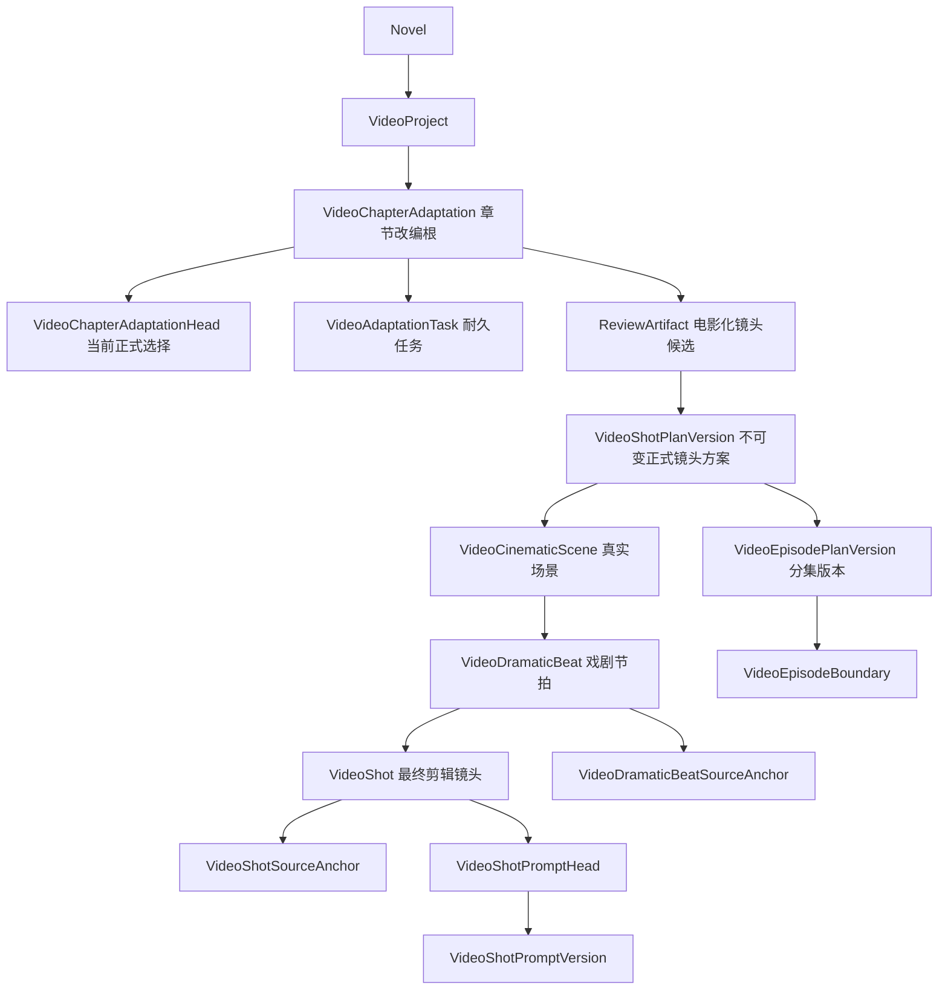
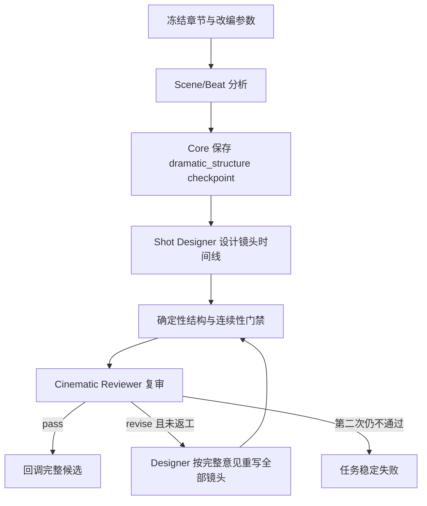

# 长篇章节影视化工作台 v2 架构规格

> 后续目标驱动生成、非阻断审镜和正式方案修订以
> `docs/specs/2026-08-19-goal-driven-shot-revision.md` 为准；本文保留首版领域落地背景。

日期：2026-08-18
状态：开发库实现与真实章节验收完成，数据库授权仅限 `novelwriterdev`
适用范围：`long_serial` 长篇工作台的“视频制作”入口
当前交付边界：完成小说章节到可审核电影化镜头方案、分集结构和即梦提示词；不调用视频生成 API

## 1. 产品目标

InkForge 当前阶段要做的不是“按句子切一组提示词”，而是一个真正可编辑的章节影视化工作台：

```text
章节不可变快照
→ 场景识别
→ 戏剧节拍
→ 有剪辑动机的镜头时间线
→ 作者确认镜头方案
→ 作者划分剧集
→ 按正式镜头生成、编辑并保存即梦提示词
```

用户面对的核心对象仍是镜头；“AI 导演”不作为页面角色。场景和戏剧节拍是镜头成立所需的结构，
不是额外聊天步骤。

本工作台是 `2026-08-08-novel-to-video-product-architecture.md` 所定义完整视频生产系统的上游“改编编辑域”。
它先解决一章小说如何变成可拍镜头；未来正式渲染再把已确认的剧集、场景和镜头转换成
`VideoStoryUnit / DirectorPlan / GenerationSegment / ProductionPackage`，本规格不提前伪造渲染事实。

## 2. 现状审计与必须淘汰的边界

### 2.1 领域对象错位

当前开发预览把 `VideoScene` 同时用作：

- 整章来源快照；
- 拆镜任务目标；
- 场景；
- 正式镜头方案容器；
- 分集结构和提示词容器。

但一章会产生多个真实场景，一个真实场景会有多个戏剧节拍和镜头。因此新功能不得再写
`VideoScene.planJson`。旧 `VideoScene` 只保留开发预览历史兼容，不能继续扩展新语义。

### 2.2 正式层级被塞入 JSON

扁平 `ChapterShotPlan` 无法用数据库约束保证以下关系：

- 场景、节拍和镜头的父子归属；
- 镜头与来源区间的有序多对一关系；
- 节拍连续性和镜头顺序；
- 分集边界只能引用当前方案镜头；
- 提示词只能引用当前正式镜头版本。

候选仍可作为完整 JSON 保存在 `ReviewArtifact` 中供审核，但用户批准后的正式事实必须关系化并不可变版本化。

### 2.3 任务绑定目标错误

现有 `VideoGenerationTask.sceneId NOT NULL` 要求拆镜前先制造一个伪 Scene。新任务必须绑定
`VideoChapterAdaptation`，并可选绑定正式 `VideoShotPlanVersion`；不得再借用场景任务表。

`series` 项目只允许进入章节改编域。旧 `VideoScene` 预览接口继续兼容历史 concept/trailer/highlight 项目，
但必须拒绝在 `series` 项目中新建旧场景或旧规划任务，避免同一项目同时出现两套正式来源。

### 2.4 Agent 一次调用直接拆镜

句末编号、每镜少量原文单元和最低四秒约束共同把模型推向“每句对白一个镜头”。新工作流必须分离：

1. 场景与戏剧节拍分析；
2. 电影化镜头设计；
3. 电影语法、连续性和短视频节奏复审；
4. 最多一次完整镜头方案返工。

来源句末编号只承担安全、稳定的原文锚定，不能决定场景、节拍或镜头边界。

### 2.5 前端单体化

当前章节镜头组件同时负责项目创建、轮询、来源选择、镜头结构编辑、分集和提示词，且在镜头卡内部展开表单。
新页面必须拆成数据容器、来源面板、结构时间线、镜头检查器、分集编辑器和提示词编辑器；
层级通过稳定工作台布局呈现，不能继续用扁平卡片列表掩盖领域结构。

## 3. 可复用能力

以下现有能力继续复用，不另造平行系统：

- 长篇工作区的当前章节、章节列表和选区身份桥；
- `VideoProject` 项目根、画幅、语言和供应商偏好；
- Core 的浏览器认证、小说归属校验、CAS、幂等请求和错误契约；
- `ReviewArtifact` 的候选审核状态机，但使用新的明确目标外键和 artifact kind；
- PostgreSQL 耐久任务 + Redis 可重建队列索引模式；
- Agent `ModelRuntime` 的计费授权、全局并发门、结构化输出和日志脱敏；
- Core/Agent Ed25519 内部接口；
- 生成 OpenAPI 客户端、原生 CSS、现有设计变量和选区改写能力。

## 4. 产品与领域层级



### 4.1 VideoChapterAdaptation

表示“某个视频项目对某个章节版本的一次完整改编”，不是场景。

字段至少包括：

- `id/projectId/novelId`；
- 可空 `chapterId`、不可变 `chapterTitle/chapterUpdatedAt/sourceText/sourceHash`；
- `lifecycleStatus=active|archived`；
- `createdAt`。

同一项目、章节和来源哈希最多一个活动改编根。章节后续修改不能覆盖旧快照；重新改编创建新根。

### 4.2 VideoChapterAdaptationHead

只保存可变当前指针：

- `currentShotPlanVersionId`；
- `currentEpisodePlanVersionId`；
- `revision/updatedAt`。

正式版本行只增不改；所有用户保存操作锁定 Head 并使用 revision CAS。

### 4.3 VideoShotPlanVersion

一次用户批准产生一个不可变正式镜头方案版本，保存：

- `adaptationId/versionNo/basedOnVersionId`；
- `sourceTaskId/reviewArtifactId/createdByUserId`；
- `contentHash/createdAt`。

完整内容由下属关系表表达，不再保存正式 `planJson`。

### 4.4 VideoCinematicScene

真实电影场景，由时间、地点和连续行动空间决定。字段包括：

- `planVersionId/sceneKey/ordinal/title`；
- `locationLabel/timeLabel`；
- 可选场景目标和场景变化摘要。

对白换人不能创建新 Scene。

### 4.5 VideoDramaticBeat

戏剧节拍由人物目标、阻力、权力关系、信息、情绪或行动结果发生变化而成立。字段包括：

- `sceneId/planVersionId/beatKey/ordinal/title`；
- `dramaticTurn/visualStrategy`。

`VideoDramaticBeatSourceAnchor` 使用 Unicode code point 左闭右开区间绑定完整章节快照。多个连续对白可以属于
同一节拍；标点、换行和说话人轮次不是节拍边界。

### 4.6 VideoShot

镜头是一次连续机位和一个可执行的主要可见动作，字段至少包括：

- `planVersionId/sceneId/beatId/shotKey/ordinal/title`；
- `narrativePurpose`：建立、动作、对白、反应、揭示、插入、转场、氛围；
- `adaptationType`：直拍、视觉化、旁白视觉化、补充；
- `shotScale/cameraAngle/cameraMovement`；
- `visualIntent/audioMode/audioIntent/cutReason`；
- `timelineDurationMs`：500～15000，500ms 粒度。

`VideoShotSourceAnchor` 保存有序来源范围。补充建立、倾听反应、物件插入和转场镜头可以没有独立原句；
其他镜头至少一个来源范围。一句原文可以支撑多个镜头，多个句子也可以共同支撑一个镜头。

即梦生成片段长度与 `timelineDurationMs` 是两个概念，本阶段只保存成片时间线时长。

数据库必须用复合外键保证 `VideoShot.beatId` 所指 Beat 同时属于该镜头的 `sceneId` 和
`planVersionId`，不能只靠应用层分别检查两个父对象。模型供应商草案可容忍秒、毫秒和字符串时长表示，
但正式候选、共享读模型和数据库中的 `timelineDurationMs` 必须已经归一为 500～15000 的整数毫秒；
越界值触发完整返工，不能静默夹到边界。

### 4.7 VideoEpisodePlanVersion 与 VideoEpisodeBoundary

分集是已确认镜头方案之上的独立不可变版本：

- EpisodePlan 固定引用一个 ShotPlanVersion；
- Boundary 只保存“在哪个正式镜头之后换集”的有序边界；
- 没有 EpisodePlan 时读模型默认整章一集；
- 保存新边界创建新版本并切换 Head，不覆盖旧版本；
- 边界优先位于节拍结束处，作者可以选择其他镜头，但界面给出连续性警告。

AdaptationHead 的当前 EpisodePlan 必须通过复合外键绑定到同一个
`currentShotPlanVersionId`；不能只保证二者属于同一 Adaptation。

### 4.8 VideoShotPromptVersion 与 Head

提示词版本独立于镜头方案：

- `shotId/versionNo/basedOnVersionId`；
- 可空 `generatedText`、非空 `currentText`；
- 可空 `sourceTaskId`、`createdByUserId/contentHash/createdAt`。

AI 结果先保存在任务候选中。用户在编辑器中明确保存后才创建 PromptVersion 并切换 PromptHead。
这属于用户直接编辑正式视频提示词，不允许 Agent 回调直接切换 Head。

读模型按镜头聚合当前 ShotPlan 上各次已完成任务的最新未保存候选；新任务不能让其他镜头尚未保存的候选消失。
候选一旦物化为 PromptVersion，接口不得再返回它覆盖 `currentText`。

### 4.9 VideoAdaptationTask

独立耐久任务表，不再引用伪 Scene：

- `adaptationId/projectId/novelId`；
- `kind=shot_plan|shot_prompt`、`workflow`；
- 可空 `baseShotPlanVersionId`；
- `jobId/idempotencyKey/status/requestJson/resultJson`；
- `checkpointStage/checkpointJson`；
- 重试、错误和时间字段。

任务 `requestJson` 保存完整冻结输入；`checkpointJson` 只保存可恢复的结构化中间结果，不是正式业务版本。
Redis 继续只承载可重建索引。

相同 `clientRequestId` 的任务重放必须先命中既有任务，再检查“当前是否有活动任务”；否则客户端在首次响应丢失后
会把自己的任务误判为冲突。EpisodePlan 和 PromptVersion 保存相同内容时也要收敛为无副作用成功。

### 4.10 ReviewArtifact 与批准命令

新增 `ReviewArtifact.kind=video_adaptation_plan`、`videoAdaptationId` 和 `videoAdaptationTaskId`。
候选目标必须明确为该章节改编根和来源任务。批准使用独立的 `VideoAdaptationDecisionCommand`，绑定：

- 用户、小说、项目、改编根；
- Artifact 和来源任务；
- `expectedArtifactRevision/expectedAdaptationRevision`；
- `clientRequestId/requestHash/resultJson`。

批准事务锁定 Artifact、AdaptationHead 和来源任务，重新校验来源、完整层级和内容哈希后，一次性创建
PlanVersion、Scene、Beat、Shot、来源锚点、空 PromptHead，并切换 Head。任一步失败整体回滚。

## 5. 电影化 Agent 工作流

新 workflow：`chapter_cinematic_adaptation_v2`。



### 5.1 Scene/Beat 分析

- 输入完整章节来源单元、项目画幅、短视频节奏预设和目标单集时长；
- 输出场景、戏剧节拍、来源单元、戏剧变化、视觉机会和可删减说明；
- 不输出镜头，不计算字符下标；
- 服务器生成稳定 `SC01..`、`B01..` 并物化来源范围。

### 5.2 Shot Designer

- 按既定节拍设计一个或多个镜头；
- 每次切镜必须有具体 `cutReason`；
- 多句对白可以留在主镜头/双人镜头中；一句对白也可跨说话者、倾听反应、过肩或关键物件多个画面；
- 不得随机景别、随机运镜或“每句一镜”；
- 允许无原句的建立、反应、插入和转场镜头；
- 短剧预设的镜头平均时长通常控制在约 2～4 秒，反应/插入可更短，长镜必须有戏剧理由；电影与对白预设
  使用各自更宽的节奏包络，不能把所有镜头硬编码成统一时长。

### 5.3 确定性门禁

Core/Agent 纯代码验证：

- Scene、Beat、Shot ID 连续且父子关系完整；
- 每个 Beat 至少一个 Shot，同一 Beat 镜头连续；
- 非补充镜头来源属于所属 Beat；
- 每个镜头有目的、可见动作、声音任务和切镜理由；
- 新场景原则上有建立空间镜头，若刻意延迟揭示必须有明确理由；
- 相邻镜头不能在主体、景别、机位和动作均无变化时无理由切换；
- 成片时长合法，节奏分布和总时长不越过产品上限；
- 不保存部分结果。

模型草案先进入宽容解析层，再由代码完成枚举、来源与时长归一；正式候选契约保持严格。短剧模式还要验证
平均镜头时长、单集建议长度、慢镜占比、新场景首镜和相邻重复镜头，避免 Reviewer 自评通过后仍退化成
“每句一镜”或 250 秒单集。

### 5.4 Cinematic Reviewer

Reviewer 只读取冻结节拍和完整镜头候选，检查：

- 戏剧节拍是否被画面落实；
- 切镜是否有动机；
- 对白是否被机械拆分；
- 视线、轴线、屏幕方向、动作和情绪是否连续；
- 短视频钩子和节奏是否成立；
- 是否凭空新增剧情结果。

Reviewer 只返回 pass/revise 和完整修改要求，不做局部 patch。最多一次完整返工。

### 5.5 即梦提示词

提示词任务按集或选定镜头生成结构化 `ShotPromptSpec`，读取：

- 当前正式 ShotPlanVersion 和 EpisodePlanVersion；
- 当前镜头及前后镜头；
- 场景、节拍、来源、画幅和成片时长；
- InkForge 已有长篇人物、关系、地点和道具冻结快照。

模型只补充可执行自然语言，不改变镜头边界和戏剧结果。Core 按固定顺序编译为即梦提示词：

```text
画幅与时长 → 场景与主体 → 可见动作与表演 → 景别/机位/运镜
→ 声音与对白 → 前后镜连续性 → 禁止提前发生的结果
```

## 6. 前端信息架构

继续嵌入当前长篇工作台和章节导航，不创建独立营销式页面。

### 6.1 拆镜与审镜

```text
顶部：章节、改编版本、节奏预设、目标单集时长、任务状态、确认动作
左侧：冻结章节正文、镜号映射、未采用文字、选区操作
中间：Scene → Beat → Shot 时间线
右侧：当前 Scene / Beat / Shot 检查器
```

镜头行只展示快速扫描信息：镜号、目的、景别、标题、时长、提示词状态。右侧检查器编辑详细字段和来源绑定，
不在列表卡片内部展开大表单。

结构编辑至少支持：

- 删除/恢复镜头；
- 合并相邻镜头；跨 Beat 合并必须明确同时合并 Beat 或重新归属；
- 在当前 Beat 新增建立、动作、反应、插入或转场镜头；
- 从原文选区创建或重绑镜头来源；
- 调整时长、目的、景别、机位、运镜、声音任务和切镜理由；
- 只在同一 Beat 内拖动镜头；跨 Beat 移动必须显式选择目标 Beat。

“拆分镜头”不再把原文范围机械对半切。用户必须选择新镜头承担的来源或选择“无独立原句”，再确定镜头目的。

### 6.2 分集

- 按镜头时间线点击边界；
- 展示每集镜头数、时长、平均镜头时长和时长分布；
- 默认目标单集 90 秒，可选择 60/90/120 秒；
- 目标只用于建议和预警，不静默删除镜头；
- 允许作者覆盖建议。

### 6.3 逐镜提示词

- 左侧按“集 → 场景 → 节拍”显示镜头树和生成状态；
- 中间显示来源、前后镜和结构化镜头规格；
- 右侧为完整提示词编辑器、AI 重新生成候选和保存版本；
- 批量生成跳过已有正式 PromptHead 的镜头，除非用户明确勾选覆盖候选；
- 章节原文选区继续复用工作台的选区身份桥，可进入原文改写，也可作为镜头来源新增/重绑；提示词本期支持
  直接手改和重新生成整镜候选，不把提示词选区误送进章节正文改写流。

### 6.4 前端模块边界

新增 `apps/web/src/features/video/adaptation/`：

- `chapter-adaptation-workspace.tsx`：只负责路由、数据加载和阶段状态；
- `source-panel.tsx`；
- `shot-timeline.tsx`；
- `shot-inspector.tsx`；
- `episode-editor.tsx`；
- `prompt-editor.tsx`；
- `adaptation-state.ts`：纯结构编辑与校验函数。

旧章节镜头单体组件和基于 `VideoScene.planJson` 的状态工具在新页面切换后删除。

工作台只能选择当前章节的 Adaptation，不得在当前章节没有改编时回退展示其他章节。刷新后根据正式分集、
提示词版本和待审候选恢复到最靠后的有效步骤。原文选区绑定或新增镜头时，前端同时维护所属 Beat 的来源范围，
确保提交前父子来源关系合法。

Agent 队列入口使用独立 `VideoJobDispatcher` 按 workflow 路由旧预览与章节改编处理器；旧
`VideoPromptJobHandler` 不得反向导入新章节改编实现。

## 7. Core、Agent 与契约模块边界

### 7.1 共享契约

新增 `packages/service-contracts/src/inkforge_contracts/video_adaptation.py`，不再把章节改编继续塞入已有
六千余行的 `video.py`。该模块定义候选、正式读模型、任务、checkpoint 和回调契约。

### 7.2 Core

新增 `apps/core-api/src/inkforge_core/video/adaptation/`：

- `schemas.py`：公共请求/响应；
- `repository.py`：新表事务与关系物化；
- `service.py`：能力门禁和业务编排；
- `router.py`：浏览器 API；
- `internal_router.py`：Agent 签名回调；
- `read_model.py`：关系表组装嵌套工作台 DTO；
- `validation.py`：来源、分集边界和内容哈希纯校验；Agent 的电影语法与节奏门禁位于
  `video_adaptation_quality.py`。

旧 `video/repository.py` 不再增加章节改编分支。

### 7.3 Agent

新增 `apps/agent-service/src/inkforge_agents/jobs/video_adaptation.py`、`video_adaptation_quality.py` 和
`video_dispatch.py`；旧 `video_chapter.py` 在迁移完成后删除。StateGraph 只持有任务结构状态，正式业务仍由
Core 保存。

### 7.4 公共 API

```text
POST /api/v1/video/projects/{projectId}/chapter-adaptations
GET  /api/v1/video/projects/{projectId}/chapter-adaptations
GET  /api/v1/video/chapter-adaptations/{adaptationId}
POST /api/v1/video/chapter-adaptations/{adaptationId}/shot-plan-runs
POST /api/v1/video/chapter-adaptations/{adaptationId}/shot-plan/confirm
PUT  /api/v1/video/chapter-adaptations/{adaptationId}/episode-plan
POST /api/v1/video/chapter-adaptations/{adaptationId}/prompt-runs
PUT  /api/v1/video/chapter-adaptations/{adaptationId}/shots/{shotId}/prompt
```

创建改编根与启动拆镜是两个明确事务；前端一个按钮可以顺序调用，但不能用一个伪 Scene 隐藏两个领域动作。

## 8. 开发库迁移边界

计划新增具名迁移：

`scripts/migrations/20260818_video_chapter_adaptation_domain.sql`

迁移只允许 `current_database()='novelwriterdev'`，使用事务和 advisory lock；不得由应用启动自动执行，
不得连接或修改生产数据库。执行前必须：

1. 更新根 `AGENTS.md` 和 `DOCS.md` 的具名 dev 例外；
2. 完成 ORM 元数据、迁移 SQL 和测试之间的结构比对；
3. 对开发库做只读当前指纹校验；
4. 运行迁移；
5. 只读重新导出并评审 `schema-contract.json`；
6. 运行 architecture/schema guard 测试。

迁移只新增表、索引、外键、ReviewArtifact 新目标列和新 enum 值，不删除、改写或回填旧视频预览数据。
回滚只针对尚未承载需要保留数据的开发环境，按外键逆序删除新增对象；常规应用代码不得执行回滚 DDL。

## 9. 兼容与清理

- `VideoProject` 继续作为共同项目根；
- 旧 `VideoScene/VideoGenerationTask/VideoReviewDecisionCommand` 数据保留，只读兼容；
- 新章节工作台只调用 chapter-adaptations API；
- 删除尚未正式落地的 chapter-shot-plan 公共/内部接口、共享契约和前端单体组件；
- 删除“原文范围对半拆分”“每镜至少四秒”“合并最多三段来源”等机械规则；
- 删除新功能对 `VideoScene.planJson/promptText` 的读写；
- 旧五任务视频试制入口是否保留只读，由单独产品决策处理，不与新工作台共享写模型。

## 10. 验收标准

### 10.1 产品

1. 用户可从当前长篇章节创建不可变章节改编根并启动电影化拆镜。
2. 候选按 Scene → Beat → Shot 展示；对白、句号和换行不会机械地产生镜头。
3. 每个镜头都有具体目的、可见动作、声音任务、摄影表达和切镜理由。
4. 用户能删除、恢复、合并、新增和重绑镜头，且操作保持合法父子关系。
5. 用户确认前没有正式 ShotPlanVersion；确认后关系表能完整重建同一方案。
6. 用户可保存独立分集版本并查看每集节奏指标。
7. 用户可按镜头生成、编辑和保存即梦提示词版本；Agent 候选不会直接覆盖正式提示词。

### 10.2 架构

1. 新流程不创建或更新 `VideoScene`、`VideoGenerationTask` 和 `VideoReviewDecisionCommand`。
2. 正式方案不依赖 `planJson`；父子关系、顺序和目标归属有数据库外键/唯一约束。
3. Agent Service 不连接 PostgreSQL；模型输入来自 Core 冻结 payload/checkpoint。
4. Scene/Beat checkpoint 后重试不会重新调用已成功阶段。
5. ReviewArtifact、来源任务、Head 和正式版本在同一批准事务中收敛。
6. 所有公共 DTO 来自生成客户端，前端不手写重复业务类型。

### 10.3 质量基线

使用同一真实章节做新旧对照：

- 旧结果“1160 字、49 镜、253 秒”仅作失败基线；
- 新结果必须展示场景和节拍，而不是按句子平铺；
- 抽查至少一个多句对白保持同镜、一个原句支撑多镜、一个无独立原句的建立/反应/插入镜头；
- 无 `cutReason=说话人变化/句子结束` 等机械理由；
- 短视频预设下平均镜头时长和分布进入页面预警范围，但不以统一五秒硬编码达标。

### 10.4 工程验证

- 相关 Web 测试、`npm run typecheck`、`npm run lint`、`npm run build`；
- Core/Agent/service-contracts pytest；
- Ruff、Mypy；
- `npm run api:generate && npm run api:check`；
- schema guard、ORM 元数据、架构测试；
- 只在 `novelwriterdev` 执行迁移并通过只读指纹；
- 浏览器以真实账号完成“创建改编 → 拆镜 → 编辑 → 确认 → 分集 → 生成并保存提示词”全流程。

## 11. 非目标

- 本阶段不调用即梦视频生成 API；
- 本规格原本不上传角色定妆；该限制已由
  `docs/specs/2026-08-22-visual-canon-and-shot-references.md` 对角色、服装、场景和道具图片明确取代，
  首尾帧与真实视频素材仍不在本阶段范围；
- 不把章节自动等同于一集；
- 不实现跨章合并，但数据模型不阻止未来多个来源快照；
- 不把当前工作台伪装成完整 production_v2 渲染系统；
- 不修改生产数据库。
