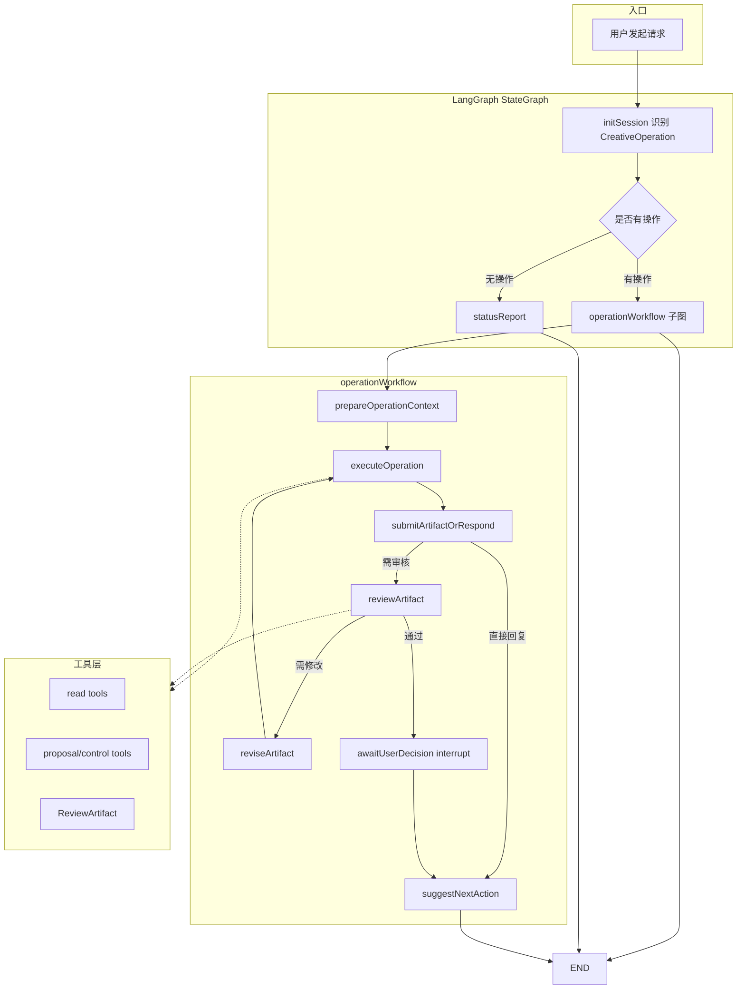

/**
 * LangGraph Agent 流程图文档
 *
 * @module agents/AGENTS
 * @description 定义智能写作系统中所有 Agent 的协作流程
 *
 * ## 更新日志
 *
 * - 2026-04-09: 初始版本
 * - 2026-05-09: v5.0 重构：LangGraph StateGraph，共享上下文构建器，统一类型定义
 * - 2026-05-13: v5.2 智能化改造：启用工具调用、JSON 结构化输出、LLM 智能路由、主动建议层
 * - 2026-05-30: v5.3 新增网文编辑 Agent：商业性评审、读者兴趣判断、返工 brief
 * - 2026-06-04: v5.4 加固结构化响应解析，避免 Agent JSON 外壳直接泄漏到聊天与质量报告
 * - 2026-06-09: v5.5 Phase 1 安全止血：/resume 鉴权修复、禁用 LLM 直接写库工具、统一 Agent ID
 * - 2026-06-09: v5.6 Phase 2 结构化输出：Zod Schema 替代手写正则 JSON 解析、callLLMStructured 意图分类
 * - 2026-06-09: v5.7 Phase 3 工具层重构：4 个只读工具文件（novel/character/lore/plot）+ 注册表 + 权限模型
 * - 2026-06-09: v5.8 Phase 4 AgentDefinition + AgentRunner：消除 5 个 Agent node 的重复模板代码（-31%）
 * - 2026-06-09: v5.9 Phase 5 拆分 LangGraph 执行器：executor.ts 1224→43 行，拆为 4 个独立文件
 * - 2026-06-09: v6.0 Phase 6 质量检查服务端化：编辑/校验评分直接落库，不依赖前端 SSE
 * - 2026-06-09: v6.1 Phase 7 写作闭环工作流：Beat Plan + 技法评审 craft 模式 + 质量门禁阈值
 * - 2026-06-09: Phase 8 文档更新：ROADMAP.md / REFACTOR_ISSUES.md 同步当前架构
- 2026-06-10: **v7.0 Agent Runtime 协议重构**：停止 JSON 信封协议，迁移到标准 tool_calls + Markdown 输出。全部 5 个 Agent 已迁移，control tools 替代 wantsToCall/updates/scores/conflicts JSON 字段。详见 `docs/AGENT_RUNTIME_PROTOCOL_REFACTOR_BLUEPRINT.md` 和 `docs/AGENT_RUNTIME_PROTOCOL_REPAIR_BLUEPRINT.md`。
- 2026-06-10: v7.1 架构边界收口：拆分 `AgentVisibleOutput`、`AgentQualityFields`、`LegacyAgentControlFields`，新协议主路径禁止再依赖旧 JSON 控制字段。
- 2026-06-10: v7.2 删除服务端 legacy JSON 主路径：移除 `response-parser.ts`、`legacy-output-processor.ts`、`legacy_json`、`parseOutput` 和 `getTools` 双轨；AgentRuntime 自持 OpenAI tool-call loop。
- 2026-06-10: v7.3 Agent 身份化重构：五个 Agent 不再是固定行为模式，而是“身份 + 工具边界 + 思考→行动→观察→调整循环”。编辑/校验/写作移除章节正文硬门槛，当前章节内容降级为可选参考。
- 2026-06-11: v7.4 Agent Capability Cards：新增 `src/shared/contracts/agent-capabilities.ts`；初始路由可直接使用能力卡选择主责 Agent，代码继续校验权限、schema 和可保存 section。
- 2026-06-11: v7.5 Runtime control tool 防护：control tool 参数校验失败时返回 Zod issues、TypeScript-like 参数形状和最小 JSON 示例；同一 control tool 连续 2 次校验失败会停止本轮工具循环并返回可见错误，避免耗尽 tool iterations。
- 2026-06-14: v7.6 LangGraph 原生编排原则与首轮迁移：后续多 Agent 循环、返工、人工确认、动态路由优先使用 LangGraph 的 StateGraph、conditional edges、Command、Send、interrupt、checkpointer/持久化能力；禁止上来手写独立流程状态机。已完成 active task context、processResult Command 路由、control event 路由拆分、resume policy 抽取。
- 2026-06-17: v7.7 LLM runtime 第三方化：新增 `ModelRuntimePort`，默认使用 `LangChainModelRuntime`（`@langchain/openai` + `ChatOpenAI`）承接通用 LLM 流式、非流式、结构化 JSON 和 tool-call turn；保留 `LLM_RUNTIME=legacy-openai` 回退。业务 Agent 协议、control tools、ReviewArtifact 和 LangGraph 编排保持自研。
- 2026-06-18: v7.8 Harness 边界收口：`AgentRuntimeImpl` 重新成为唯一 tool-call loop 与 control tool 捕获层；`ModelRuntimePort` 只提供单轮 `runToolCallTurn()` 模型适配，不再解析业务 control events 或决定 terminal routing。
- 2026-06-18: v7.9 章节工作流子图与用户决策契约：历史章节子图曾承载 Agent 执行、审核、返工循环；后续主线已收口到 `operationWorkflow`。新增 `UserDecision` 契约，统一 artifact review 的 `interrupt()` / `/resume` / 前端按钮 payload。
- 2026-06-18: v8.0 CreativeOperation 入口迁移：聊天入口先识别 `CreativeOperation`（操作类型、目标、产物、主责 Agent、是否需要草案/用户确认），再把 Agent 作为执行角色派发。新增 `operation_classified` SSE 事件与前端 Operation 状态展示，现有 Agent/ReviewArtifact/LangGraph 子图保持兼容。
- 2026-06-18: v8.1 创作操作图落地：父图默认进入 `operationWorkflow`，业务步骤改为“识别创作操作 → 准备操作上下文 → 执行创作操作 → 提交草案或直接回复 → 审核草案 → 返工草案 → 等待用户决策 → 建议下一步”。正文生成改为正文草案，不再自动写入章节正文。
- 2026-06-18: v8.2 LangGraph Studio 接入：新增 `langgraph.json` 和 `src/agents/graph/studio-app.ts`，由 `@langchain/langgraph-cli` 加载现有 compiled graph；新增 `studio:dev` / `studio:input` 脚本，Studio 调试复用真实 StateGraph 与上下文聚合，不新增平行编排。
- 2026-06-19: v8.3 LangSmith Studio monitoring：Studio 入口在导出 graph 前初始化 LangSmith；`operationWorkflow` 节点注册层增加 `operation:<stage>` trace；`AgentRuntimeImpl` 非 control tool 调用增加 `tool:<toolName>` trace；兼容 `LANGCHAIN_TRACING_V2=true`。
- 2026-06-19: v8.4 operationWorkflow control-event repair: `executeCreativeOperation()` consumes AgentRuntime side-effect control events through `processControlEvents()`; reviewer flow,返工和用户确认由 `operationWorkflow` 的 LangGraph edges 驱动；reviewer `submit_evaluation` is preferred over prose inference.
- 2026-06-19: v8.5 operationWorkflow interrupt repair: LangGraph `__interrupt__` update chunks are converted to `user_input_required` SSE and stop terminal `done/workflow_completed`; `submit_evaluation(pass)` in `operationWorkflow` now routes from `executeOperation` to `awaitUserDecision` for a single user-approval interrupt; the writing UI keeps `awaiting_user` review state when terminal stream events arrive.
- 2026-06-19: v8.6 AgentRuntime tool-call throttling: model tool calls returned in the same turn are executed sequentially instead of via `Promise.all`, reducing Prisma connection spikes during long multi-agent runs while preserving control-event ordering.
- 2026-06-19: v8.7 ReviewArtifact editing and text-boundary repair: text artifacts submitted through `begin_artifact_output` are extracted from explicit `ARTIFACT_OUTPUT_START` / `ARTIFACT_OUTPUT_END` markers so explanatory prose does not enter persisted drafts; when a model omits markers, the server falls back to conservative heading-based extraction and removes review handoff/process notes before saving. The review modal allows local draft editing and sends edited content only when the user clicks approve/apply.
- 2026-06-19: v8.8 Agent observability switches: root `.env` now controls workflow JSONL logging, LangGraph streamEvents, project-level LangSmith tracing, MemorySaver, and MemorySaver cleanup. Heavyweight workflow JSONL and LangSmith tracing default off; MemorySaver remains on for current-process interrupt/resume and is cleaned by task id after terminal completion.
- 2026-06-19: v8.9 WritingSession recovery: `WritingTask` can now bind to `WritingSession` via `writingSessionId`, and stores a serializable `graphStateJson` snapshot for future resume. Server-side workflow events persist user-visible `WritingMessage` rows with workflow metadata de-duplication. Session detail restores messages, bound task, operation state, stage, active artifact id, and awaiting-review artifact entry from the bound task instead of time-window guessing.
- 2026-06-20: v8.10 结构化大纲层级：`OutlineNode.kind` 明确三层长篇结构（`stage` 阶段/卷、`plot_unit` 剧情单元、`chapter_group` 章节组）。剧情 Agent 的 `outlineAdjustments` 草案可携带 `kind`，大纲读取工具和上下文索引会展示节点类型。
- 2026-06-20: v8.11 聊天流结构化大纲：`create_outline` 改为 `agent_updates` 草案，剧情 Agent 通过 `outlineContent` 更新总纲，通过 `outlineAdjustments[].clientKey/parentKey` 在同一待审核草案内创建三层节点树；聊天审核卡片展示结构化大纲树预览。
- 2026-06-21: v8.12 非关键 DB 写入队列：`TokenUsage` 统计和 workflow 派生 `WritingMessage` 持久化改为进入进程内有界队列（最大 100、并发 3），降低日志型写入抢占 Prisma 连接池的风险；`ReviewArtifact`、`WritingTask` 状态、用户确认应用/丢弃等关键业务写入仍必须同步执行，不得进入该队列。
- 2026-06-21: v8.13 通用 AgentUpdates 构建器：新增 `start_update_builder` / `append_update_batch` / `put_update_text_block` / `finish_update_builder` control tools，用于批量设定、长文本 section 和结构化大纲重构。构建器复用 `ReviewArtifact.kind = "agent_updates"`，同轮 builder 事件先在内存合并，完成时统一严格校验；短小变更仍可使用 `propose_updates`。
- 2026-06-21: v8.14 Agent 工具暴露边界收口：`AgentRunner` 只按当前 `AgentDefinition.toolCapabilities` 和工具 `permission.agentIds` 暴露 read/proposal/control tools；`AgentRuntimeImpl` 会拒绝模型返回的未暴露 tool call。职责外任务只能在正文中说明边界，不得靠越权工具硬写草案。
- 2026-06-21: v8.15 嵌套大纲树 builder：新增 `append_outline_tree` control tool，剧情 Agent 在创建、展开、重构、迁移复杂大纲树时提交 `stage → plotUnits → chapterGroups` 嵌套树，服务端展开为合法 `outlineAdjustments` 并生成 `clientKey/parentKey`。`append_update_batch.outlineAdjustments` 保留为短小修补和兼容路径；编辑 Agent 需要改大纲时通过 `submit_evaluation(revise)` 写清返工要求，由 LangGraph 返工边交给剧情 Agent。
- 2026-06-22: v8.16 长文本参数根因收口：`put_update_text_block` 的长文本正文改从 assistant `ARTIFACT_OUTPUT_START/END` 标记块读取，tool arguments 只放短元数据；长总纲、世界设定、故事背景或整章梗概不得塞入 JSON tool arguments。
- 2026-06-22: v8.17 Tool arguments 短通道收口：`propose_updates` / `append_update_batch` 改用 LLM 入参专用短 schema，禁止 `outlineContent` / `worldSetting` / `storyBackground` 和超长数组 item 文本进入 tool arguments。新增 `put_update_item_text_block`，用于把章节组长梗概、角色长设定、伏笔长说明等 assistant marker block 合并回指定 `AgentUpdates` item；内部 `AgentUpdatesSchema` 和 ReviewArtifact payload 形态保持不变。
- 2026-06-22: v8.18 `append_outline_tree` 纯结构化：嵌套大纲树 tool arguments 只允许 `title` / `estimatedWordCount` / 层级结构，不再接受节点 `content`。新增 `put_update_item_text_blocks`，用一个工具调用批量挂载多个长文本 marker block，减少设定和大纲批量写入时耗尽工具轮次的风险。
- 2026-06-22: v8.19 AgentUpdates 数据通道协议中心化：新增 `src/shared/contracts/agent-update-channels.ts` 作为短 tool arguments、长文本 marker block、`append_outline_tree` 禁用字段和 item block 白名单的单一来源；schema、builder、runtime 输出规则、control tool 描述和测试必须引用这套契约，避免各工具入口各自维护规则。
- 2026-06-23: v8.20 ReviewArtifact 部分应用：`artifact_review` 用户决策可携带 `selectedUpdateRefs`，用户在审核结构化 `agent_updates` 草案时可以只应用部分 section/item；`applyReviewArtifact()` 会先过滤再校验并调用 `executeUpdates()`，未选择任何变更时不落库且回到 `awaiting_user`。
- 2026-06-25: v8.21 监督式正文写作链路：`plan_chapter / write_chapter / rewrite_scene / review_chapter` 在 `prepareOperationContext` 刷新写作上下文；`NovelData.approvedBeatPlan` 纳入 Agent 上下文；`submit_beat_plan` 创建结构化 `beat_plan` ReviewArtifact，用户确认后落为 approved `ChapterBeatPlan / SceneBeat` 并 supersede 旧计划；当时 `chapter_draft` 应用后自动确保四类质量检查项，已在 v8.29 收口为仅 consistency 一致性终检。
- 2026-06-26: v8.22 积分计费边界：真实模型调用统一在 `ModelRuntimePort` / direct SDK wrapper 边界做余额预检和 usage 结算；`CreditLedger` 与 `User.creditBalanceMicros` 属于关键计费写入，必须同步执行，不得进入非关键 DB 写入队列。
- 2026-06-26: v8.23 Agent activity 内联摘要：`AgentRuntimeOptions.onToolResult` 在 read/proposal tool 成功后回传结果，`AgentRunner` 只生成短 `resultSummary` 并通过 `agent_status` SSE 发送；前端过程栏内联在对应 Agent 回复中展示“查到了什么”，不暴露完整工具结果或模型 reasoning。
- 2026-06-26: v8.24 安全查询工具并行：同一模型轮次内，`readOnly && concurrencySafe` 且非 control 的工具调用最多 5 个并行执行；control、不安全或越权工具仍按原顺序单个处理，tool result 回填顺序保持与模型 tool_call 顺序一致。
- 2026-06-26: v8.25 ModelCallProfile：`ModelRuntimePort` 支持 `normal | fast` 调用 profile。`fast` 用于入口路由等小型结构化任务，保留完整业务提示词，但不注入深度思考提示、不设置 reasoning_effort，并使用小输出预算；Agent 正文与 tool-call 主路径仍默认 `normal`。
- 2026-06-26: v8.26 operationWorkflow 多 reviewer 路由修复：`reviewArtifact` conditional edge 补齐自循环 destination，确保校验通过后还能继续进入编辑等后续 reviewer；相关路由映射导出并加测试防止漏配。
- 2026-06-26: v8.27 ReviewArtifact 小修/大改分流：`submit_evaluation(revise)` 可声明 `revisionMode=patch|rewrite`。小修进入 `applyArtifactPatch` 节点并生成新的 artifact revision；大改继续走 `reviseArtifact → executeOperation` 返工链路。
- 2026-06-26: v8.28 Agent runtime 内存止血：tool-call 下一轮不再回灌 `reasoning_content`；`ReadableStream.cancel()` 后的后续 SSE 发送会中断 runner，避免前端断开后继续完整跑后台工作流。
- 2026-06-27: v8.29 章后终检收口：`chapter_draft` 应用后默认只确保 consistency 一致性终检；商业性和技法评审留在写作草案复审循环内，设定同步改为显式动作并继续走 ReviewArtifact 待审核草案。
- 2026-06-27: v8.30 写作目标章节自动推进：`write_chapter/rewrite_scene` 在准备上下文时解析正文草案目标；已送审/已完成且有正文的章节默认推进到后续空草稿章，若不存在则生成 `new_next_chapter` 草案并在用户应用时创建下一章。语义冲突时通过 LangGraph interrupt 让用户选择当前章或下一章。
- 2026-06-28: v8.31 待审核草案聊天卡片化：`review_artifact_requested` / `artifact_awaiting_user_approval` 只刷新聊天流底部草案卡片，不自动打开审核弹窗；弹窗由用户点击“查看全文/编辑”主动打开。复审 Agent 未提交 `submit_evaluation` 时发出可见 `agent_status(error)`，避免用户只看到流程结束。
- 2026-06-29: v8.33 正文工作流调用收敛：Artifact reviewer 对话历史不再重复携带完整草案；明确要求 approved Beat Plan 但计划缺失时作家 preGuard 直接阻断；`submit_evaluation` 在同轮输出报告后终止；Agent runtime 使用声明式 model profile/reasoning effort，不再注入或泄漏完整思考提示；LLM 日志改为 `LLM_LOG_MODE=off|summary|full` 的 JSONL，默认 summary 并记录完整请求/响应字符数、token、调用关联 ID。
- 2026-06-29: v8.34 LangGraph State 分层收口：Graph state 改为 `StateSchema`，`novelData`、SSE callbacks 和 runtime context 使用 `UntrackedValue`；`conversationHistory` / `controlEvents` 使用 reducer；`artifactReview` 成为待审核草案流程权威状态，`agentOutputs` 成为 Agent 输出权威 map，旧固定输出字段和 `activeArtifactId` 等字段仅作兼容 facade；`WritingTask.generatedContent` 不再存待审核 artifactId。
- 2026-06-28: v8.32 待审核草案继续修改收口：前端“继续修改”只关闭审核弹窗并聚焦聊天输入；当任务仍在 `awaiting_user_review` 或快照含 `artifactReview.activeArtifactId` 时，下一条普通聊天由 `/resume` 自动路由为同一草案的新 revision 返工请求。

# 智能写作 Agent 流程图（v8.23 — CreativeOperation + operationWorkflow）

## 〇、Phase 1 安全加固（2026-06-09）

### 鉴权
- `/api/writing/resume` 新增 `getSession()` 登录校验 → 未登录返回 401
- 新增 `authorizeWritingTask()`（`src/agents/lib/task-auth.ts`）→ 越权访问返回 403
- `getWritingTaskAction`、`confirmPlanningAction`、`acceptGeneratedContentAction`、`persistUpdatesAction` 均添加归属校验
- 历史 `novel.userId` 为空的数据渐进式兼容：允许访问但记录 warning 日志

### 写工具禁用
- 所有 Agent node 移除 `withWriteTools()` 调用，只保留只读工具
- `createToolExecutor()` 新增 `WRITE_TOOL_NAMES` 保护集合，LLM 调用写工具时返回 `WRITE_TOOL_DISABLED` + proposal 引导
- 写入操作必须走 `proposal → ReviewArtifact待审核草案 → Agent复审/返工 → 用户确认应用 → executeUpdates()` 链路

### Agent ID 统一
- 统一使用中文 ID：`"设定" | "剧情" | "写作" | "校验" | "编辑"`
- 前端 `AGENT_INFO` 移除旧 ID 回退（`host`/`writer`/`validator`/`plot` 等）
- 默认 `enabledAgents` 更新为 `["设定", "剧情", "写作", "校验", "编辑"]`

### Agent 身份化原则（v7.3）

Agent 是身份，不是行为菜单。进入某个 Agent 后，系统不得预设用户一定要执行某个固定任务，例如“编辑必然审章节正文”或“校验必然检查正文”。

每个 Agent 必须遵循：

```
理解用户目标 → 判断对象 → 选择工具 → 观察工具结果 → 调整下一步 → 输出/协作
```

- `设定` 是设定体系架构师：可讨论、评价、创建、维护角色/世界观/势力/物品/术语等设定；不保存大纲/伏笔结构变更。
- `剧情` 是剧情结构顾问：可处理主线、章节职责、角色行动链、伏笔生命周期、节奏结构和 beat plan；负责保存大纲/伏笔变更提案。
- `写作` 是正文创作者：可写整章、续写、改写、对白、场景样稿、局部桥段；已有正文不再自动拒绝。
- `校验` 是一致性审计员：可校验正文、角色设定、大纲、世界观、伏笔和剧情逻辑；没有正文也可以工作。
- `编辑` 是网文商业编辑：可评价作品定位、角色卖点、大纲潜力、正文追读、世界观商业性和伏笔期待管理。

Control tools 是控制面事件，不是固定流程要求。只有在任务语义需要时才调用：章节质量评审才提交 `submit_quality_report`，正式冲突校验才提交 `submit_validation_report`，明确需要保存短小变更才提交 `propose_updates`。批量设定、长文本 section、结构化大纲重构和复杂 updates 必须优先使用 update builder 工具链分批构建。复杂大纲树必须优先使用 `append_outline_tree`，让服务端生成 `outlineAdjustments` 引用字段。服务端会按 Agent 身份过滤可保存 section：设定 Agent 只保存设定类 section，剧情 Agent 只保存大纲/伏笔类 section。

`AgentRunner` 只会把当前 Agent 声明过的 capability 对应工具暴露给模型，并同时尊重工具定义里的 `permission.agentIds` 白名单。禁止把所有 control tools 无条件暴露给所有 Agent。`AgentRuntimeImpl` 也会在执行前检查模型返回的 tool call 是否属于本轮实际暴露的工具列表；如果模型调用未暴露工具，本轮会以 `tool_authorization_error` 停止，不会生成 control event，也不会进入 ReviewArtifact 写入链路。

Control tool 参数校验由 runtime 兜底。第一次校验失败时，runtime 会把字段级 Zod issues、TypeScript-like 参数形状和最小 JSON 示例作为 tool result 返回给模型，允许模型自修复；同一 control tool 连续 2 次仍失败时，runtime 必须停止本轮工具循环，返回“未保存任何变更”的可见错误，并把失败参数和 schema issues 写入日志。

Agent 能力边界由 `src/shared/contracts/agent-capabilities.ts` 的 Capability Cards 描述。初始意图分类器使用能力卡做首次分派；Agent 运行时不再通过工具读取能力卡或自行转交。模型根据任务主产物、能力边界和可保存 updates section 选择入口主责 Agent。

当当前 Agent 判断任务主责属于另一个 Agent 时，只能在正文中说明职责边界和缺口，不得静默处理、不得保存越界 updates、不得自行转交。固定审核、返工、用户确认都由 `operationWorkflow` 的 LangGraph 节点和 conditional edges 决定。

典型例子：编辑 Agent 可以审核大纲并提交 `submit_evaluation`。如果需要剧情 Agent 返工，编辑 Agent 使用 `submit_evaluation(revise)` 并在 `requiredChanges` 写清可执行修改要求；LangGraph 的返工边会把 brief 交给创作操作的主责 Agent。编辑 Agent 不应看到 `start_update_builder` / `append_update_batch` / `append_outline_tree` / `put_update_text_block` / `finish_update_builder`，因此不能自己构建大纲更新草案。

### LangGraph 原生编排优先原则（v7.6）

后续新增或修改多 Agent 协作、循环返工、人工确认、动态分派、并行子任务或长流程恢复时，必须先评估 LangGraph 原生能力，不得直接手写一套独立流程状态机。

优先使用的 LangGraph 能力：

- `StateGraph` / `StateSchema`：承载可 checkpoint 的流程状态、Agent 输出、控制事件、用户确认状态和跨节点上下文。runtime-only 数据必须使用 `UntrackedValue` 或 runtime context，不得进入可恢复快照。
- conditional edges：表达“根据当前状态选择下一个节点”，例如意图路由、返工/通过/结束分支。
- `Command`：在节点返回时同时更新 state 并决定 `goto`；动态跳转不得通过额外中转字段实现。
- `Send`：需要动态并行 worker 时使用，例如多个章节/多个设定对象并行评审后汇总。
- `interrupt()`：所有用户确认、保存前审核、人工补充信息必须优先走 LangGraph interrupt，而不是自定义轮询状态。
- checkpointer / persistence：需要跨请求、长任务、停机恢复时优先接入 LangGraph 持久化检查点；`MemorySaver` 只适合当前进程内开发和短会话。
- streaming：可见文本 chunk 和结构化事件应继续通过 LangGraph/SSE 桥接输出，禁止把控制信息混进可见正文。

设计要求：

- 多 Agent 流程应建模为 Graph 节点、边、Command 和 interrupt 的组合，而不是在普通函数中手写 while/switch 状态机。
- Agent 不再拥有路由 control tool；目标 Agent 和返工 brief 必须来自 CreativeOperation、ReviewArtifact evaluation 和 Graph state，而不是依赖对话正文。
- 循环退出条件必须是显式状态或 control event，例如“评审通过”“请求返工”“达到最大循环次数”“等待用户确认”，不能从 assistant 可见正文中猜。
- 如果需要通用循环，不要为每个场景补一个专用流程；优先抽象为 evaluator/reviser 的 Graph 模式，并由 conditional edge 或 Command 控制循环。
- 只有在 LangGraph 原生能力无法表达某个需求时，才允许新增薄封装；新增封装必须说明为什么不能直接用 StateGraph/Command/interrupt。

### 创作操作入口原则（v8.1）

聊天入口的主抽象是创作操作，不是“用户选择了哪个 Agent”。`initSession` 必须先识别用户要完成的创作操作，再由操作决定执行视角、预期产物、是否需要待审核草案和是否需要用户确认。

当前创作操作中文名包括：

- 回答问题
- 新建设定 / 修改设定
- 创建大纲 / 修改大纲
- 规划章节
- 生成正文草案 / 改写场景草案
- 审核章节
- 同步设定
- 管理伏笔

兼容规则：

- `@设定`、`@剧情`、`@写作`、`@校验`、`@编辑` 前缀仍可快速指定执行视角，但服务端必须同步构造默认创作操作，并写入 Graph state。
- 面向用户、SSE 日志、前端状态、文档说明和代码注释必须使用中文操作名；内部变量和 enum 可保留英文。
- `targetAgent`、`intent_classified`、`command_parsed` 继续保留兼容旧日志和旧前端；新的前端主展示应消费 `operation_classified`、`operation_stage` 或事件中的操作字段。
- 内部执行角色仍通过 `buildActiveTaskContext()` 读取当前操作上下文；不得只依赖 Agent 身份推断本轮任务。
- 所有会改变项目状态的重要产物都必须走待审核草案。正文生成和场景改写也必须先形成正文草案，用户确认后才写入正式章节。
- 新创作操作图不暴露 Agent 路由工具；主流程跳转由创作操作图决定。

### LangGraph Studio 接入（v8.2）

Studio 是调试外壳，不是新的业务入口。`src/agents/graph/studio-app.ts` 只导出 `getGraph()` 的 compiled graph，让 LangGraph Agent Server 能加载现有 `initSession → operationWorkflow/statusReport` 图。

本地调试入口：

```bash
npm run studio:dev
npm run studio:input -- --novel-id <id> --chapter-id <id> --user-id <id> --message "继续写本章"
```

约束：

- Studio 入口不得新增独立 Agent 状态机、工具注册或 ReviewArtifact 旁路。
- Studio 输入生成脚本必须复用生产上下文聚合逻辑，避免与 `createInitialState()` 的 GraphState 结构漂移。
- Studio 运行会真实执行 Graph 节点，可能创建/更新 `WritingTask`、`ReviewArtifact` 和 evaluation；正式章节写入仍必须经过 `ReviewArtifact → 用户确认应用`。
- 前端 SSE 回放和本地 JSONL workflow event 日志继续保留；Studio 主要看图结构、节点路径、state、interrupt/resume 和 LangSmith trace，不替代 Next API/SSE 端到端审计。
- Studio 入口必须显式初始化 LangSmith，因为它不经过 Next.js API 路由的 `initServer()`；operation graph 阶段 trace 和 tool trace 只能作为观察层，不得承载路由、权限或 ReviewArtifact 状态判断。

### Phase 2 结构化输出（历史阶段，v7.2 已收口）

- `src/agents/graph/schemas.ts` 现在只保留内部意图分类 `IntentClassificationSchema`
- Agent 回复不再使用 `AgentOutputSchema` / `ValidatorOutputSchema` / `EditorOutputSchema`
- `callLLMStructured()` 仅用于内部结构化任务，例如意图分类；不得用于 Agent 正文协议
- `response-parser.ts` 已删除，服务端不再解析 Agent 正文 JSON 信封
- 质量评分、校验结果和设定更新通过标准 tool_calls control tools 传递；Agent 跳转由 LangGraph 图决定

### Phase 3 工具层重构（2026-06-09）

**新目录结构**：
```
src/agents/tools/
  index.ts              # 统一导出 + 副作用注册
  permissions.ts        # ToolPermission 类型 + 工厂函数
  registry.ts           # 工具注册表（registerTool/getTool/executeTool/getOpenAITools）
  read/
    novel-tools.ts      # get_novel_info, list_available_data（2 个）
    character-tools.ts  # list_characters_summary, get_character_detail, get_character_list（3 个）
    lore-tools.ts       # 势力/地点/物品/术语/搜索/相似召回/文风（11 个）
    plot-tools.ts       # 大纲/进度/伏笔/章节（6 个）
  proposals/            # 写入 proposal 工具（待 Phase 4）
```

**关键改进**：
- `src/agents/lib/tools.ts` 已收缩为执行器与参数摘要辅助；工具定义统一由 `src/agents/tools/registry.ts` 管理
- 只读、proposal、control 工具全部使用 Zod schema 做入参校验
- 工具注册表统一管理权限元信息（readOnly/concurrencySafe/requiresConfirmation/capability）
- `createToolExecutor()` 委托给 `executeTool()` 注册表执行
- OpenAI tool schema 统一通过 `getOpenAITools()` 从 registry 生成
- 写作工作流初始化只预载小说基本信息、世界设定、故事背景和大纲总纲；角色、章节正文、结构化大纲节点、伏笔、地点、物品、势力、术语、参考资料和文风画像必须通过只读工具按需查库，不再依赖 `state.novelData` 的全量缓存
- 所有 AgentDefinition 必须声明 `toolCapabilities`，禁止恢复 `getTools` 回调
- `AgentRunner` 使用 `getToolNamesForAgent()` 按 capability + `permission.agentIds` 生成本轮 OpenAI tools；新增 control tool 时必须同步考虑哪些 Agent 应声明对应 capability，并补充工具暴露测试。

### Phase 4 AgentDefinition + AgentRunner（2026-06-09）

**核心模式**：
```
AgentDefinition（声明式配置）→ AgentRunner（统一执行管道）
```

**AgentRunner 执行管道**：
1. sendStatus 设置 → 2. preGuard 预检 → 3. buildMessages 构建消息
4. createToolExecutor + registry 生成工具链 → 5. AgentRuntime 执行 OpenAI tool-call loop
6. 生成段落文本 `AgentOutput` → 7. controlEvents 交给 Graph 处理 → 8. 日志 + 返回 state partial

工具链生成不是“read/proposal + 全量 control tools”。它必须只使用当前 Agent 的 `toolCapabilities`，并过滤掉 `permission.agentIds` 不包含当前 Agent 的工具。这样职责边界会在模型可见工具层先被收口，而 `processControlEvents()` 的 allowed section 过滤继续作为服务端落库前防线。

**迁移结果**：
| Agent | 原行数 | 新行数 | 变化 |
|-------|--------|--------|------|
| 编辑 | 206 | 153 | -26% |
| 校验 | 225 | 156 | -31% |
| 设定 | 242 | 128 | -47% |
| 剧情 | 207 | 147 | -29% |
| 写作 | 324 | 258 | -20% |
| **Runtime（新增）** | 0 | 246 | +246 |
| **合计** | 1224 | 1088 | **-136 行** |

**关键改进**：
- 删除重复模式（sendStatus、createToolExecutor、旧 JSON 字段流式提取、startTime/logging、try-catch）
- 新 Agent 只需写 AgentDefinition 配置 + 系统提示词
- 编辑/设定/剧情/校验 Agent 完全声明式（node 函数只是 `return runAgent(def, state)`）
- 作家 Agent 保留正文提取后处理；在创作操作图中正文只进入待审核草案，不自动写入章节正文。

### Phase 5 拆分执行器（2026-06-09）

**拆分结构**：
```
	src/agents/graph/
	  executor.ts              # 43 行兼容重导出层（原 1224 行）
	  graph-definition.ts      # StateGraph 定义 + initSession + operationWorkflow + statusReport
	  control-event-processor.ts # Control tool 副作用处理：草案、评审、质量报告，可独立测试
	  workflow-runner.ts       # HTTP 入口：executeWritingWorkflow / resumeWriting / createInitialState（347 行）
	  sse-adapter.ts           # SSE 事件转换：文本 streamCallbacks + 结构化 eventCallbacks + sanitize + fallback
	  task-state.ts            # WritingTask 持久化（68 行）
	```

**关键改进**：
- graph、runtime、SSE、persistence 完全分层
- `createSSEStream()` 统一 SSE Response 构建模式
- 服务端旧 JSON 字段兼容逻辑已删除，Graph 定义文件不再直接处理 `updates/wantsToCall`
- `createSSEController` 可独立测试 LangGraph event 处理
- `streamCallbacks` 只传段落文本 chunk，`eventCallbacks` 只传结构化事件，禁止通过 JSON 字符串嗅探区分事件
- Agent 输出类型分层：`AgentVisibleOutput` 是新协议主输出，`AgentQualityFields` 只服务质量报告；控制信息必须走 `AgentControlEvent`
- `MemorySaver` 仅作为当前进程内 `interrupt/resume` 检查点，服务确认保存/确认路由；项目当前不做停机恢复或多实例恢复，不引入持久化 checkpointer。根 `.env` 中的 `LANGGRAPH_MEMORY_SAVER_ENABLED` 可关闭它；`LANGGRAPH_MEMORY_SAVER_CLEANUP_ON_DONE=true` 时，工作流正常完成、草案应用或丢弃后会按 taskId 清理进程内 checkpoint。可持久恢复状态以 `WritingTask.graphStateJson` 的序列化 Graph state 为准，但该快照不得包含 `novelData`、SSE callbacks 或其他 runtime-only 对象。
- SSE 客户端断开后，后续 `sendEvent()` 会停止当前 runner；它是后台长流程止血，不是模型 HTTP 流级别的实时 abort。

### Phase 6 质量检查服务端化（2026-06-09）

**核心改进**：
- `trySaveQualityCheckResult()` — 编辑/校验 Agent 完成后，服务端直接将评分写入 `chapterQualityCheck`
- 流程：Agent 通过 `submit_quality_report` 提交 scores → processControlEvents → prisma update
- 前端仅需展示，评分不依赖 SSE 存活
- 自动推断 qualityGate（overall ≥ 7 → pass，≥ 5 → revise，< 5 → rewrite）

## 一、总览

> **核心变化（v8.23）**：入口先识别 `CreativeOperation`，再由 `operationWorkflow` 这个 LangGraph 子图推进执行、审核、返工和用户确认；Agent 不再通过工具自行转交。



## 二、入口路由规则

| 用户输入 | 路由方式 | 主责 Agent |
|---------|---------|-----------|
| @设定 | 映射为默认 CreativeOperation | 设定 |
| @剧情 | 映射为默认 CreativeOperation | 剧情 |
| @写作 | 映射为默认 CreativeOperation | 写作 |
| @校验 | 映射为默认 CreativeOperation | 校验 |
| @编辑 | 映射为默认 CreativeOperation | 编辑 |
| "帮我看看云天宗有哪些长老" | 操作分类 | 设定 |
| "主角的性格有没有矛盾" | 操作分类 | 校验 |
| "这一章商业性怎么样" | 操作分类 | 编辑 |
| 不清楚意图 | 回退 | statusReport |

## 二点五、待审核中间层（ReviewArtifact）

Agent 产出的可落库修改必须先进入 `ReviewArtifact` 待审核中间层。正式小说表与待审核草案严格分离：

- `propose_updates`：提交或更新 `agent_updates` 草案，不直接写库，不直接等价于用户保存确认。
- update builder：`start_update_builder` 开始或打开草稿箱，`append_outline_tree` 追加纯结构嵌套大纲树，`append_update_batch` 批量追加短结构化 updates 或短小大纲修补，`put_update_text_block` 写入 `outlineContent` / `worldSetting` / `storyBackground` 长文本 section，`put_update_item_text_block` / `put_update_item_text_blocks` 写入数组 item 的长文本字段，`finish_update_builder` 完成并触发严格校验。构建器最终仍生成 `agent_updates` ReviewArtifact，不绕过待审核中间层。
- `submit_evaluation`：编辑/校验对同一个 `artifactId` 提交 `pass | revise | block` 评审结论。`revise` 可声明 `revisionMode=patch|rewrite`；小修 patch 只支持文本唯一 `find/replace` 或 `agent_updates` 合并，大改 rewrite 交回主责 Agent。
- `get_active_review_artifact` / `get_review_artifact`：读取草案详情。工具输出会明确标记“待审核草案，不是正式设定”。
- `show_review_artifact`：Agent 请求前端展示指定草案，可传 `artifactId`，也可传创建草案时使用的稳定 `artifactKey`。服务端会在同轮草案创建/更新完成后，校验草案归属和未结束状态，再发送 `review_artifact_requested`；前端只刷新聊天流底部草案卡片，不自动打开弹窗，不应用、不修改、不删除草案。
- 用户确认应用：服务端调用 `applyReviewArtifact()`，再由 `executeUpdates()` 写入正式库。
- 用户部分应用：结构化 `agent_updates` 草案允许用户在审核弹窗中取消某些 section/item；前端通过 `selectedUpdateRefs` 表示本次要应用的条目，服务端必须过滤后重新校验，不能让未选择条目进入正式库。
- 用户继续修改：前端按钮只把焦点交还聊天输入，不直接提交 `artifact_review revise`。用户下一条普通聊天若发生在当前任务待审核草案期间，`/resume` 会优先根据 graph snapshot 中的 `artifactReview.activeArtifactId` 构造返工 brief，旧 `generatedContent` 仅作为历史兼容 fallback；返工路由回 `updatedByAgent` / `createdByAgent`，并围绕同一 `artifactKey` 产生新 revision。
- 用户丢弃：硬删除 `ReviewArtifact`、revision、evaluation，不保留 `discarded` 状态。

允许的 Artifact 状态只有：

| 状态 | 含义 |
|------|------|
| `draft` | Agent 已创建草案，尚未进入复审 |
| `under_review` | 草案正在由 reviewer Agent 审核 |
| `awaiting_user` | reviewer 已通过，等待用户应用或硬删除 |
| `applying` | 用户已确认，服务端正在写入正式库 |
| `applied` | 已写入正式库 |

禁止把草案内容默认混入正式小说上下文。只有当前 Graph state 存在 `artifactReview.activeArtifactId`（旧 `activeArtifactId` 仅作 facade 兼容），或 Agent 显式调用 artifact read tools 时，草案才进入上下文，并且必须带“不是正式设定”的警示。

典型循环：

```text
剧情/设定 propose_updates 或 update builder → ReviewArtifact
  ↓
编辑/校验 get_active_review_artifact
  ↓
submit_evaluation(revise, revisionMode=patch) → applyArtifactPatch 生成小修 revision
  ↓
submit_evaluation(revise, revisionMode=rewrite) → reviseArtifact 交回主责 Agent 返工
  ↓
submit_evaluation(pass)
  ↓
用户确认应用 → executeUpdates 正式落库
```

## 三、Agent详情

### 3.1 设定顾问（★工具调用 + Control Tools）

- **文件**: `src/agents/graph/nodes/lore-advisor-node.ts`
- **Agent ID**: `设定`
- **输出模式**: `paragraph_text_with_control_tools` — 自然段文本直接输出，control tools 处理草案、报告和评审
- **上下文策略**: 摘要索引优先 — `buildSummaryIndex()`
- **身份**: 作品设定体系架构师，可讨论、评价、创建、调整和维护设定；不把所有请求都套成设定更新。

**工具列表**：read tools（novel/character/lore/plot 查询）+ control tools（`propose_updates`、update builder）

**v7.0 输出协议**：
- 可见回复直接以自然段文本输出（不包裹在 JSON 中）
- 短小设定更新通过 `propose_updates` tool 提交，`updates` 参数携带实际可执行变更数据；批量设定、长世界设定、长故事背景通过 update builder 分批提交
- 设定字段说明见 `LORE_UPDATE_SCHEMA_PROMPT`（指向 tool args 的 updates 参数结构）

**设定更新协议**：
- 只有用户明确要求”新增/修改/删除/保存/更新设定”时才调用写入类 control tools；短小变更用 `propose_updates`，批量或长文本用 update builder
- `sanitizeAgentUpdates()` 清理未知字段 → `processControlEvents()` → 创建/更新 `ReviewArtifact` 待审核草案 → Agent 复审/返工 → 用户确认应用 → `executeUpdates()` 落库
- `propose_updates` 不再表示“立刻请求用户保存”；它表示“提交待审核草案”。用户拒绝时硬删除草案，不写入正式库。
- 核心字段/角色不变量只在正文明确长期改变、揭露真实事实、或用户明确要求时才更新；临时情绪/伤势默认写入 `statusNote` 或 `characterExperiences`
- 当任务主产物不属于设定体系时，设定顾问只说明职责边界和缺口，不提交越界 updates；入口重分派和返工由 `operationWorkflow` 决定。

### 3.2 剧情顾问（★工具调用版）

- **文件**: `src/agents/graph/nodes/plot-advisor-node.ts`
- **Agent ID**: `剧情`
- **输出模式**: `paragraph_text_with_control_tools` — 自然段文本直接输出，AgentRuntime 执行 OpenAI tool-call loop
- **上下文策略**: 摘要索引优先 — `buildSummaryIndex()` + 工具查询，避免默认读取完整大纲/伏笔
- **身份**: 剧情结构顾问，可处理主线推进、章节职责、角色行动链、伏笔生命周期、节奏结构和 beat plan。

**工具列表**：get_novel_info, list_outline_summary, get_outline_node, get_plot_progress, list_foreshadowings_summary, get_foreshadowing_detail, get_character_list, get_character_detail, search_lore, list_available_data + control tools（`propose_updates`、update builder、`append_outline_tree`）

**剧情更新协议**：
- 用户明确要求生成、修改、展开或重构大纲时，剧情顾问提交 `outlineContent` 和最终展开后的 `outlineAdjustments` 待审核草案；短小变更可用 `propose_updates`，批量节点树、长总纲、章节组长梗概或复杂重构必须使用 update builder；复杂节点树主路径必须用 `append_outline_tree` 提交嵌套树，不要再把结构化大纲主流程写成纯文本 `outline_draft`。
- 用户明确要求调整章节结构或伏笔时，剧情顾问提交 `outline`、`outlineAdjustments`、`foreshadowing` 待审核草案；批量变更优先使用 update builder。
- 结构化大纲节点必须使用三层类型：`stage`（阶段/卷）只能顶层；`plot_unit`（剧情单元）只能挂在 `stage` 下；`chapter_group`（章节组）只能挂在 `plot_unit` 下。创建大纲节点时必须在 `outlineAdjustments[].kind` 明确类型，并提供 `title` 或 `nodeTitle`。
- 使用 `append_outline_tree` 时，Agent 只提供 `stage → plotUnits → chapterGroups` 嵌套树，不得提供 `parentId`、`parentKey`、`clientKey` 或 `content`；服务端负责展开并生成引用字段。
- 只有短小修补、已有节点更新或兼容旧流程才直接提交 `outlineAdjustments`。同一草案内批量创建父子节点时，必须给新节点提供稳定 `clientKey`，子节点用 `parentKey` 指向草案内父节点；已有父节点才使用 `parentId`，不得同时提供 `parentId` 和 `parentKey`。使用 update builder 时，`parentKey` 可以跨批次引用同一 artifact 内之前追加的 `clientKey`。`outlineAdjustments[].content` 在 tool arguments 中只能写 240 字以内职责摘要；详细章节组梗概必须用 `put_update_item_text_block` 或 `put_update_item_text_blocks`。
- `estimatedWordCount` / `actualWordCount` 是辅助规划字段，有明确规划或写作结果时再填写，不作为结构化大纲草案通过的硬门槛；不得为了填数字而编造。
- 用户要求“先审核/写入前审核/让编辑复审/改到满意后再落库”时，剧情顾问必须提供 `artifactKey` 并将同一 `ReviewArtifact` 交给 reviewer；不得绕过中间层直接要求用户保存。
- 剧情顾问不保存角色/世界观/势力/地点/物品等设定类 section；这类需求由入口分类到设定 Agent，或在当前回复中说明边界。

### 3.3 作家（★段落文本直接输出）

- **文件**: `src/agents/graph/nodes/author-node.ts`
- **Agent ID**: `写作`
- **输出模式**: `paragraph_text_with_control_tools` — 创作文本直接输出，不包裹在 JSON 中
- **上下文策略**: 摘要索引 + 按需工具查询；已有章节内容仅作为续写/改写/承接上下文的可选参考
- **后处理**: `extractContentNewMode()` 提取文本；在创作操作图中正文必须形成待审核草案，用户确认后才写入章节正文
- **身份**: 正文创作者，可写整章、续写、改写、对白、场景样稿和局部桥段；已有正文不再自动拒绝。

### 3.4 校验员（★工具调用 + Control Tools）

- **文件**: `src/agents/graph/nodes/validator-node.ts`
- **Agent ID**: `校验`
- **输出模式**: `paragraph_text_with_control_tools` — 自然段文本直接输出校验报告
- **控制面**: `submit_validation_report(hasConflicts, conflicts)` 提交结构化冲突列表；复审返工通过 `submit_evaluation(revise)` 交给 `operationWorkflow`
- **上下文策略**: 摘要索引优先 + 按需工具查询详情；当前章节内容只是可选参考。OOC 判定优先对照角色不变量
- **身份**: 一致性审计员，可校验正文、角色设定、大纲、世界观、伏笔和剧情逻辑；没有正文也可以工作。

**工具列表**：read tools + control tools（`submit_validation_report`、`submit_evaluation`）

### 3.5 网文编辑（★商业性评审 + Control Tools）

- **文件**: `src/agents/graph/nodes/editor-node.ts`
- **Agent ID**: `编辑`
- **输出模式**: `paragraph_text_with_control_tools` — 自然段文本直接输出评审报告
- **控制面**: `submit_quality_report(scores, qualityGate, rewriteBrief?)` 提交结构化评分；复审返工通过 `submit_evaluation(revise)` 交给 `operationWorkflow`
- **身份**: 网文商业编辑，可评价作品定位、角色卖点、大纲潜力、正文追读、世界观商业性和伏笔期待管理
- **职责**: 从读者留存、付费转化、题材卖点、角色吸引力、爽点兑现、节奏控制和市场差异化角度给出编辑判断
- **质量报告**: `visibleContent`（完整可见文本）→ `ChapterQualityCheck.result` 落库；评分通过 `processControlEvents` 直接写入结构化评分字段

## 四、新增类型（v5.2）

### AgentInsight — 主动发现
```typescript
interface AgentInsight {
  type: "gap" | "conflict" | "opportunity" | "observation";
  category: "character" | "plot" | "setting" | "world" | "style" | "foreshadowing" | "commercial" | "craft";
  severity: "info" | "warning" | "critical";
  title: string;
  description: string;
  suggestedAction?: string;
}
```

### ProactiveSuggestion — 主动建议
```typescript
interface ProactiveSuggestion {
  text: string;
  action: string;
  agentId?: CoreAgentId;
  priority: "high" | "medium" | "low";
}
```

## 五、控制事件协议

**Agent 控制信息通过标准 OpenAI tool_calls 传递；流程跳转由 LangGraph `operationWorkflow` 决定。**

### 当前协议（v7.0）

| 操作 | 旧 JSON 字段 | 当前 Control Tool |
|------|-------------|----------------|
| 质量评分 | `scores`, `qualityGate` | `submit_quality_report(scores, qualityGate, rewriteBrief?)` |
| 设定更新 | `updates` | `propose_updates(summary, updates)` |
| 校验结果 | `hasConflicts`, `conflicts` | `submit_validation_report(hasConflicts, conflicts)` |
| Beat Plan | — | `submit_beat_plan(title, beatCount, summary, chapterGoal?, sceneBeats?, reviewerAgent?)` |
| 工作流评估 | — | `submit_evaluation(artifactKey, verdict, summary, requiredChanges?, revisionMode?, patches?)` |

通用“评估者/返工者”循环使用 `submit_evaluation(pass | revise | block)` 表达审核结论和 `requiredChanges`。`revise` 必须区分小修 patch 与大改 rewrite：patch 由 `applyArtifactPatch` 节点直接修订 ReviewArtifact，rewrite 由 `reviseArtifact` 交回主责 Agent；不要为每个新场景手写一套专用流程状态机。

### 调用流程

```
Agent 调用 control tool → runtime 拦截 → parseControlEventArgs() → AgentControlEvent
  → control-event-processor.processControlEvents() → 创建 ReviewArtifact / 质量报告落库 / 记录评审结论
```

### 服务端 legacy 删除状态

服务端已删除 Agent JSON 信封解析主路径：
- 删除 `src/agents/graph/response-parser.ts`
- 删除 `src/agents/graph/legacy-output-processor.ts`
- 删除 `legacy_json` / `parseOutput` 配置
- 删除 AgentDefinition 的 `getTools` fallback

历史 DB 消息如果包含旧 JSON 信封，只允许在前端展示层用 `extractDisplayContent()` 清洗为可见正文。任何服务端控制行为不得从 assistant prose 中解析。

### 输出类型边界（v7.1）

`src/agents/graph/state.ts` 中的输出类型分为三层：

| 类型 | 允许用途 | 禁止用途 |
|------|----------|----------|
| `AgentVisibleOutput` | 新协议主路径：段落文本正文、建议、洞察 | 承载路由、设定更新、评分等控制面 |
| `AgentQualityFields` | `submit_quality_report` 产生的评分、质量门禁、返工 brief | 作为 Agent 间路由或设定更新载体 |
| `AgentControlEvent` | `propose_updates`、`submit_quality_report`、`submit_evaluation` 等 control tool 参数 | 混入可见正文或 `AgentOutput.content` |

当前 `AgentOutput = AgentVisibleOutput & Partial<AgentQualityFields>`。新增代码必须优先声明为 `AgentVisibleOutput` 或 `AgentVisibleOutput & Partial<AgentQualityFields>`；控制信息必须走 `AgentControlEvent`。

## 六、SSE 事件流（v7.0）

### 控制事件（v7.0 新增）

| 事件类型 | 触发时机 | 携带数据 |
|---------|----------|----------|
| quality_report_submitted | 编辑/校验提交评分 | { agentId, qualityGate, overallScore } |
| validation_report_submitted | 校验员提交冲突列表 | { agentId, hasConflicts, conflictCount } |
| beat_plan_submitted | 剧情顾问提交 Beat Plan 草案 | { agentId, artifactId, title, beatCount } |

### 基础事件

| 事件类型 | 触发时机 |
|---------|----------|
| agent_chunk | 流式输出段落文本内容（不解析，直接渲染） |
| agent_done | Agent 完成，content 是纯段落文本 |
| user_input_required | 等待用户确认草案或补充信息 |
| artifact_submitted | 待审核草案已提交 |
| artifact_awaiting_user_approval | 草案通过 Agent 复审，等待用户确认 |
| review_artifact_requested | Agent 请求前端刷新某个未结束草案卡片 |
| artifact_applied / artifact_deleted | 用户应用或硬删除草案 |

> 当前：agent_chunk 和 agent_done 中的 content 是纯段落文本，前端不解析 JSON。工具返回内容不通过 SSE 发送。control events 由服务端 `control-event-processor` 处理，前端通过 SSE 事件感知控制行为（评分已提交、校验报告已提交等）。`streamCallbacks` 不允许承载 JSON 状态事件，状态事件必须走 `eventCallbacks`。

### 基础事件（保持）

| 事件类型 | 触发时机 |
|---------|----------|
| start | 工作流开始 |
| command_parsed | 指令解析完成 |
| agent_start / agent_done | Agent 执行 |
| agent_chunk | 流式输出可见回复内容 |
| completed | 工作流完成 |
| error | 错误 |

## 七、分层上下文策略

| Agent | 上下文策略 | Token 估算 |
|-------|----------|-----------|
| 设定顾问 | `buildSummaryIndex()` — 摘要索引 + 按需详情 | ~500-1200 |
| 剧情顾问 | `buildSummaryIndex()` — 摘要索引 + 按需详情 | ~500-1200 |
| 作家 | `buildSummaryIndex()` + 可选章节参考 + 按需详情 | ~800-4000 |
| 校验员 | `buildSummaryIndex()` + 可选章节参考 + 高风险对象详情 | ~500-3000 |
| 网文编辑 | `buildSummaryIndex()` + 作品圣经 + 可选章节参考 + 按需详情 | ~800-4000 |

五个 Agent 都遵循“先理解用户目标，再按需查询”的策略。摘要索引用于判断相关性；只有事实核对、冲突校验、精确改写、正文承接或商业判断需要证据时才读取详情。当前章节正文不再被编辑/校验/写作默认视为任务对象，只作为可选参考材料。作品圣经用于约束题材定位、读者承诺、爽点模型和雷点。角色不变量会进入角色摘要和角色详情，用于 OOC 校验、角色商业性判断和正文写作约束。

Artifact reviewer 使用专用历史模式：保留用户消息和 Agent 调用 brief，将当前草案生产者的完整正文替换为 artifactId 读取提示，其他 Agent 输出最多保留 800 字。待审核正文只通过 `get_active_review_artifact` 读取一次，避免对话历史和工具结果重复携带同一草案。

## 八、工具分组（v7.2）

```
src/agents/tools/
├── registry.ts              → registerTool / getToolsByCapabilities / getOpenAITools / executeTool
├── read/                    → 只读查询工具
├── proposals/               → proposal 模板工具
└── control/                 → propose_updates / submit_quality_report / submit_evaluation 等 control tools

src/agents/lib/tools.ts
├── createToolExecutor()     → 委托 registry.executeTool()
├── summarizeToolArgs()      → 前端状态栏参数摘要
└── summarizeToolResult()    → 前端过程栏工具结果短摘要
```

## 九、当前 LLM Runtime 路径（v7.7）

```
AgentRuntimeImpl.runTurn()
  → 持有唯一 tool-call loop
  → 捕获 control tools 为 AgentControlEvent
  → 执行 read/proposal tools
  → ModelRuntimePort
    → runToolCallTurn() 只返回单轮 assistant content + raw tool calls
    → LangChainModelRuntime（默认，ChatOpenAI）
    → LegacyOpenAIRuntime（LLM_RUNTIME=legacy-openai）
  → visibleContent = aggregateVisibleParts()
  → operationWorkflow.executeOperation
    → control-event-processor
    → addAgentMessage / ReviewArtifact / 前端 renderMessageContent()
```

业务 Agent 设计仍由项目自研：`AgentDefinition`、`AgentRunner`、`AgentRuntimeImpl`、control tools、`ReviewArtifact` 生命周期、LangGraph `StateGraph/Command/interrupt` 和 SSE 事件协议不交给 LangChain Agent。LangChain 只承接通用模型运行时能力，包括普通流式、非流式、结构化 JSON 和单轮 tool-call turn。

`callLLM()`、`callLLMSync()`、`callLLMStructured()` 现在是 `ModelRuntimePort` 的兼容薄封装；`callLLMWithTools()` 走 `AgentRuntimeImpl`，避免历史入口绕过统一 tool-call loop。默认 runtime 为 `langchain`；设置 `LLM_RUNTIME=legacy-openai` 时回退到旧 OpenAI SDK runtime。非法 runtime 值必须显式报错，不能静默降级。

层级边界：

- LangGraph：流程、状态、路由、循环返工、interrupt。
- AgentRunner：读取 `AgentDefinition`，构建 messages，按当前 Agent capability 和工具 `agentIds` 派生 tools，注入回调。
- AgentRuntimeImpl：唯一多轮 tool-call loop、工具执行、未暴露工具调用拒绝、control tool 参数校验和自修复提示。
- ModelRuntimePort：模型供应商适配，只做 `streamText`、`completeText`、`completeStructured`、`runToolCallTurn`；支持 `ModelCallProfile` 区分 `normal` 与 `fast` 调用预算/推理策略；推理强度只通过供应商原生 `reasoning_effort` 配置，不得向 system prompt 注入或向用户/日志暴露完整 reasoning；不得解析 `propose_updates`、`submit_evaluation` 等业务 control event。
- control-event-processor：解释 side-effect `AgentControlEvent`，创建 ReviewArtifact、写 evaluation、落库质量报告。

## 十、LangGraph 编排现状

### 现状判断

当前系统已经使用 `StateGraph`、`StateSchema`、conditional edges、`interrupt()` 和 `MemorySaver`，主线结构是：

- 父图在 `graph-definition.ts` 中负责入口：`START → initSession → operationWorkflow/statusReport → END`。
- `operationWorkflow` 在 `src/agents/operations/operation-graph.ts` 中，内部结构为 `prepareOperationContext → executeOperation → submitArtifactOrRespond → reviewArtifact/reviseArtifact/awaitUserDecision → suggestNextAction`。
- 入口路由由 `CreativeOperation` 分类结果决定；审核、返工和用户确认由 `operationWorkflow` 的 conditional edges 和 `interrupt()` 决定。
- `pendingAgentCall` 只作为 Graph 内部返工 brief 容器，由 `reviseArtifact` 写入，不由模型工具直接生成。
- `/resume` 的 checkpoint-vs-fresh 决策已抽取到 `resume-policy.ts`，避免恢复规则散落在入口函数里。
- `MemorySaver` 仅用于当前进程内 `interrupt/resume`，尚未承担真正的长流程恢复。

这说明项目不需要另起流程引擎或手写 DSL；后续改造应继续增强现有 LangGraph 图。

### 当前原则

1. 保留现有 AgentRuntime 和 side-effect control tools，不推翻段落文本 + tool_calls 协议。
2. 不再保留 Agent 路由工具；Agent 不决定“下一个 Agent 是谁”。
3. 把“谁调用谁、完成后回到谁、是否需要用户确认、循环何时结束”放进 Graph state 和 edge/Command，而不是写在 Agent 回复正文里。
4. 多 Agent 循环采用 LangGraph evaluator/reviser 模式：一个节点产生产物，一个节点评估，conditional edge 决定返工、继续、确认或结束。
5. 用户确认统一走 `interrupt()`，保存前审核、保存确认、补充信息都不应自定义状态轮询。

### 后续方向

- 当写作任务需要跨请求、长时间运行、浏览器刷新后恢复或服务重启恢复时，评估接入 LangGraph 持久化 checkpointer。
- `WritingTask` DB 仍保存业务状态，但 Graph checkpoint 负责恢复图执行位置；两者职责不能混淆。
- `MemorySaver` 继续只用于本地短流程，不作为生产级恢复承诺。

### 禁止事项

- 禁止为了某个新流程直接新增独立 `while` 循环、手写阶段枚举和 switch-case 调度器，除非先论证 LangGraph 的 node/edge/Command/interrupt 无法表达。
- 禁止从 Agent 可见正文中解析“通过/不通过/请返工”来推进流程。
- 禁止让 Agent 只在文字中承诺“我会再审核”，但 Graph 没有返回边或控制事件保证。
- 禁止绕过 `interrupt()` 自定义保存确认机制。

---

## 六、Phase 7 写作闭环工作流（v6.1）

### Beat Plan 类型（`writing-workflow-service.ts`）

```typescript
interface StoryBeat {
  order: number;
  goal: string;
  conflict?: string;
  characters: string[];
  estimatedWords: number;
  foreshadowingRefs?: string[];
  acceptanceCriteria: string;
}

interface BeatPlan {
  chapterGoal: string;
  mainPlotConnection: string;
  beats: StoryBeat[];
  chapterAcceptanceCriteria: string;
  totalEstimatedWords: number;
}
```

### 质量门禁（`evaluateQualityGate()`）

| 阈值 | 默认值 | 规则 |
|------|--------|------|
| `passThreshold` | 7 | overall ≥ 7 + 无维度低于最低分 → pass |
| `reviseThreshold` | 5 | overall ≥ 5 → revise |
| `minimumDimensionScore` | 4 | 任一维度 < 4 → 严重问题 |
| `autoRewrite` | false | 是否自动触发作家返工 |

### 技法评审（craft）模式

编辑 Agent 自动检测消息中的"技法"/"craft"/"反流水账"关键词，
切换到技法评审专用系统提示词（场景 6 要素、信息控制、描写密度、语言质量、视角控制、对抗升级）。

### 标准流水线

```
goal_defined → beat_plan_generating → beat_plan_review → writing
→ consistency_check → editorial_review → craft_review → quality_gate → done
```

### 主要缺口
- Beat Plan API 端点未实现（类型已定义）
- 工作流阶段未持久化到 WritingTask
- 质量门禁阈值未通过 UI 配置

## 七、Phase 8 文档更新（2026-06-09）
- `docs/AGENT_NOVEL_WRITING_ROADMAP.md` 更新当前状态
- `docs/REFACTOR_ISSUES.md` 已追踪 18 条遗留问题（跨 Phase 1-7）
- 本文件版本号更新至 v6.1

## ReviewArtifact 生命周期驱动规则（2026-06-14）

`ReviewArtifact` 的审核循环由服务端状态驱动，而不是由 Agent 在可见正文里承诺下一步。

- `propose_updates` 创建或更新草案后，如果当前创作操作需要审核，`operationWorkflow` 的 `reviewArtifact` 节点会选择 reviewer，并发送 `artifact_review_started` SSE 事件。
- reviewer 必须通过 `get_active_review_artifact` 或 `get_review_artifact` 读取草案，再用 `submit_evaluation(pass | revise | block)` 提交结构化结论。
- `pass` 后进入 `awaiting_user`，通过 LangGraph interrupt/SSE 等待用户应用、继续修改或丢弃；不得直接写入正式库。
- `under_review` 草案不是正式小说事实，也不是等待用户确认的终态；前端只展示“Agent 复审中”，不展示“应用到正式库”按钮。

## Runtime 路由边界（2026-06-26）

AgentRuntime 不再提供 Agent 路由 control tool。模型本轮实际可见工具由 `AgentRunner` 根据 `toolCapabilities` 和工具 `permission.agentIds` 生成；如果模型调用未暴露工具，runtime 必须拒绝并停止本轮工具执行。

- `propose_updates`、`submit_quality_report`、`submit_beat_plan`、`submit_validation_report` 是 side-effect control tools，单独调用后允许模型继续整理回复。`submit_evaluation` 是 reviewer 终止工具：reviewer 必须在同一轮先输出完整报告并调用该工具，runtime 成功捕获后立即结束；若本轮没有可见正文，服务端从 `summary` / `requiredChanges` 生成兜底报告。注意：在 `operationWorkflow` 的 `plan_chapter` 主路径中，`submit_beat_plan` 会创建结构化 `beat_plan` ReviewArtifact，并由执行器结束本次产物创建，不再回退为纯文本 Beat Plan 草案。
- 复审不通过时，reviewer 使用 `submit_evaluation(revise | block)` 和 `requiredChanges` 表达结论；`operationWorkflow` 决定是否进入 `reviseArtifact`。
- 当前 Agent 判断任务不属于自己的职责时，只能在可见正文中说明边界和缺口，不得自行转交或提交越界草案。

这一边界属于 runtime + graph 的硬约束，不依赖 Agent prompt 自觉遵守。


## 2026-06-14 段落文本输出协议

- 当前 Agent 可见输出协议是“段落文本 + control tools”，不是 Markdown 输出协议。
- Agent 正文直接写自然段文本，不要求 Markdown 标题、列表、表格、代码块、引用块或加粗标记。
- 前端按普通段落文本渲染 Agent 内容，不使用 ReactMarkdown，也不把 Markdown 符号转换成 HTML 结构。
- 路由、评审、待审核草案、评分、设定变更等控制信息只能通过 control tool 提交，不能从可见正文中解析。
- `portraitMarkdown` 等历史数据库字段名只是兼容旧数据，不代表当前 Agent 输出协议。


## 2026-06-16 文本型产物与用户审核事件顺序

- `begin_artifact_output` 用于提交不适合放进 JSON tool arguments 的长文本产物，例如纯文本大纲草稿、章节正文草稿、设定草稿、返工说明和兼容旧式 Beat Plan 正文；长正文保留在本轮 assistant 可见正文中，由 `processControlEvents()` 保存到 `ReviewArtifact.payload.content`。结构化大纲的创建、修改、展开、重构、迁移必须提交 `agent_updates` 草案：短小变更可用 `propose_updates`，批量节点树、长总纲或复杂重构必须使用 update builder，复杂节点树必须用 `append_outline_tree`，不得用 `begin_artifact_output` 替代节点树。新的章节规划主路径必须使用 `submit_beat_plan` 提交结构化 `beat_plan` 草案，`beat_plan_submitted` 只是观察事件，不是持久化结果。
- 长文本产物正文必须放在独立行 `ARTIFACT_OUTPUT_START` 和 `ARTIFACT_OUTPUT_END` 之间。只有标记之间的文本会保存到 `ReviewArtifact.payload.content`；标记外的说明性文字只作为聊天可见内容，不进入待审核草案。服务端会对缺少标记的旧式输出做保守兜底：从首个正文型标题开始截取，并移除“以上为/请审核/修订要点对照/编辑建议落实情况”等过程性说明；这只是兼容防线，不替代 marker 协议。
- `submit_evaluation(pass)` 后草案进入 `awaiting_user`，服务端必须先发送 `artifact_awaiting_user_approval` SSE 事件，再触发 LangGraph `interrupt()` 等待用户应用、继续修改或丢弃。顺序不能反过来，否则 `interrupt()` 中断节点后前端收不到草案卡片刷新事件。

## 2026-06-25 监督式正文写作链路

- `operationWorkflow.prepareOperationContext` 在 `plan_chapter / write_chapter / rewrite_scene / review_chapter` 中必须调用写作专用上下文聚合，确保 Agent 能看到作品圣经、设定、背景、故事进展、当前章节、最近章节摘要、结构化大纲、剧情进度、活跃伏笔、角色摘要、文风画像、参考资料和最新 approved Beat Plan。
- `NovelData.approvedBeatPlan` 是写作上下文的一部分。作家 Agent 必须把 approved Beat Plan 当作当前章结构约束，而不是普通参考。用户明确要求“基于已批准章节计划/Beat Plan”但当前章没有 approved 计划时，作家 preGuard 必须直接阻断，不调用模型、不创建草案、不进入 reviewer；未明确要求计划的普通写作仍允许生成，并标注“未基于已批准章节计划”。

## 2026-06-29 LLM 本地日志

- `LLM_LOG_MODE=summary` 是默认值，LLM 日志写入 `logs/llm/llm-YYYY-MM-DD.jsonl`。摘要记录 request/agent run/model turn 关联 ID、消息数、角色分布、序列化请求总字符数、文本字符数、响应字符数、300 字预览、token、cache token、耗时和 finish reason。
- `LLM_LOG_MODE=full` 在摘要字段外附加完整 messages、tools、响应正文和工具参数/结果；`off` 只保留 ERROR 记录。
- 单轮模型结果使用 `RESPONSE`；AgentRuntime 聚合结果使用 `AGENT_RUN_FINAL`，禁止把同一最终正文再次记录为第二条 `RESPONSE`。
- `submit_beat_plan` 创建或更新 `ReviewArtifact.kind = "beat_plan"`，payload 为结构化 `BeatPlanDraft`。用户确认应用后写入 `ChapterBeatPlan(status=approved)` 和 `SceneBeat`，并把同章旧 approved 计划标记为 `superseded`。
- `chapter_draft` 通过用户确认应用后才写入 `Chapter.content`，章节状态进入 `review`，并自动 upsert consistency 一致性终检。不得恢复旧的 `generatedContent` 直接采纳路径；商业性和技法评审应在草案复审循环中完成，设定同步必须由用户显式触发并进入 ReviewArtifact 待审核草案。
- `chapter_draft` 不再等同于入口 `chapterId`。写作目标解析会为正文草案写入 `target: existing_chapter | new_next_chapter`；`new_next_chapter` 在用户确认应用时创建下一章并落库，避免已落库章节被“继续写作”覆盖。


## 2026-06-16 待审核草案前端兜底恢复

- 前端不能只依赖 `artifact_awaiting_user_approval` SSE 事件展示审核入口；SSE 断线、热更新旧进程或 interrupt 顺序异常都可能导致一次性事件丢失。
- 写作 SSE 流结束后，前端必须按 `taskId` 查询最新 `awaiting_user` ReviewArtifact；如果存在，就恢复聊天流底部审核卡片。弹窗只能由用户点击卡片上的查看/编辑操作打开。
- 这个兜底不替代实时 SSE，只保证持久状态可恢复；WebSocket 不能替代这条持久状态查询。

## 2026-06-17 待审核草案的权威状态与前端恢复规则

- 待审核草案卡片必须由当前 `WritingTask` 的权威状态驱动，而不是由前端按 `novelId/chapterId` 扫描所有未解决 `ReviewArtifact` 后自行决定展示。
- `submit_evaluation(pass)` 后，服务端必须把当前任务标记为 `phase = "awaiting_user_review"`，并把待确认 artifact 写入 `graphStateJson.artifactReview.activeArtifactId`；禁止再把 artifactId 写入 `generatedContent` 作为新规则。
- 前端兜底恢复只能调用 `/api/writing/tasks/[taskId]/review-artifact`。该接口只有在任务处于 `awaiting_user_review` 且 `graphStateJson.artifactReview.activeArtifactId`（或旧 `generatedContent` fallback）指向同一任务下的 `awaiting_user` artifact 时才返回草案。
- 章节级 `/api/writing/review-artifact?novelId&chapterId` 可以保留给手动“草案箱”或调试入口，但禁止作为自动展示底部草案卡片的数据源，否则旧草案会被前端错误推到用户面前。
- 用户点击“应用到正式库”或“丢弃草案”后，服务端必须清除当前任务的待审核标记；用户在待审核期间发送下一条普通聊天时，服务端必须根据 artifact 的 `updatedByAgent` / `createdByAgent` 把带 `artifactId` 的返工 brief 路由回产出 Agent，并把任务恢复为 `active`。返工 Agent 围绕同一 `artifactKey` 提交新 revision 时，artifact 可从 `awaiting_user` 回到 `draft` 或 `under_review`。
- WebSocket 只能改善事件传输实时性，不能替代上述持久化状态。草案卡片能否可靠出现，取决于服务端是否正确维护任务级权威状态。

## 2026-06-21 非关键 DB 写入队列

- `src/shared/lib/db-write-queue.ts` 提供进程内有界队列，默认最大 100 条、并发 3，只用于日志型或派生型写入。
- 当前允许入队的写入包括 workflow SSE 派生出来的用户可见 `WritingMessage` 持久化。队列满时丢弃新任务并记录 warning，不阻塞 LLM 调用、SSE 输出或主业务流程。
- 禁止将关键业务状态写入放入该队列：`ReviewArtifact` 创建/复审/应用/丢弃、`WritingTask.phase` / `graphStateJson`、用户确认应用正式内容、权限校验相关写入，都必须继续走同步路径并显式处理失败。
- 积分余额扣减和 `CreditLedger` 账本是关键计费状态，必须在模型调用边界同步完成；`TokenUsage` 只能作为同一结算路径中的内部统计副产物，不能再作为可丢弃的异步队列任务。
- 高频但不会落库的 SSE 事件（例如 `agent_chunk`）不得入队，避免挤占 100 条日志写入容量。

## 2026-06-21 通用 AgentUpdates 构建器

- `start_update_builder` / `append_outline_tree` / `append_update_batch` / `put_update_text_block` / `put_update_item_text_block` / `put_update_item_text_blocks` / `finish_update_builder` 用于构建不适合一次性放入 `propose_updates` 的 `agent_updates` 草案，例如批量设定、结构化大纲树重构、长总纲、长世界设定、故事背景、章节组长梗概和设定 item 长描述。
- 构建器复用 `ReviewArtifact.kind = "agent_updates"`，不会新增正式写库旁路；用户确认应用后仍由 `applyReviewArtifact()` 调用 `executeUpdates()`。
- 同一轮 `processControlEvents()` 中的多个 builder 事件先在内存合并，最后最多更新一次 builder artifact，减少 Prisma 写入次数。跨轮继续构建时，会按 `artifactKey` 读取已有 `agent_updates` 草案再合并。
- `append_outline_tree` 接受 `stage → plotUnits → chapterGroups` 嵌套树，不接受 `parentId`、`parentKey`、`clientKey` 或 `content`；服务端在 builder 合并阶段自动展开为 `outlineAdjustments`。节点正文、职责摘要、章节组梗概和其他长文本都不能放入这个工具。
- `append_update_batch` 使用 LLM 入参专用短 schema，保留给普通数组 section、短小大纲修补和兼容旧流程；禁止提交 `outlineContent`、`worldSetting`、`storyBackground`，数组 item 文本字段只能写短摘要。若手写 `outlineAdjustments`，允许跨批次补全 `clientKey/parentKey`。`finish_update_builder` 使用内部 `AgentUpdatesSchema` 严格 proposal 校验，不通过时保持 `draft` 并发送 `update_builder_validation_failed`，不得进入 `under_review`。
- `put_update_text_block` 只允许 `outlineContent`、`worldSetting`、`storyBackground` 三个长文本 section。tool arguments 只写 `artifactKey`、`section`、`summary` 等短元数据；长文本必须放在同轮 assistant 正文的 `ARTIFACT_OUTPUT_START/END` 标记块中，由服务端提取。
- `put_update_item_text_block` / `put_update_item_text_blocks` 用于数组 item 的长文本字段，例如 `outlineAdjustments.content`、`characterExperiences.content`、`references.content`、角色/地点/物品/势力描述、伏笔说明等。调用前必须先通过 `append_update_batch` 或 `append_outline_tree` 追加目标 item，再用 `section + field + targetId/targetKey/targetName` 定位；服务端按单个工具调用顺序或 `blocks[]` 顺序消费 assistant 正文里的多个 `ARTIFACT_OUTPUT_START/END` 标记块。找不到目标、字段不允许或缺少 marker 时发送 `update_builder_text_ignored`，不得静默丢弃。
- 服务端继续按 Agent 身份过滤 section：设定 Agent 只能保存设定类 section，剧情 Agent 只能保存大纲/伏笔类 section。越界 section 会被忽略，不得进入草案。
